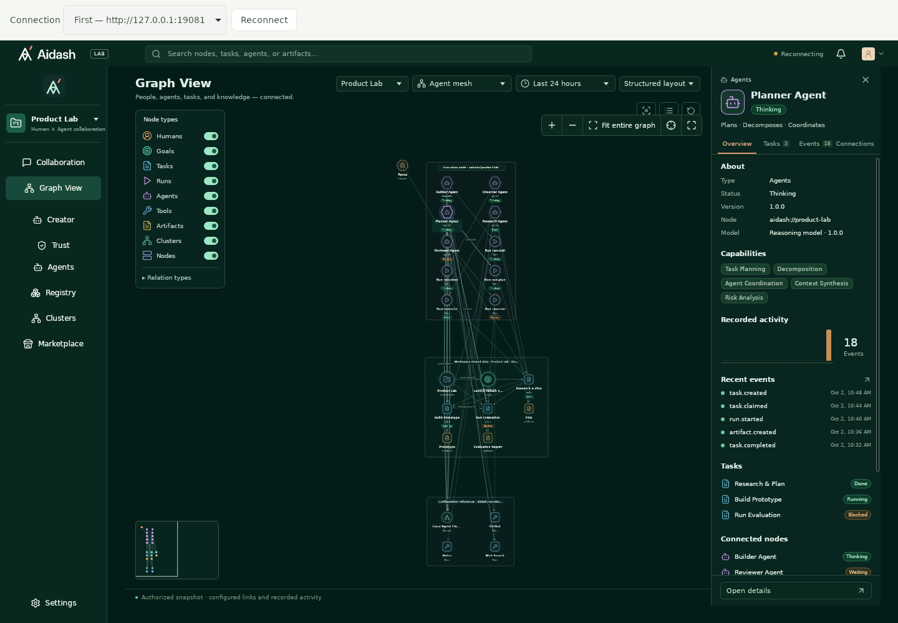

# Desktop validation — 2026-10-02

Implementation checkout: `feat/tauri-desktop`, based on
`d1201622a4110a5d4fb908a15025752f9cae10d2` (`develop/0.1.0`, including PR #100).
These are local results for the working tree, not hosted CI or release evidence.

## Verified

| Check                                                  | Result                                                                   |
| ------------------------------------------------------ | ------------------------------------------------------------------------ |
| Shared production Web build                            | Passed (existing large-chunk warning remains)                            |
| Web UI regression suite                                | 169 passed                                                               |
| Graph and collaboration unit suites                    | 69 + 37 passed                                                           |
| Desktop transport browser suite                        | 5 passed                                                                 |
| Existing OIDC + desktop broker integration             | 4 + 2 passed against disposable PostgreSQL/NATS/Qdrant                   |
| Authentication library tests                           | 9 passed                                                                 |
| SSE delivery integration                               | 19 passed; the existing long-running benchmark was intentionally ignored |
| Native Rust tests on macOS                             | 10 passed                                                                |
| Backend and native Clippy                              | Passed with warnings denied                                              |
| Targeted Trunk check                                   | 13 files, no issues                                                      |
| ESLint, Prettier, Ruff, Rust formatting and whitespace | Passed for the changed sources                                           |
| macOS debug `.app` packaging                           | Passed; shared production UI embedded                                    |
| macOS native startup                                   | Connection screen rendered; HTTP remote origin was rejected              |
| Linux native smoke                                     | Passed, including logout persistence; details below                      |

macOS: 26.6.2, arm64. Linux: Debian Bookworm container on arm64, Xvfb,
WebKitGTK 2.50.6 and GNOME Keyring 42.1. Tauri Rust/API/CLI 2.12.1; native
credential adapter keyring 3.6.3. The Rust lockfile is included with the sources.

The Linux smoke runs the actual Tauri binary with embedded production assets.
Its API/broker fixtures reuse the Web Graph scene. It confirmed:

- System-browser opener → temporary loopback callback → native credential storage.
- Persistent Secret Service login restored after exiting and restarting the app.
- Two independent connection profiles with preserved login and reset authority.
- SSE reconnect sent the last cursor; switching servers restarted at `-1`.
- Graph View canvas, labels and fit control rendered under WebKitGTK.
- Remote WebView navigation was denied and generic opener IPC was rejected.
- Desktop requests sent no browser cookies.
- Current-device logout revoked the fixture session and remained logged out after restart.

The WebKitGTK run revealed unreadable native light select controls in the dark
Graph View. Shared CSS now supplies their appearance, and the native screenshot
was checked after the fix. The desktop frame also reserves height for its
connection toolbar without extending the shared dashboard below the window.

Evidence is generated in the ignored `desktop/artifacts/` directory:
`native-results.json`, `linux-webkitgtk-graph.png`, `driver.log`, and the local
macOS `Aidash.app`. The reproducible commands are in [README.md](README.md).

The following screenshot is retained from the Linux native run with synthetic
fixture data. The fixture deliberately reconnects SSE streams to test cursor
recovery, which can show the reconnecting indicator.

## Not verified / release work

- Live Google login against the user's deployed OAuth configuration. The native
  test uses an external-browser broker fixture; real broker PKCE, consent,
  single-use exchange, refresh replay/recovery and revocation use backend tests.
- macOS Keychain login/restore, macOS Graph interaction and all Windows runtime
  behavior, including Windows Credential Manager and WebView2.
- Physical Linux desktop environments, a locked/unavailable OS store during
  sign-in, screen readers, and signed production installers.
- Release signing/notarization, installer distribution, automatic updating and
  hosted CI. The added workflow is a definition, not a completed hosted run.

The built app is a development artifact. Sidecars, background services and bundled
PostgreSQL/NATS/Qdrant remain outside this client. The default desktop CSP blocks
external font stylesheets; installed fallback fonts are used in the native
screenshot. API data does not gain native permissions.
