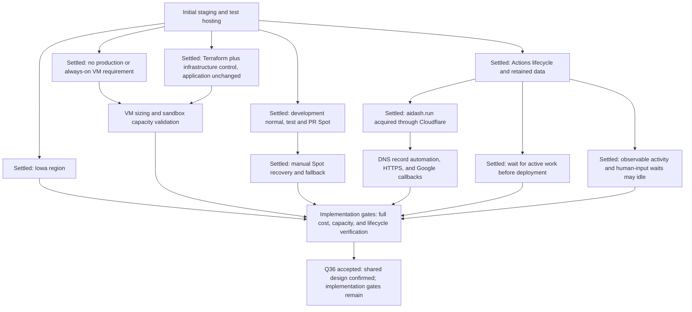

# GCP deployment and delivery design

Status: accepted on 2026-09-28 after the user confirmed the consolidated design
in Q36; the design interview is complete.
Terraform, lifecycle automation and local verification are implemented in
[infra/gcp](../../infra/gcp/README.md). Live GCP, OAuth and capacity acceptance
gates remain open. No GCP resources have been provisioned by this implementation.

Latest scope update: 2026-09-28. The user deferred the `main` production
environment. Initial delivery covers GitHub Actions-controlled staging and test
environments. The previous always-on production topology and cost model are
superseded for this phase. Q27-Q28 selected normal VMs for shared development
staging, Spot VMs for tests and PR staging, and Iowa (`us-central1`).
Q29 and Q31 selected manual Spot recovery/fallback and deployment after active
work finishes. The user then purchased `aidash.run`, settling Q32. Public
registry data identifies Cloudflare as the registrar, superseding Q33's earlier
Porkbun plus Cloud DNS proposal. Q34-Q35 accepted observable activity as the
inactivity signal and allowed waits solely for human input or approval to idle.
Q36 confirmed the complete staging/test design, including the proposed origins,
operating policies, cost assumptions, and explicit implementation gates.

## Confirmed scope and constraints

- Do not create the `main` production environment yet. A `main` push does not
  deploy or provision production in this phase.
- Provide one shared development staging environment following an explicitly
  selected `develop/x.y.z` branch, PR staging for explicitly requested PRs
  targeting `main` or `develop/x.y.z`, and a test environment created from a
  selected branch or commit, including `main`.
- At most one shared development staging, one PR staging, and one test
  environment run at once. Additional PR requests wait for the PR capacity slot.
  More than one stopped PR environment may retain private data.
- All environments support explicit create, resume, stop, and destroy operations.
  Use GitHub Actions for shared staging and tests; PR comments also control PR
  staging. Opening a PR alone does not create infrastructure.
- After one hour without meaningful human use or active Agent/verification work,
  stop compute and retain private data. Health checks, automated polling, and
  idle worker loops do not reset the inactivity clock.
- Observable login, submission, save, and execution requests reset the clock;
  reading, scrolling, and unsent drafts alone do not. Explicit resume on an
  already running environment grants another idle hour. A wait solely for human
  input or approval can become idle, without extending approval expiry.
- A push never creates an absent nonproduction environment or restarts a stopped
  one. Running shared development staging and opted-in same-repository PR
  staging update after CI. Stopped environments receive the permitted pending
  version on manual resumption; a test remains pinned to its chosen SHA.
- Explicit destruction deletes that environment's private data and resources.
  Closing or merging a PR also destroys its PR staging environment and data.
  Q26's retained test data supersedes the earlier idle-destruction policy.
- Serve a small invited group, using the Google OAuth/OpenID Connect integration
  being implemented. Authentication and Aidash resource authorization remain
  separate. Do not provision Keycloak.
- Use the user-purchased `aidash.run` domain. Cloudflare is the registered
  registrar, and its nameservers must remain at the zone apex while using
  Cloudflare Registrar. Manage the environment records through Terraform.
- Include Shell, Python execution, and file processing. Do not introduce a global
  one-execution queue for isolation; use the existing isolated sandboxes and
  validate resource capacity. The earlier combined one-slot queue was withdrawn.
- Prefer JPY 10,000/month across all GCP environments together. LLM and external
  API usage is a separate budget. The target is not an enforced billing cap.
- Overseas regions and self-managed OS/Kubernetes/database operation are allowed.
- Use Iowa (`us-central1`). Shared development staging uses normal on-demand
  VMs; test and PR staging use Spot VMs. None requires a continuously running
  host. If Spot capacity is unavailable or reclaimed, record the condition and
  wait for manual resumption. A manual operation may explicitly select a normal
  VM; do not fall back automatically or replay interrupted Shell/Python work.
- Automatic updates wait for active work to finish while the current version
  continues serving. Coalesce pending updates to the newest authorized,
  CI-successful SHA. Force an update only through an explicit Actions operation.
- Define infrastructure in Terraform. GitHub Actions and infrastructure-side
  control code are allowed; Aidash application logic and the existing Runner
  remain unchanged.
- Backups remain out of scope for this pre-release phase. Persistent disks are
  still required. The earlier few-hours service-recovery preference does not
  establish a backup-based one-hour data-loss guarantee.

Production can be designed again when the user chooses to introduce it.
Its earlier 24-hour UI/API requirement does not create a current infrastructure
dependency or justify a continuously running host in this phase.

## Environment lifecycle

| Environment                | Source and creation                                                           | Updates                                                                                   | Stop and retirement                                                                               |
| -------------------------- | ----------------------------------------------------------------------------- | ----------------------------------------------------------------------------------------- | ------------------------------------------------------------------------------------------------- |
| Shared development staging | One explicitly selected `develop/x.y.z`; manual Actions creation              | CI-validated updates while running; pending version applied on manual resume              | Stop after one idle hour; retain data until explicit destroy                                      |
| PR staging                 | Explicit PR comment, allowed base branch, one active PR slot                  | Same-repository commits update after CI while running; stopped environments defer updates | Stop after one idle hour; resume by comment/Actions; destroy on explicit request, close, or merge |
| Test                       | Manual Actions selection of branch or commit, including `main`, pinned to SHA | Remains pinned; a new selected version is an explicit lifecycle operation                 | Stop after one idle hour; retain data until explicit destroy                                      |
| Production                 | Deferred                                                                      | No production deployment workflow enabled now                                             | No production resources created now                                                               |

A `main`-sourced test uses the existing test slot. It is not a production
environment. A stopped environment retains its identity and persistent
database/files; it does not promise to preserve Python RAM.

### Manual operations

Propose one trusted `workflow_dispatch` entry point with an environment class,
action (`create`, `resume`, `stop`, `destroy`), and source selection when
creating. Resolve refs to immutable, CI-validated SHAs. Do not silently destroy
an existing slot's data when a create request names another source.

For PR comments, proposed commands are `/preview up`, `/preview stop`, and
`/preview destroy`. Check repository write/maintainer permission and bind
the target to the PR in the event.

| Event                      | Result                                                                                                                               |
| -------------------------- | ------------------------------------------------------------------------------------------------------------------------------------ |
| Explicit create/up         | Create an absent environment, or return the matching existing environment; do not silently replace data                              |
| Explicit resume/up         | Start retained infrastructure/data and deploy the permitted pending version; if already running, renew the idle deadline by one hour |
| Manual stop or idle expiry | Stop admission, drain active work, then stop compute; retain persistent data                                                         |
| Manual destroy             | Retire the environment and data; clear the creation request                                                                          |
| PR close/merge             | Retire the PR environment and data regardless of build success                                                                       |
| Push while running         | Update eligible shared/PR staging after exact-SHA CI                                                                                 |
| Push while stopped/deleted | Preserve lifecycle state; do not create or wake compute                                                                              |
| Reopened PR                | Require a fresh explicit creation request                                                                                            |
| Spot preemption            | Record interruption and wait for manual resumption; do not automatically switch VM type or replay work                               |

Use an environment generation and lifecycle lock across apply, updates, idle
checks, stop, destroy, and recovery. Stale workflows must not undo a newer
stop/delete or recreate a closed PR. Recheck current PR state and authorized SHA
before provisioning and deployment.

A manual stop drains active work; report pending drain honestly. An explicit
destroy or PR close retires the environment, including its work and private
data. Cleanup must target only resources owned by that environment; another
environment, shared registry, and shared routing are not cleanup targets.

An interrupted Spot environment is not eligible for push-triggered waking.
Normal-VM fallback is an explicit create/resume choice. Persist the selected
provisioning mode so that a later code-only update cannot silently undo it;
default test/PR provisioning remains Spot. Any infrastructure replacement needed
for a mode change must preserve the environment's retained disks and identity.

### Activity observation

No existing setting provides the complete environment inactivity signal.
Infrastructure control must combine meaningful user activity with active
Agent/verification work and recheck immediately before stopping. CPU idleness,
the absence of HTTP traffic, or interpreter idle time alone is insufficient.

The observer and lifecycle timers can run while the environment is active, or
in short-lived control services. A stopped environment resumes through GitHub
Actions; an always-on GCP VM is not needed merely to wait for that command.
The activity contract and failure behavior need implementation validation.

The inspected UI polls session/state every five seconds and other views at
different intervals (`web/src/main.tsx`). Both Shell and Python polling use POST
endpoints (`src/capabilities/api.rs`), so counting all POSTs as user activity
would also keep an idle environment running. Classify existing endpoints and
observe durable Run, capability-operation, and verification state separately.
Browser-only interaction that emits no distinguishable request is not observable
from a proxy alone; do not claim exact human inactivity from that signal.

Q34 accepted observable login, submission, save, and execution activity;
reading, scrolling, or editing an unsent draft alone does not reset the clock.
An explicit resume operation on an already running environment renews its
idle deadline by one hour, without an application change.

Q35 accepted allowing a Run waiting only for human input or approval to become
idle, while actual Agent, capability, or verification work continues to block
an idle stop. `WAITING` alone cannot establish idleness:
`src/harness.rs` also uses it for timed and tool-related waits. Inspect the
pending reason and associated operations rather than treating every waiting
Run identically. Existing approval expiration still uses wall-clock time;
stopping an environment does not extend or renew an approval. A resumed
environment can require a fresh approval after expiry.

The implementation contract must distinguish a fresh idle observation from an
unknown or stale observation. Missing or inconsistent state must postpone an
automatic stop or deployment and expose a diagnostic; it must not be converted
to "no active work." Track the most recent intentional request, completion of
active work, and explicit keep-alive operation when calculating the deadline,
so a long task's completion does not trigger immediate suspension. Recheck
under the lifecycle lock after closing new admission. If the current application
cannot support a safe observation/admission boundary without logic changes,
report that feasibility gate instead of weakening the accepted stop policy.

## Proposed initial topology

Use one Compute Engine VM per active environment, containing:

- Frontend, API, and background Agent coordination.
- PostgreSQL 17 with the required extension, NATS JetStream, and Qdrant.
- Self-managed Kubernetes and the trusted Runner controller.
- Shell/Python Pods isolated by the existing gVisor RuntimeClass and node guard.

This is the leading candidate, not a selected or measured production shape.
The cost comparison uses 4 vCPUs and 16 GiB per VM to leave room for services
and sandboxes. Kubernetes reservations, actual memory use, parallel execution,
and saturation behavior must be checked before choosing a smaller host or
promising a particular concurrency level.

The same host can contain trusted services and isolated execution Pods; the
security boundary for submitted code remains gVisor and the existing physical
lifecycle checks. Different Aidash environments keep separate VMs, credentials,
databases, files, and Runner journals. Do not treat a namespace alone as
permission for a PR application to access another environment's data.

### Startup and stop sequence

1. An authorized Actions/comment operation acquires the environment lifecycle
   lock and resolves the desired state and exact permitted source.
2. Terraform creates or resumes the environment's managed resources; deploy
   immutable application and runner images using the chosen source's configuration.
3. Start database, messaging, search, control services, and application roles.
4. Run readiness and the existing isolation/freeze probes before marking the
   environment ready or returning its usable URL.
5. Keep the environment's execution infrastructure ready while the environment
   is in use. The existing Runner creates and reclaims execution Pods.
6. On idle expiry or an explicit stop, block new admission, recheck activity,
   drain work, and stop the host. Retain disks and state for manual resumption.

This whole-environment startup avoids placing VM boot latency inside a user's
capability call. The application's runner HTTP timeout is ten seconds and its
Pod-readiness waits are 120 seconds. Those remain unchanged; starting an entire
environment before use is different from promising transparent VM autoscaling
after a Shell/Python request has already entered the application.

There is no separately budgeted always-on production or Runner VM. Extra
execution nodes or a managed control plane are later options with additional
cost and node-adapter validation requirements.

### Persistent resources and naming

Provision disks with ownership independent from accidental VM deletion or Spot
preemption. Stop means preserving database/file data; explicit environment
destruction deletes the owned disks. Use persistent Terraform state and
lifecycle metadata outside a stopped VM.

Prefer a small fixed set of environment origins to match the three active
slots. An ephemeral VM address can change on resume while its DNS name stays
the same. Google requires exact registered OAuth callback URLs and forbids
wildcard redirect URIs; DNS alone does not complete the OAuth design. Callback
registration, certificates, and switching a PR slot between retained
environments must follow the proposed contract below without application changes.

### Acquired domain, DNS, and OAuth origins

On 2026-09-28, the user reported purchasing `aidash.run`. A subsequent registry
RDAP lookup confirmed registration through `Cloudflare, Inc`, with assigned
nameservers `brynne.ns.cloudflare.com` and `coleman.ns.cloudflare.com`. This
settles the name selection; it does not establish that application DNS, HTTPS,
or Google OAuth callbacks are configured.

Cloudflare Registrar requires Cloudflare nameservers for the registered zone.
The previous proposal to register through Porkbun and move the entire zone to
Cloud DNS therefore does not apply. Subdomain delegation is technically
possible, but is not needed for the proposed three-record layout. Retain the
Cloudflare zone and propose its Free-plan DNS with the Cloudflare Terraform
provider. No nameserver transfer or Cloud DNS zone is required by this layout.
Account plan and billing details have not been inspected.

| Environment                             | Proposed stable origin       | Exact Google OAuth redirect URI            |
| --------------------------------------- | ---------------------------- | ------------------------------------------ |
| Shared development staging              | `https://develop.aidash.run` | `https://develop.aidash.run/auth/callback` |
| Active PR staging slot                  | `https://preview.aidash.run` | `https://preview.aidash.run/auth/callback` |
| Test slot, including main-sourced tests | `https://test.aidash.run`    | `https://test.aidash.run/auth/callback`    |

The callback paths match the inspected Google-login implementation's
`public_origin + /auth/callback` contract. These are configuration targets,
not currently deployed URLs. The PR origin serves only the active PR slot;
change its binding under the lifecycle lock without exposing another retained
environment's data. Leave the apex and future production hostname outside
the initial application deployment.

The proposed record mode is DNS-only (`proxied = false`), with public HTTPS
terminated on each active environment. A DNS-only record does not provide
Cloudflare's HTTP proxy or origin TLS termination; obtain a browser-trusted
certificate on the host and verify SSE directly. Terraform manages only the
owned environment records in the existing zone, preserving unrelated records.
Resolve the zone ID and use a zone-scoped DNS-edit credential for trusted
automation during implementation; do not grant that credential to PR code or
execution sandboxes.

For a normal stop, withdraw the owned address record before releasing the IP.
After a Spot interruption, reconcile the record against the actual instance
state; a stopped environment must not remain intentionally bound to a released
address. On resume or PR-slot reassignment, update the binding under the same
lifecycle lock and verify DNS, trusted TLS, and the intended environment identity
before reporting readiness. Cached DNS can lag these changes. Persist the
certificate material needed for restart without putting DNS credentials on
the application host, and test issuance/renewal before accepting the ingress
configuration. Each environment keeps independent session secrets and data;
switching the shared PR origin must reject the preceding environment's session.

The first recursive NS lookup still returned NXDOMAIN after registration.
Registration is confirmed, but DNS propagation and record readiness remain
unverified. No DNS records, nameserver settings, certificates, or OAuth client
settings have been changed by this design task.

Sources: [aidash.run registry record](https://rdap.identitydigital.services/rdap/domain/aidash.run),
[Cloudflare Registrar nameserver requirements](https://developers.cloudflare.com/registrar/get-started/register-domain/),
[Cloudflare nameserver and subdomain delegation FAQ](https://developers.cloudflare.com/registrar/faq/),
[Cloudflare DNS](https://developers.cloudflare.com/dns/),
[Terraform DNS records](https://developers.cloudflare.com/api/terraform/resources/dns/subresources/records/),
[DNS-only and proxied records](https://developers.cloudflare.com/dns/proxy-status/),
and [Google redirect URI rules](https://developers.google.com/identity/protocols/oauth2/web-server#uri-validation).

## Runner and platform findings

The inspected application already creates operation-specific gVisor Pods and
independent reconciliation threads. A retained Python interpreter can span
multiple cells; the default interpreter idle limit is 1,800 seconds. Preserve
its reset-acknowledgement contract. Destroying an interpreter after every cell
would change behavior and is outside the accepted scope.

A single worker process has four worker loops. VM count, Terraform parallelism,
and Terraform state locking are not application concurrency limits. Kubernetes
quotas reject excess resource admission; the existing Runner may record uncertain
operation outcomes when Pod creation fails. Validate saturation rather than
inventing a friendly busy/retry contract or automatically replaying side effects.

Cloud SQL's published extension list did not include `pg_jsonschema` when
checked. The application requires PostgreSQL 17 with `pg_jsonschema` 0.3.4.
An unchanged Cloud SQL deployment is not assumed compatible. GKE Sandbox is
available, but Aidash's node-local `runsc`, cgroup, and physical freeze/termination
checks still require validation on the selected platform. Cloud Run has
background worker pools, but does not directly replace this Kubernetes Runner
contract. The existing kind installer is an acceptance fixture, not a production
installer.

## Spot and pricing choices

GCP Spot VMs are discounted interruptible VMs. They can be reclaimed at any time,
can be unavailable on create/resume, and do not guarantee successful completion
of an active test or Python session. Persistent disks can survive preemption,
but live RAM and in-flight work cannot be treated as preserved or safely replayed.

The current E2 Iowa rate checked on 2026-09-28 is USD 0.080424/hour for
`e2-standard-4`, versus USD 0.13402284/hour for normal on-demand provisioning:
about a 40% compute discount. Current Spot prices can change daily. Do not rely
on old articles' claims of a universal 60% minimum discount.

Q27 selected normal VMs for shared development staging and Spot VMs for tests
and PR staging. Q28 selected Iowa (`us-central1`). Q29 selected manual
resumption after capacity unavailability or interruption, with an explicit
normal-VM override and no infrastructure-initiated replay of interrupted work.
Preserve the existing Runner's uncertain-effect and Python-session-reset
contracts. Automation must continue to respect explicit stop/delete requests.

See [the host cost estimate](2026-09-28-gcp-host-cost-estimate.md). With 120 total
VM-hours/month, three retained 30 GiB disks, ephemeral public IPs only while
running, and a planning conversion of JPY 160/USD, VM + disk + IP subtotals are:

| Choice                                                          | Monthly subtotal, excluding tax and other services |
| --------------------------------------------------------------- | -------------------------------------------------- |
| All normal VMs                                                  | Approximately JPY 4,109                            |
| Shared development normal; tests and PR staging Spot (selected) | Approximately JPY 3,571                            |
| All Spot                                                        | Approximately JPY 3,032                            |

The examples do not prove the machine size or workload hours. Registry, egress,
logs, DNS, secrets, state/control services, applicable Actions charges, and tax
remain additional. Retained disks keep costing money when compute stops.
The complete target is still JPY 10,000 across the initial environment set.

## Delivery workflow

- Build and validate deployable application commits, including Google login,
  from the selected source line. Production deferral removes the requirement
  to merge an initial application release into `main` before testing.
- Build immutable image digests and record their source SHA. Deploy only the
  exact commit whose required CI checks passed.
- Authenticate GitHub Actions to GCP using Workload Identity Federation with
  restricted repository/workflow/environment identities and separate environment
  credentials. Keep privileged lifecycle code on a trusted branch.
- `issue_comment` requires a workflow on the default branch and reports the
  default-branch SHA. Fetch PR metadata to resolve the intended head SHA; do
  not deploy the event SHA as though it were the PR commit.
- Same-repository PRs can proceed after an authorized creation request and CI.
  Forks require maintainer review and a deployment decision bound to each exact
  SHA; later commits do not inherit that authorization.
- Serialize lifecycle/deploy operations and reject stale generations. An older
  run must not overwrite newer desired state or a manual stop/delete.
- Check schema compatibility and run the migration stage. Startup also
  serializes migrations. Application rollback does not imply database downgrade
  or undoing external effects. Backups are not a gate in this phase.
- Check login/session, durable work, SSE, and sandbox admission before publishing
  readiness. Record source, digests, schema state, and verification results.
- Handle close/merge cleanup independently from build success and periodically
  reconcile resources left behind by failed cleanup.

Q31 selected waiting for active work to finish before automatic deployment.
Keep serving the current version and coalesce pending updates to the newest
authorized CI-successful SHA, with an explicit Actions force option. Persist
the pending version rather than leaving an Actions job polling indefinitely.
The existing shutdown path drains only current worker steps and requests for up to 20 seconds
(`src/main.rs`, `docs/orchestration.md`); it does not itself wait for an entire
long-running Agent or capability operation. The selected wait-before-update
policy therefore needs infrastructure-side observation and race checks before
termination; its implementation is not yet verified.

### Failure handling

| Failure or interruption                    | Required outcome                                                                                                                                                                                                     |
| ------------------------------------------ | -------------------------------------------------------------------------------------------------------------------------------------------------------------------------------------------------------------------- |
| CI, authorization, or build failure        | Keep the current version and lifecycle state; do not provision an unapproved replacement.                                                                                                                            |
| Spot capacity unavailable or preempted     | Mark unavailable/interrupted, preserve disks, remove stale routing, and wait for explicit resume or normal-VM selection.                                                                                             |
| Activity state unavailable or ambiguous    | Defer automatic stop/update and record the diagnostic; an explicit destructive operation retains its stated semantics.                                                                                               |
| Migration or post-deploy readiness failure | Mark the deployment failed and preserve data and evidence. Revert the application only when the current schema is compatible; otherwise require repair. Do not silently downgrade the database or recreate it empty. |
| Close/merge cleanup partially fails        | Keep the environment retired, record remaining owned resources, and retry cleanup; an old build must not recreate it.                                                                                                |

## Implementation sequence and acceptance gates

The interview's operating-policy choices are settled. The following is the
recommended implementation sequence, not evidence that a deployment has run.
Technical feasibility must be demonstrated before the environment is advertised
as usable; it does not require another round of speculative product questions.

1. **Establish the trusted deployment foundation.** Refresh the source baseline,
   choose a deployable SHA containing Google login, and place trusted lifecycle
   workflows on the repository's default branch. Provision Terraform remote
   state, durable lifecycle metadata, an image registry, and scoped deployment
   identities. Keep shared resources separate from per-environment resources so
   retiring a PR cannot delete the state store, registry, or DNS zone. PR source
   must not supply privileged workflow or Terraform code, including through a
   modified reusable action. WIF authorization must bind the trusted caller.
2. **Prove one complete environment.** Build the VM/bootstrap configuration with
   the existing runtime contract, persistent data, and a configured Google
   origin. Validate PostgreSQL's required extension, NATS, Qdrant, web/API/worker,
   gVisor, node guard, and physical freeze/termination before enabling users.
   Measure memory, disk use, concurrent Shell/Python behavior, saturation, and
   startup time on the candidate `e2-standard-4`. If 30 GiB of total retained
   storage or this VM size is insufficient, revise the estimate explicitly.
3. **Implement lifecycle control outside application logic.** Use a trusted
   controller entry point, a durable desired-state record, per-environment
   generations/locks, and an active-environment activity observer. Store source
   and pending SHAs, image digests, provisioning mode, PR identity, owned
   resources, and operation status outside the stopped VM. Timers can run while
   the host is active; periodic or event-driven reconciliation can use short
   control jobs. No controller needs a continuously running VM. Validate the
   race between a new operation and stop/deploy rather than assuming Terraform
   locking also locks application work.
4. **Connect delivery, routing, and recovery.** Wire exact-SHA CI events and
   authorized Actions/comments to this controller, automate only the owned
   Cloudflare records, configure trusted TLS and exact OAuth callbacks, and
   exercise stop/resume, interrupted startup, PR-slot handover, and cleanup.
   A workflow completion, VM power state, or successful `terraform apply` alone
   is not application readiness.

| Acceptance scenario                                   | Evidence required before first usable deployment                                                                                                                  |
| ----------------------------------------------------- | ----------------------------------------------------------------------------------------------------------------------------------------------------------------- |
| One idle hour with automatic polling                  | Polling and health checks cannot keep the environment alive; retained data survives stop/resume.                                                                  |
| Long LLM, Shell, Python, or verification work         | No automatic stop or update while work is active; completion starts a fresh idle interval.                                                                        |
| Human response/approval wait and read-only browsing   | The environment can stop; resume while already running renews the idle deadline; approval expiry remains unchanged.                                               |
| Stop/delete racing with CI, retries, or a reopened PR | Stale operations cannot wake or recreate the environment; a reopened PR requires a new explicit request.                                                          |
| Spot interruption or normal-VM override               | Retained disks survive; no infrastructure replay; Python loss/reset acknowledgement and selected VM mode remain correct.                                          |
| Deferred deployment and migration failure             | Pending versions coalesce by authorized source, active work drains safely, and failure cannot imply a destructive database rollback.                              |
| PR source and preview-slot isolation                  | Unapproved SHAs cannot obtain deployment credentials; one PR cannot read another environment's data or reuse its login session.                                   |
| Complete public entry point                           | Current DNS resolves to the intended environment, browser-trusted HTTPS and SSE work, Google login succeeds, and an uninvited identity cannot gain Aidash access. |
| Resource and cost accounting                          | Report measured capacity, actual retained disks and all control/registry/egress costs; distinguish the subtotal from the combined JPY 10,000 target.              |

Deployment inputs still need to be resolved before provisioning: the GCP project
and billing account, the followed `develop/x.y.z`, a currently deployable SHA,
the Cloudflare zone and scoped automation credential, Google OAuth client
configuration, and the invited-user/operator configuration. These are setup
inputs, not a request to put secrets in this design document or chat. Prefer
existing approved resources; keep application runtime identities separate from
deployment and DNS identities.

## Observed baseline

The design checkout starts from application commit
`236bc28b099dcd77a6ae8df7608f84028d9b1fec`. On the 2026-09-28 refresh, remote
`main` remained `8300f44de59ca136cd136583a65aa9837d119559` and contained
repository scaffolding rather than the application; remote `develop/0.1.0`
was `dcede2adb3403fb281c1efaf3c889870521457b5`. The Google login branch was
clean and committed at `01732b6196bce6c5e2d068c2ca60e40703ded258`.
Refresh these source facts before implementation; none establishes a release.

The baseline CI covers lint, Rust, browser, federation, orchestration, and
core-runtime acceptance. There is no GCP CD/Terraform implementation in that
baseline. Helm separates server, worker, and frontend; NATS and Qdrant also need
persistent storage. The runtime example uses 2 CPUs and 2 GiB per sandbox, which
is a test profile rather than production sizing evidence.

Evidence: `src/main.rs`, `src/capabilities.rs`,
`src/capabilities/operations.rs`, `src/capabilities/python.rs`,
`runner/control.py`, `runner/node_guard.py`, `scripts/setup-capability-runtime.py`,
`deploy/helm/aidash/`, `deploy/local-k8s/infra.yaml`,
`migration/src/m20260921_071045_record_constraints.rs`,
`docs/orchestration.md`, and `docs/operations/core-capabilities.md`.

## Design review state

Do not silently bring the deferred production environment or backups back into
the initial phase. Q32 is settled by the domain purchase; Q33's earlier
registrar/DNS proposal is superseded by the observed Cloudflare registration.
Q34-Q35 are accepted, and Q36 confirmed shared understanding of the consolidated
design on 2026-09-28. No design-interview questions remain. Activity observation, platform capacity, lifecycle
state, and DNS/HTTPS/OAuth are explicit implementation gates; the chosen topology
and prices are not runtime or billing guarantees. No implementation or cloud
deployment is implied by completion of this design interview.

## Documentation status

The glossary is in `CONTEXT.md`. Local ADR 0004 covers Google identity; ADR 0005
covers the current environment lifecycles. ADR 0006 records the superseded
always-on production direction and is deprecated for this phase. New files in
`docs/adr/` are ignored by the repository rules; accepted decisions are also
recorded in this non-ignored design document. No Git publication has occurred.

## Sources checked

- [Compute Engine pricing](https://cloud.google.com/products/compute/pricing/general-purpose)
- [Spot prices](https://cloud.google.com/spot-vms/pricing)
- [Spot behavior](https://docs.cloud.google.com/compute/docs/instances/spot)
- [VM billing](https://cloud.google.com/products/compute/pricing)
- [Instance stop and restart](https://docs.cloud.google.com/compute/docs/instances/stop-start-instance)
- [Network and IPv4 prices](https://cloud.google.com/vpc/network-pricing)
- [Persistent disk prices](https://cloud.google.com/compute/disks-image-pricing)
- [Cloud SQL extensions](https://docs.cloud.google.com/sql/docs/postgres/extensions)
- [GKE Sandbox](https://docs.cloud.google.com/kubernetes-engine/docs/concepts/sandbox-pods)
- [GKE Autopilot security](https://docs.cloud.google.com/kubernetes-engine/docs/concepts/autopilot-security)
- [Cloud Run worker pools](https://docs.cloud.google.com/run/docs/deploy-worker-pools)
- [Google OAuth redirect rules](https://developers.google.com/identity/protocols/oauth2/web-server#uri-validation)
- [Workload Identity Federation for deployment pipelines](https://docs.cloud.google.com/iam/docs/workload-identity-federation-with-deployment-pipelines)
- [GitHub workflow events](https://docs.github.com/en/actions/reference/workflows-and-actions/events-that-trigger-workflows)
- [GitHub Actions secure use](https://docs.github.com/en/actions/reference/security/secure-use)
- [Terraform resource management](https://developer.hashicorp.com/terraform/intro)
- [Kubernetes resource quotas](https://kubernetes.io/docs/concepts/policy/resource-quotas/)
