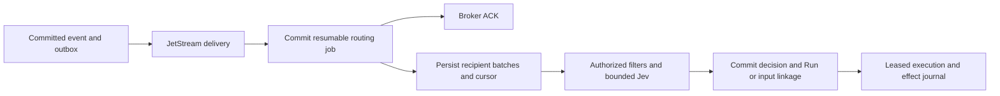

# Durable Agent event subscriptions, routing and replay

Status: accepted. Decisions Q1-Q27 and the integrated design were confirmed by
the user on 2026-09-28. The design interview is complete. Runtime implementation
has not started.

The consolidated [event-to-execution contract](2026-09-28-event-routing-contract.md)
defines the records, state transitions, APIs, UI, cutover and acceptance matrix.
This document preserves the accepted design decisions and their rationale.

Issue: [#70](https://github.com/kent8192/aidash/issues/70).
Inspected development baseline: `20d1fb46f13cf042af6afce7763140c132428b78`.
The subsequent `origin/develop/0.1.0` snapshot `6b90aca` was checked for changes
to `src`, migrations, the glossary, ADRs and repository instructions; there
were none in those paths. The design retains the source-inspection baseline above.

## Sources and existing constraints

- [Aidash concept](https://app.notion.com/p/3d972fa877aa80ca8fd1f48b8d129d01):
  event-driven collaboration, subscriptions, role-dependent response selection
  and shared Workspace history.
- [Functional requirements](https://app.notion.com/p/3e172fa877aa8096bca5c8d8c2c73b24):
  FR-HARNESS-001/005 and FR-EXEC-002/003.
- [Technology selection](https://app.notion.com/p/3e172fa877aa80e88c60d0dfeae01419):
  PostgreSQL state authority, JetStream delivery, Outbox/Inbox, ACK boundaries
  and the distinction between redelivery and re-execution.
- [Architecture](../architecture.md) and [authorization](../authorization.md):
  transactional events, current authority, execution leases and effect journals.
- [Issue #14](https://github.com/kent8192/aidash/issues/14) owns collaboration UX;
  [#30](https://github.com/kent8192/aidash/issues/30) owns accepted Run-input
  completion fencing; [#38](https://github.com/kent8192/aidash/issues/38) owns
  subject-scoped remote execution. Node-internal NATS does not become a remote
  peer requirement.

The issue already requires per-recipient durable processing, atomic recording
of delivery and its create/resume/enqueue decision, ACK after durable handoff,
current authority before content exposure and execution, and fail-closed
revocation or disabled subscriptions. At-least-once delivery must preserve
existing leases, input fences, idempotent effects and unsafe-effect
reconciliation. These are constraints, not pending product choices.

## Verified implementation gaps

- `src/bus.rs::consumer` commits a global `inbox(event_id)` record, wakes
  workers and acknowledges the broker message. It does not record a logical
  recipient or a decision linking that event to a Run.
- `src/harness.rs::worker_once` leases existing runnable work. Its durable
  state recovery is not evidence of event-triggered Agent routing.
- `src/store.rs::event` inserts events in the caller's transaction and orders
  sequence allocation with commit through an advisory transaction lock.
- `src/store.rs::accept_run_message_in` uses a durable input ledger and rejects
  new input for completing or terminal Runs. Event routing must preserve that
  boundary and provide an explicit disposition when input cannot be admitted.
- `src/authorization/execution.rs::admit` currently derives an execution subject
  from node, Agent definition ID and version. The accepted independent logical
  participant model therefore needs an explicit identity/authority mapping.

These observations are source inspection, not new runtime acceptance evidence.

## Accepted decisions: round 1

| ID  | Decision                                                                                                                                                                                                                        | Rationale                                                                                                                  |
| --- | ------------------------------------------------------------------------------------------------------------------------------------------------------------------------------------------------------------------------------- | -------------------------------------------------------------------------------------------------------------------------- |
| Q1  | Two participants using one Agent definition can be distinct logical Agents, each with its own ID, role, subscriptions and processing history.                                                                                   | Research and review responsibilities must not collapse into one recipient. Worker replicas do not create new participants. |
| Q2  | Joining a Workspace presents and enables role-appropriate subscriptions; participants can subsequently change subscribed event types and enablement. Read access alone does not subscribe an Agent.                             | Start collaboration through the ordinary invitation/participation flow while keeping activation intentional.               |
| Q3  | Role-appropriate business events can autonomously initiate work: messages, task additions, Artifact publication and goal changes. Internal execution transitions are not default triggers for new work.                         | Support the intended event-driven collaboration without making every internal update a fresh assignment.                   |
| Q4  | Ordinary subscriptions start after participation. Processing earlier events requires an explicit request with a selected scope; existing subscribers' unfinished work recovers automatically.                                   | Separate historical context, recovery of owed work and new requests to act on history.                                     |
| Q5  | Use Jev only after deterministic filters and only when semantic selection is needed. Failure defers work with bounded retries and an inspectable exhausted state; explicit requests requiring no semantic selection bypass Jev. | Preserve uncertain work without speculative execution or silent loss.                                                      |

Architectural records: [recipient identity](../adr/0004-logical-agent-subscription-identity.md),
[historical routing](../adr/0005-explicit-historical-event-routing.md),
[semantic selection failures](../adr/0006-defer-unavailable-semantic-response-selection.md).
Shared vocabulary lives in [CONTEXT.md](../../CONTEXT.md).

## Accepted decisions: round 2

| ID  | Decision                                                                                                                                                                                                                             | Rationale                                                                                                             |
| --- | ------------------------------------------------------------------------------------------------------------------------------------------------------------------------------------------------------------------------------------ | --------------------------------------------------------------------------------------------------------------------- |
| Q6  | Reuse an active compatible Run only for the same logical Agent and explicitly correlated work. Independent Tasks or threads remain separate; inferred semantic similarity cannot merge work.                                         | Avoid mixing distinct requests while retaining an existing work context for related inputs.                           |
| Q7  | Each participant has a distinct authority binding and role scope, bounded by the inviting/delegating subject and the pinned definition's allowed capabilities.                                                                       | Participants sharing one definition can have different data access without role selection becoming a privilege grant. |
| Q8  | Use the subscription revision effective when the event committed, with an explicit sequence boundary for edits; recheck current authority and enablement before exposure and execution.                                              | Later broadening does not silently acquire earlier events, and broker outage duration does not redefine eligibility.  |
| Q9  | Re-enabling a subscription enables future delivery without automatically resurrecting work that disablement prevented from reaching execution. Record a visible disposition and require an explicit request to reconsider that work. | Distinguish an intentional stop from ordinary worker downtime, which still preserves owed work.                       |
| Q10 | An event handler declares its purpose: competing to claim an existing Task, contributing input to explicitly correlated work, or initiating distinct work such as independent reviews.                                               | Multiple recipients do not imply multiple owners of one Task; independent contributions remain possible.              |
| Q11 | Allow cross-Agent reaction chains, suppress ordinary self-triggering and impose a finite chain-wide execution/cost budget with visible deferral at the limit.                                                                        | Support collaboration while bounding autonomous feedback loops.                                                       |
| Q12 | Initial Jev defaults: at most three attempts per decision, ten seconds per attempt, five- and thirty-second retry delays. Exhaustion requires explicit retry. Valid semantic deferral waits for a declared condition.                | Bound transport failures and distinguish them from legitimate uncertainty that needs new context.                     |

Subscription revision rationale is recorded in
[ADR-0007](../adr/0007-event-time-subscription-revisions.md).

## Existing implementation boundaries

- The current Run input API rejects completing/terminal Runs. A follow-up
  created by a routing handler must be distinguishable from accepting input
  into the original Run; the existing endpoint cannot silently change meaning.
- Creating a child Task under a terminal parent is rejected. Any proposed
  follow-up to completed work must use an explicit relationship that does not
  reopen the original Task or pretend it is an active parent.
- `lease_run` already excludes manually paused Runs and respects session
  ordering. Waiting for human approval or unsafe-effect reconciliation must
  not be bypassed by an unrelated incoming event.
- Artifacts have stable publication IDs in the inspected implementation; a
  Task/Workspace revision is not an Artifact version number.
- The existing Jev transport serves compaction and has its own timeout.
  Q12 describes the proposed event-selection boundary; it does not authorize
  changing the compaction contract or its timeout.
- Existing generated-Agent budgets reserve tokens conservatively. They are
  not yet proof of a reaction-chain cost cap across all event recipients.

## Accepted decisions: round 3

All decisions in this table were accepted in round 3. Numeric values are
initial protection defaults, not measured capacity or cost estimates.

| ID  | Prerequisites  | Decision                                                              | Accepted behavior                                                                                                                                                                                                                                                                                                                                                                                                     |
| --- | -------------- | --------------------------------------------------------------------- | --------------------------------------------------------------------------------------------------------------------------------------------------------------------------------------------------------------------------------------------------------------------------------------------------------------------------------------------------------------------------------------------------------------------- |
| Q13 | Q6, Q10        | What happens when correlated work is completing or terminal?          | Never revive the old Run. A handler allowed to initiate distinct work may create a linked follow-up Task/Run after successful completion; an input-only or claim-only handler reports a terminal target. Failed/cancelled work requires an explicit recovery decision. Preserve the original Run-message API rejection and admitted-input completion fences.                                                          |
| Q14 | Q6, Q10        | How do concurrency and deliberate waiting affect new input?           | At most one active Run per logical Agent and correlated work, with durable ordered input. Allow at most two independent active Runs per logical Agent initially, subject to stricter existing session rules. Manual pause retains input without resuming; approval/reconciliation waits retain their gates; ordinary event waits may wake on matching admitted input.                                                 |
| Q15 | Q7, Q8         | What does an Agent definition upgrade do to pending work?             | Pin each accepted delivery to its selected definition; upgrades apply to later subscription revisions. Existing work keeps its old definition while still authorized, and invalid/revoked definitions stop further work. Do not rewrite pending work or a running Run to the newest definition.                                                                                                                       |
| Q16 | Q7, Q9         | How do removal, re-invitation and restored authority affect old work? | Removal retires the participant and blocks further content/execution at current authority boundaries. Re-invitation creates a new participant identity. Restoring authority does not automatically revive deliveries suppressed by revocation; explicit recovery can reconsider them under current authority.                                                                                                         |
| Q17 | Q8, Q10        | What if several subscription conditions match one event?              | Deduplicate by event, logical recipient and stable handler identity; matching conditions and their revisions are evidence, not extra executions. A different handler can perform a distinct declared responsibility. Editing a condition must not change the handler identity merely to bypass deduplication.                                                                                                         |
| Q18 | Q8, Q10        | Which delayed inputs can be superseded by newer state?                | Order state-change processing within each aggregate/handler using source revisions and canonical event order, and revalidate current state before claims or mutations. Superseded state notifications may be recorded as stale; distinct messages, explicit requests and Artifact publications remain individually accountable. No global order across unrelated work is promised.                                    |
| Q19 | Q4, Q7, Q8, Q9 | What may explicit historical routing repeat?                          | Separate retrying existing unfinished delivery from routing selected history to new recipients. Reuse prior decisions and effect identity for existing deliveries; completed work is not reset. A request to do completed work again is a separately authorized new Task with a visible relationship, not replay. Preview recipient scope/counts and require current subscription-management and execution authority. |
| Q20 | Q11, Q12       | What are the initial reaction-chain limits and reset rules?           | A maximum of 16 response handoffs, four reaction hops and USD 1 of model/Jev spend per root chain, including branches, retries and follow-ups. Reserve a configured upper bound before spending; missing usable cost bounds defer. Stricter tenant/Workspace budgets win. Only an authorized explicit budget extension can resume exhausted work; replay or retries do not reset the chain.                           |
| Q21 | Q12            | What can wake a valid semantic deferral, and for how long?            | Use a restricted set of persisted conditions: relevant new input/state revision, a declared dependency reaching its required state, or authorized manual reconsideration. Coalesce condition changes, allow at most three automatic decision rounds including the initial round, each with Q12 transport limits, and surface attention after 24 hours without a resolution. No free-form model polling.               |

Recovery and overlap identity are recorded in
[ADR-0008](../adr/0008-preserve-recipient-handler-identity-during-recovery.md).

## Consequences of the accepted behavior

- A delivery has distinct selection, handoff and processing outcomes. A broker
  ACK or a `respond` decision cannot be presented as completed Agent work.
- The stable recipient key is scoped by tenant/Workspace, source event,
  logical Agent and handler. Record selected subscription revisions, pinned
  definition, decision reason, correlation, reaction root/parent, Run/Task and
  input linkage separately; neither schema version nor subscription edits
  create a new processing identity.
- A newer definition cannot supply input to an incompatible older Run. Input
  for the newer definition remains durable while the earlier work retains its
  permitted position; any later Run is separately pinned and correlated.
- For a compatible active Run, accept input and commit its delivery linkage
  together under the existing input/terminal fence. If terminal completion wins
  the race, use the handler's terminal-target behavior. Do not report acceptance
  into the old Run and then quietly move the input elsewhere.
- A follow-up to completed work uses an explicit relation such as
  `follows_task_id`, not a child link that revives a terminal parent. Failed or
  cancelled work remains visible until an authorized recovery decision.
- State revisions are comparable only within their aggregate. Message and
  Artifact publication identities remain distinct even when a related Task
  has advanced; stale notification suppression never means discarding an
  accepted human request or treating a newer Artifact as the same publication.
- Subscription suppression and semantic deferral are distinct. A worker crash
  preserves the obligation automatically; a disabled subscription, removed
  participant or revoked authority cannot become active again merely because
  a replay job or a newer permission check succeeds.
- Recheck current authorization before fetching content for Jev, before
  handing work to execution, and at subsequent execution/effect boundaries.
  An inference already sent while authorized cannot be unsent after revocation;
  its result must not authorize a later handoff or effect after authority is
  lost. Keep decision metadata scoped and avoid copying source content into
  routing reasons or operational logs.
- Reaction-chain reservations cover Jev and model attempts, branches, handoffs
  and follow-ups. Retried provider calls spend separately when their outcome
  is unknown; do not refund on timeout alone. Retry and replay preserve the
  originating root and prior consumption. Monetary caps cover model/Jev spend,
  not arbitrary external Tool charges, which remain governed by Tool policy.

## Accepted decisions: round 4

| ID  | Prerequisites        | Decision                                                              | Accepted behavior                                                                                                                                                                                                                                                                                                                                                                                                                                                                                                                                     |
| --- | -------------------- | --------------------------------------------------------------------- | ----------------------------------------------------------------------------------------------------------------------------------------------------------------------------------------------------------------------------------------------------------------------------------------------------------------------------------------------------------------------------------------------------------------------------------------------------------------------------------------------------------------------------------------------------- |
| Q22 | Q8, Q13-Q19          | At what point can the broker ACK, and how is fanout recovered?        | ACK after committing a resumable PostgreSQL routing job tied to the canonical event and its historical subscription boundary. Enumerate recipients in bounded, durable batches; a separate recipient worker makes semantic decisions and atomically links accepted work to a Run/input or durable execution queue. ACK does not wait for Jev or task completion, and the routing job is executable work with a cursor/retry state rather than an inert global inbox bit.                                                                              |
| Q23 | Q14, Q20             | What happens when queues or storage approach their configured limits? | Preserve already committed events and recipient obligations; pause new execution admission and resume from durable state when capacity returns. Reject new external submissions before committing them when the hard storage/admission limit cannot preserve the obligation, with an explicit retryable response. Never silently drop, mark completed or truncate pending work. Keep cancellation, authorization and operator recovery controls available.                                                                                            |
| Q24 | Q8, Q17-Q19          | What can retention remove without making old events executable again? | Inherit the approved tenant data-class retention policy; absent a configured policy, disable automatic purge. Retain unresolved obligations and necessary subscription history. After content expiry, retain permitted minimal deduplication evidence or a replay floor that rejects older events; explicit source deletion removes content visibility immediately and leaves an authorized content-unavailable disposition. No expired content is silently reconstructed through replay.                                                             |
| Q25 | Q13-Q21              | Where are subscriptions, decisions and recovery actions presented?    | Use Workspace participant details for role/subscription configuration and an event/message contextual panel for recipient decisions, reasons and Run/Task links. Keep ordinary success out of the conversation stream; show actionable defer/failure/overflow in a contextual attention list. Gate inspect/manage/retry/history/budget actions independently under current authority and expose no unauthorized event or participant details; provide en-US/ja-JP.                                                                                    |
| Q26 | Q1-Q21               | How does rollout affect existing Workspaces and old workers?          | Opt existing Workspaces into routing through an explicit participation/subscription setup rather than converting every Registry definition or reader. Preserve existing Task/Run histories and direct Run-message semantics. Enable event-generated work only for compatible workers, and provide a durable stop-new-routing switch that preserves pending state and authority checks. New participation uses the role subscription flow after authority and cost configuration are valid.                                                            |
| Q27 | Q1, Q3, Q7, Q10, Q17 | What are the initial role templates and explicit-recipient rules?     | Provide editable goal/coordinator, task-executor and reviewer templates for the corresponding business events. Resolve explicit destinations to a logical participant ID; ambiguous definition/name references require disambiguation rather than broadcasting. Events already accepted through direct Run-input delivery reuse that linkage and do not create a second reaction for the addressed handler. Internal Run transitions, routing/decision bookkeeping and ordinary self-originated events are excluded from default autonomous triggers. |

The durable broker handoff is recorded in
[ADR-0009](../adr/0009-durable-routing-job-before-broker-ack.md).

## Accepted durable handoff

1. A source mutation and its canonical event commit together. Participation
   and subscription changes use the same ordered boundary mechanism so a later
   consumer can resolve the revision effective for that event.
2. On broker delivery, validate the envelope and canonical event identity,
   then insert or recover a unique routing job in PostgreSQL. The job stores
   its versioned routing contract, event reference, stable enumeration cursor,
   lease/fencing state and retry disposition. ACK only after that commit.
3. A routing worker enumerates historical candidates in bounded batches. Each
   transaction records recipient/handler deliveries, matching revision evidence
   and enumeration progress together. Current authorization gates content;
   failures and negative decisions do not require exposing the event body.
4. Recipient workers first run deterministic filters, then the bounded Jev
   decision if needed, without holding a database transaction across inference.
   Persist attempts and recover expired leases; recheck authority and definition
   validity after inference before acting on its result.
5. A short transaction commits the selection/handoff decision with the durable
   Run/input/queue linkage and any required reservation. Task claim conflicts
   yield an explicit disposition rather than a second claim or duplicate Run.
6. Processing progress remains linked to the original delivery, and completion
   is reported only when its promised handling is evidenced. Worker wakeups
   accelerate work; they are never the only record of accepted obligations.

Recovery scans canonical events for missing routing jobs and resumes unfinished
jobs/deliveries. Healthy-path acceptance disables periodic scanning and verifies
that broker delivery itself creates the routing job and triggers recipient work.
Recovery uses the same identities and effect journal; it cannot re-execute a
completed delivery just because a broker message or historical job is repeated.

## Final review

The behavioral decision frontier is empty. The user confirmed that the
consolidated contract reflects the shared understanding on 2026-09-28, completing
the interview. Runtime verification remains a separate implementation gate.
Deployment-specific quotas, approved provider cost bounds and tenant
retention settings are configuration inputs governed by the contract's explicit
validation and fail-closed behavior, not silently assumed product decisions.

The [contract](2026-09-28-event-routing-contract.md) includes the consequences
of durable handoff preceding recipient enumeration, historical stop barriers,
definition changes, handling input near terminal completion, admission limits,
deduplication after content expiry, and a test for each Issue #70 acceptance
criterion. Document checks are not evidence that these runtime behaviors pass.

## Required verification when implemented

Acceptance must exercise real PostgreSQL and JetStream with two eligible
logical recipients and an unauthorized Agent; duplicate and out-of-order
delivery; stale revisions and competing claims; crashes around durable handoff
and ACK; policy revocation; and broker outage/recovery. The healthy-path
event-triggered-work assertion must suppress periodic recovery scanning so a
scan cannot masquerade as successful event routing. Historical routing must
not repeat committed external effects or bypass unsafe-effect reconciliation.

New contextual UI must explain handled, skipped, deferred and failed decisions
and resulting Run/Task links under current authorization, in en-US and ja-JP.
Documentation must distinguish durable state recovery from event replay.
