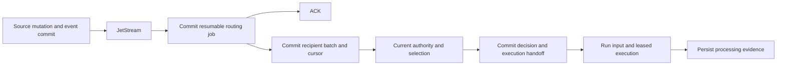

# Agent event-to-execution contract v1

Status: accepted. The user confirmed shared understanding of the integrated
design on 2026-09-28. The product decisions Q1-Q27 are accepted in the
[decision record](2026-09-28-durable-agent-event-routing.md).
This document specifies work for [Issue #70](https://github.com/kent8192/aidash/issues/70);
it does not claim implemented or tested runtime behavior.

## Scope and invariants

PostgreSQL is authoritative for source events, subscription history, routing,
recipient decisions and execution handoff. JetStream delivers notifications
within a Node. Remote work uses the existing scoped Federation grant/admission
and command contracts; a peer need not operate NATS or expose its database.

The source mutation and event commit atomically. Every eligible logical
recipient receives its own durable processing obligation. Subscription
eligibility is not authorization, response selection is not permission to act,
handoff is not processing completion, and recovery is not a new instruction to
repeat an external effect. Existing Run leases, input completion fences, Task
claims, effect identities and unsafe-effect reconciliation remain authoritative.

All new queries and migrations use SeaORM/SeaQuery. Any indispensable DDL that
SeaQuery cannot express must be documented as a specific exception. SQLx may
execute the constructed statements.

## Versioned contracts and identities

Wire/schema version, configuration revision, exact Agent definition version and
aggregate revision are separate values. New routing contracts start at version
1; unknown versions are durably quarantined with an upgrade-required reason,
not interpreted as the latest known version. Additive event metadata preserves
the existing CloudEvents envelope and ordinary event/SSE consumers.

| Record                     | Required meaning and fields                                                                                                                                                                                                                                                                                                                                                     |
| -------------------------- | ------------------------------------------------------------------------------------------------------------------------------------------------------------------------------------------------------------------------------------------------------------------------------------------------------------------------------------------------------------------------------- |
| Logical participant        | Stable participant ID, tenant, Workspace, role, lifecycle revision, current authority binding/delegation chain and retirement state. Definition identity and worker identity are separate.                                                                                                                                                                                      |
| Handler                    | Stable ID under a logical participant for delivery deduplication. Immutable handler configuration revisions carry purpose (`claim_task`, `append_input`, `start_work`), work-correlation rule, exact definition ID/version/digest and selection policy; each revision has an effective sequence interval. An upgrade retains the stable handler ID.                             |
| Subscription revision      | Subscription ID/revision, stable handler ID and exact handler configuration revision, event kinds, Workspace and optional Task/thread scope, deterministic allow/deny conditions, explicit-recipient behavior and effective sequence interval. Overlapping matches for one handler at one boundary must agree on its configuration revision.                                    |
| Canonical event            | Source Node and event ID, commit sequence, tenant/Workspace resolved from trusted source data, kind and schema version, aggregate kind/ID/revision where applicable, actor participant, recipients, correlation, causal parent/root references and authorized content reference. The broker envelope is not trusted authority for these fields.                                 |
| Routing job                | Unique canonical-event reference, routing-contract version, historical subscription boundary, enumeration cursor, status, lease/fencing token, attempts, next retry and safe error code. A duplicate broker message recovers the same job.                                                                                                                                      |
| Recipient delivery         | Tenant/Workspace, event, logical participant and stable handler as the unique identity; matched subscriptions/revisions, selected handler configuration revision and copied exact definition ID/version/digest, decision/attempt history, current state, work key, input/Task/Run/handoff references, causal roots, suppression evidence, retry/wait conditions and timestamps. |
| Execution handoff          | Unique delivery reference, accepted operation (`create`, `resume`, `enqueue_input`), durable work key and Task/Run/input or pending execution-queue identity. Remote handoff references the durable scoped command/admission until the receiver supplies its Run linkage.                                                                                                       |
| Historical routing request | Actor, idempotency key, explicit mode, event range, recipient/handler scope, pinned request configuration, preview counts, progress and per-delivery results. Its ID never becomes a new execution-idempotency namespace.                                                                                                                                                       |

Different subscription conditions for one handler contribute match evidence to
one delivery. Separate handlers may perform genuinely separate responsibilities;
renaming/editing conditions must not mint a new handler merely to repeat work.
Definition pins do not form part of the work key, so an upgrade cannot permit
two incompatible Runs to execute the same correlated work concurrently.
The event-time subscription revision selects an immutable handler configuration
revision. Fanout copies that revision and its exact definition binding onto the
delivery before the routing cursor advances. Delayed broker delivery, retries
and recovery use this copied binding, never the handler's current configuration.

The API validates finite event-kind sets and bounded declarative predicates;
subscriber configuration does not contain executable SQL or arbitrary code.
Tenant and Workspace boundaries, deny rules and current authority take
precedence over all positive matches and Jev outcomes.

## Eligibility, authority and configuration changes

Participation and subscription changes share the source event commit-order
mechanism. A change records a boundary sequence: events after that boundary use
the new revision, and events before it retain their original eligibility.
Intervals are resolved from immutable history, not timestamps or broker arrival
order. Activation does not acquire earlier events implicitly.

Evaluate current participant, subscription, delegated subject, resource and
definition authority before content retrieval for either an Agent or Jev, then
again before handoff and subsequent execution/effect boundaries. Use the
repository's authorization and visibility fences with short transactions;
do not hold database locks across model/provider or remote calls. Reacquire
and validate the relevant revisions before committing a result. Authorization
service failure defers work without exposing content or executing it.

Disablement, revocation and retirement leave durable stop barriers, including
for earlier events whose recipient rows have not yet been enumerated. Checking
only the current enabled flag after re-enablement is insufficient: that would
revive work stopped while the router was offline. Unhanded work covered by a
barrier becomes `suppressed`; work already handed off is fenced at its next
boundary and exposed as blocked/suppressed, not reported as completed. A Run
whose context can no longer be used safely remains paused for authorized
recovery. Re-enabling/restoring authority alone does not clear these records.

Explicit retry revalidates the selected definition and authority and appends a
new decision attempt to the same delivery. An Agent definition upgrade applies
to later handler configuration and subscription revisions at the same effective
sequence boundary; previous deliveries and Runs retain their copied pins while
valid. The stable handler ID and delivery key remain unchanged by that upgrade.
Removal retires the participant; re-invitation creates a new identity. A replay
request does not impersonate the retired participant.

## Event catalog and role templates

All templates are editable within authority limits. Matching an event does not
automatically mean `respond`; explicit addressed requests that need no semantic
selection bypass Jev, while untargeted business events use the configured
bounded relevance decision after deterministic filtering.

| Source occurrence            | Canonical event and ordering                                                                                                                                            | Default interested role/purpose                                                                                                  |
| ---------------------------- | ----------------------------------------------------------------------------------------------------------------------------------------------------------------------- | -------------------------------------------------------------------------------------------------------------------------------- |
| New Workspace/thread message | `message.created`; preserve each message identity and order within its explicit work/thread scope. Thread-open metadata does not create another copy of the root input. | Goal/coordinator; explicitly addressed eligible handlers.                                                                        |
| New available Task           | `task.created`; Task revision, dependency readiness and current claim state.                                                                                            | Task executor competes for the existing Task; coordinator may handle it as separately correlated planning work.                  |
| Meaningful Task update       | `task.updated`; compare revisions within that Task and evaluate relevant changed fields/current state.                                                                  | Coordinator following related work; a failed Task can be observed as distinct coordination work without reviving its failed Run. |
| Published Artifact           | `artifact.published`; stable Artifact ID and publication sequence. Distinct publications are not collapsed merely because their Task has advanced.                      | Reviewer starts a distinct review Task; coordinator follows related outcomes.                                                    |
| Changed Workspace goal       | Versioned `workspace.goal_changed` event with Workspace revision and actual goal-change provenance.                                                                     | Goal/coordinator revises explicitly correlated planning work.                                                                    |

The inspected `workspace.updated` producer updates Workspace state; it must not
be mislabeled as a goal change. Implementation must provide a real authorized,
revision-checked goal mutation that emits the goal-change event in the same
transaction, and connect it to the existing Workspace goal controls.

Internal `run.*` transitions, thread bookkeeping, routing/decision events and
ordinary self-originated publications are not default autonomous triggers.
Declaring additional supported kinds requires an event-catalog contract with
ordering, content authority and stale handling; unknown kinds cannot cause
execution. Event bookkeeping must not recursively manufacture more work.

Explicit destinations resolve to participant IDs. Ambiguous names or shared
definition references require disambiguation. Preserve existing legacy direct
Run-input semantics: canonical linkage to an already admitted `run_inputs`
record is reused, and its `message.created` event cannot start another response
for that same addressed work. Do not infer a new participant from a legacy
definition reference or broadcast an ambiguous direct request.

## Handoff, ACK and recovery

1. Validate the notification against the canonical database event. Commit the
   unique resumable routing job before ACK. PostgreSQL unavailability means
   no successful durable handoff and therefore no normal ACK.
   Malformed or noncanonical notifications receive a durable sanitized
   rejection/quarantine disposition before terminal broker acknowledgment;
   they cannot supply substitute event bodies or authority.
2. A leased routing worker enumerates the event-time subscriber set in bounded
   batches. Insert deliveries/match evidence and advance the cursor in one
   transaction. Restart from the committed cursor; completed fanout is not
   rerun under a newer subscription snapshot.
3. A recipient worker claims a delivery with a lease/fencing token, records
   its attempt, runs deterministic filters and, where required, Jev. Persist
   retries and wait conditions. Expired ownership cannot commit later results.
4. Recheck current authority, stop barriers, definition compatibility, Task
   revision and work ownership. In a short transaction, persist the response
   decision with its create/resume/enqueue disposition, durable execution
   linkage and required budget reservation. A crash cannot leave a recorded
   accepted handoff with no runnable or recoverable obligation behind it.
5. Execution uses the existing Run/input/effect contracts. Report processing
   completion from input-consumption and promised Task/Run handling evidence;
   broker ACK, an Agent wakeup and Run allocation alone do not prove it.

Before recipient work for a later event proceeds, the router establishes the
required earlier canonical-event prefix for that work/aggregate. A newer broker
notification can trigger bounded gap filling from PostgreSQL; this is part of
event-driven routing, not a periodic recovery scan. Sequence values need not
be gapless, and unrelated aggregates need not finish in global order. A slow
Jev decision does not block recipient enumeration or independent recipients.

Periodic recovery finds missing routing jobs from canonical events and resumes
unfinished jobs/deliveries. Broker outage/recovery uses the same pipeline and
identities. Transient infrastructure failures retry durably with exponential
backoff capped at 60 seconds; configuration/schema failures remain inspectable
and require correction. These retries do not retry unsafe external effects.
Jev uses its separately bounded policy below.

For remote work, commit a durable scoped handoff/command locally with the
delivery decision, reuse its identity across transport retries, and link the
receiver's acknowledged admission/Run without creating another Task claim.
If the peer cannot enforce the required participant/definition binding, leave
the delivery blocked with an explicit compatibility reason. A local database
commit does not claim atomic creation in a remote database.

## Recipient state and execution behavior

Selection outcome, handoff operation and processing result are separate fields
with append-only attempt evidence. The following states describe recoverable
obligations, not merely display labels.

| State                       | Meaning and permitted progression                                                                                                                                                                 |
| --------------------------- | ------------------------------------------------------------------------------------------------------------------------------------------------------------------------------------------------- |
| `pending` / `selecting`     | Durable recipient obligation awaiting or holding a fenced selection lease. Expired leases return to eligible pending work.                                                                        |
| `deferred`                  | No permitted handoff yet; retain a typed reason and a retry time or validated wait condition. Capacity/authority availability, semantic uncertainty and budget exhaustion remain distinguishable. |
| `attention_required`        | Automatic semantic rounds, transport attempts or the 24-hour unresolved window are exhausted. Preserve the obligation for an authorized retry or explicit dismissal.                              |
| `skipped`                   | A recorded disposition such as unrelated content, stale state notification, another claimant, terminal input-only target or default self-trigger suppression. It is not successful execution.     |
| `suppressed`                | A lifecycle/permission stop barrier prevents further use. Only explicit authorized recovery can reconsider; restored flags alone cannot activate it.                                              |
| `handed_off` / `processing` | Decision and Run/input/durable execution-queue linkage committed together. Recover existing work and effect identities; do not make a second handoff on redelivery.                               |
| `completed`                 | The promised handling is evidenced. Keep its deduplication protection; neither retry nor historical routing resets completion.                                                                    |
| `failed`                    | Linked execution reached a terminal failure or unrecoverable contract error. Keep the failure and linkage; recovery is explicit and respects the existing Run/effect contract.                    |

Reason codes are bounded identifiers such as `not_relevant`, `stale_revision`,
`already_claimed`, `target_terminal`, `definition_revoked`,
`subscription_disabled`, `content_unavailable`, `input_capacity`,
`authority_unavailable`, `semantic_uncertain`, `selection_unavailable`,
`budget_exhausted` and `contract_unsupported`. Human-readable explanations are
localized and sanitized; model scratch reasoning and raw provider errors are
not stored as user-visible justifications.

| Work situation                                                | Required handoff behavior                                                                                                                                                                                                  |
| ------------------------------------------------------------- | -------------------------------------------------------------------------------------------------------------------------------------------------------------------------------------------------------------------------- |
| Compatible active Run, same participant and explicit work key | Append ordered input and delivery linkage under the input/terminal fence. If already executing, enqueue input; wake an ordinary matching event wait when permitted.                                                        |
| No active Run, handler can start distinct work                | Atomically create its Task/Run or durable queued work identity and delivery linkage. Independent reviewers receive independent Tasks.                                                                                      |
| Claim handler targeting an available Task                     | Recheck current revision, readiness and authority, then atomically win its sole claim or record the conflict. Never clone the Task merely because two recipients selected respond.                                         |
| Same work already active under another definition             | Preserve input/intent durably; do not mix definitions or allocate a concurrent replacement. Later admission remains subject to purpose and terminal-target rules.                                                          |
| Manually paused or approval/reconciliation-blocked Run        | Retain ordered input without bypassing the control or gate. A pause continues to hold that work's position.                                                                                                                |
| Completing Run                                                | Admission and terminal completion serialize. An input admitted before completion must satisfy existing completion fences; otherwise keep an explicit disposition and apply terminal behavior after completion resolves.    |
| Completed correlated work                                     | A `start_work` handler may create an explicitly related follow-up with fresh Task/Run IDs. Input-only/claim-only handlers report target termination. Never reopen the previous Run or attach a child to a terminal parent. |
| Failed/cancelled correlated work                              | Require an explicit authorized recovery decision. A notification about that failure can still be distinct coordination work for another handler.                                                                           |

At most one nonterminal execution occupies a participant/work key; initially,
at most two independent active Runs occupy a logical participant. Stricter
existing session ordering wins. Configuration edits do not silently change
previously committed work identities or bypass controls.

Large event bodies remain in authorized source storage. Queue references and
bounded event-input envelopes must not claim the model read omitted content;
use authorized retrieval and input-consumption evidence. If required context
cannot fit or be retrieved, defer visibly rather than truncate an accepted
instruction or report it processed.

## Bounded response selection and reaction budgets

Use a separate event-selection adapter over the approved Jev transport. Its
validated result is `respond`, `skip` or `defer`, with a bounded reason code and
optional typed wait condition. It receives only authorized, bounded event and
role/context data; it cannot choose new recipients, broaden authority, invent
resource IDs or grant execution. This contract does not change compaction's
existing questions, behavior or timeout.

| Setting                                         | Accepted initial value                                           |
| ----------------------------------------------- | ---------------------------------------------------------------- |
| Jev transport attempts in one decision round    | 3 total, 10 seconds each; retry delays 5 seconds then 30 seconds |
| Automatic semantic decision rounds              | 3 total including the initial round; condition changes coalesce  |
| Unresolved semantic deferral attention deadline | 24 hours from initial deferral; further changes do not reset it  |
| Independent active Runs per logical participant | 2, subject to stricter session controls                          |
| Response handoffs per reaction root             | 16 across all branches and follow-ups                            |
| Maximum reaction depth                          | 4; originating event is depth 0 and first reaction is depth 1    |
| Model/Jev spending allowance per root           | USD 1; stricter tenant/Workspace constraints win                 |

Valid wake conditions refer to explicitly related new input/state revisions,
declared dependency completion, or authorized manual reconsideration. A Jev
transport outage does not become a semantic `skip`; an invalid answer does not
become permission to respond. Manual retries append attempt history and may
start a new explicit retry cycle but do not erase prior costs or causal limits.

Reserve a configured, usable upper bound before each model/Jev request and
reserve handoff capacity with its unique delivery. Unknown outcomes retain
their conservative charge until trustworthy usage permits reconciliation;
timeouts alone do not justify refunds. A retry may incur another provider
charge, while recovering the same committed handoff does not consume another
handoff slot. Missing cost bounds cause visible deferral.

Propagate causal roots through resulting events and follow-ups. Replay-job IDs,
new subscription revisions and resumed workers do not mint fresh allowances.
When an inference handles outstanding input from several roots, each root
must have a sufficient conservative reservation; store the provider request
once so accounting does not present duplicate invoices. Merely reading
historical context does not revive its old execution obligations. An authorized
explicit budget extension records its actor and previous/new limits.

These are admission protections, not measured performance targets or a promise
that arbitrary external Tool charges are capped. Existing Tool authorization
and effect rules continue to govern those actions.

## Capacity, retention and replay

Deployment configuration supplies finite subscription, fanout-batch, pending
work, source-size and storage-admission limits. Validate them before enabling
routing, reserve enough durable capacity for newly accepted obligations and
keep control/recovery capacity separate. Already committed events or inputs
must not disappear because a downstream queue is full. Pause new execution
admission when necessary; if a new external submission cannot be preserved,
reject its transaction with an explicit retryable capacity result. Cancellation,
authorization changes and recovery controls remain available under pressure.

Live recovery resumes existing jobs, deliveries, decisions and effects.
Explicit historical operations have two distinct modes:

- Retry existing unfinished or explicitly reconsiderable deliveries, preserving
  their selected identity, definition and effect linkage under current authority.
- Route a selected available event range to selected new recipients/handlers,
  using an explicitly pinned current subscription configuration rather than
  pretending those participants existed at the original event boundary.

Both modes preview scope and counts, require current management/execution
authority and persist idempotent job progress. A preview is advisory: execution
rechecks authority, availability and budget. Existing completed deliveries
are no-ops with visible prior results. Deliberately repeating completed work is
a new explicitly authorized Task with a relationship to the original work.

Inherit tenant-approved retention by data class; without such a policy,
automatic purge is disabled. Keep unresolved obligations, definition and
subscription history needed for them, and effect reconciliation evidence.
Explicit source deletion removes visibility immediately and converts dependent
unusable work to a visible `content_unavailable` disposition without restoring
the content through broker payloads or backups.

After content expiry, retain only permitted minimal deduplication metadata or
advance a durable replay floor below which events are rejected. Do not advance
a floor across unresolved protected work. Purging a delivery row without either
protection would turn an old broker message into fresh executable work and is
invalid. A source-authorized event may still have retention-expired content;
report that distinction without fabricating successful handling.

## API and contextual UI inventory

The following routes are the v1 design inventory, not implemented endpoints.
Reuse the repository's error, authentication, pagination and idempotency
conventions. Resolve all resource scopes server-side, require expected revisions
for configuration mutations, and use stable cursors for lists.

| Surface                                                                      | Planned operation and authority                                                                                                                                                      |
| ---------------------------------------------------------------------------- | ------------------------------------------------------------------------------------------------------------------------------------------------------------------------------------ |
| `/api/workspaces/{workspace}/agent-participants`                             | List authorized participants and create explicit participation with role/subscription preview; configuration requires participation management and eligible delegated authority.     |
| `/api/workspaces/{workspace}/agent-participants/{participant}`               | Read/update role or pinned definition, or retire the participant using revision checks. Re-invitation uses a new ID.                                                                 |
| `/api/workspaces/{workspace}/agent-participants/{participant}/subscriptions` | Inspect/create/edit/disable subscriptions and handlers within the participant's allowed scope; record effective sequence boundaries and stop barriers.                               |
| `/api/workspaces/{workspace}/goal`                                           | Revision-checked authorized goal update with a transactional goal-change event.                                                                                                      |
| `/api/workspaces/{workspace}/event-deliveries`                               | Filtered inspection by event, participant, handler, state, Task or Run; require routing inspection plus current source/participant visibility.                                       |
| `/api/workspaces/{workspace}/event-deliveries/{delivery}/retry`              | Explicit idempotent retry/reconsideration with current delivery-management and execution authority; completed handling is not reset.                                                 |
| `/api/workspaces/{workspace}/event-routing/history/preview` and `/history`   | Preview and submit the two explicit historical modes; pin request scope and require historical-routing management plus current execution authority.                                  |
| `/api/workspaces/{workspace}/event-routing/jobs/{job}`                       | Inspect authorized routing/history progress and failure reasons, without exposing hidden recipients through counts or identifiers.                                                   |
| `/api/workspaces/{workspace}/event-routing/budgets/{root}`                   | Inspect allowed budget information; explicit extension requires a separate budget-management action and audit.                                                                       |
| `/api/workspaces/{workspace}/event-routing/control`                          | Revision-checked operational start/stop of new routing. This preserves subscriptions and pending obligations, while ordinary disablement retains its separate suppression semantics. |

The existing direct Run-message endpoint keeps its current acceptance/rejection
contract. Additive delivery references connect those inputs to event history
without making users submit them again through a new endpoint.

Participant details contain role, exact definition, subscription configuration
and enablement. Event/message contextual details show authorized recipient
selection, handoff, processing, reasons and Task/Run links. A contextual attention
list collects actionable defer/failure/capacity states and opens the same origin.
Do not post every successful routing decision into the conversation timeline.

Expose inspection, management, retry, historical routing and budget extension
as independent policy actions. An Agent cannot grant itself a role, elevate its
delegator or self-approve additional budget. Render en-US and ja-JP states,
reasons, actions and errors; omit or redact data inaccessible to the current
viewer, including recipient existence or aggregate counts when those would
disclose protected information. Source deletion and policy changes invalidate
previously displayed detail.

## Migration, enablement and rollback

1. Add versioned records, constraints, historical boundaries and worker contract
   fencing with SeaORM/SeaQuery migrations. Keep routing disabled for existing
   Workspaces. Do not reinterpret the global inbox as proof of per-Agent work.
2. Deploy compatible control, routing and execution workers, using a versioned
   durable routing consumer independent of the legacy shared `execution`
   consumer. Old consumers must not ACK away the new router's notifications;
   recipient subscriptions remain logical database records rather than a
   consumer per Agent. Bring this consumer up before enabling new subscriptions.
   New event-created
   work declares its required worker contract; an older worker cannot lease or
   mutate it through an unguarded legacy path. Test this fence during mixed
   version operation rather than relying only on deployment order.
3. Validate authority bindings, exact definitions, supported event kinds,
   finite capacity settings and usable provider cost bounds. Explicitly set up
   participants/subscriptions in existing Workspaces; preserve old Task/Run and
   input history without assigning every Registry entry or reader a participant.
4. Enable from a committed sequence boundary. Newly invited participants use
   the role subscription flow. Historical execution requires its separate
   explicit request. Grant the new policy actions explicitly; there is no
   wildcard migration that expands existing permissions.
5. Operational rollback stops new routing/admission while retaining jobs,
   pending deliveries, stop barriers, budgets, input links and effects. Quiesce
   compatible workers before any binary rollback; do not drop routing tables
   or permit an older binary to process incompatible work. Resume through the
   same durable contract after repair.

Implement database/state contracts first, then router and recipient workers,
execution integration, APIs/contextual UI, and the full fault matrix below.
This sequence preserves all acceptance criteria; merging these documents does
not deliver the runtime implementation.

## Acceptance matrix

Use real PostgreSQL and JetStream, deterministic model/Jev fixtures and explicit
fault barriers. Fixture success establishes routing/recovery behavior, not the
quality of commercial-model relevance decisions. All cases remain unexecuted.

| Case                                            | Required evidence                                                                                                                                                                                                                                                                                                                                            |
| ----------------------------------------------- | ------------------------------------------------------------------------------------------------------------------------------------------------------------------------------------------------------------------------------------------------------------------------------------------------------------------------------------------------------------ |
| Healthy fanout                                  | Two eligible logical recipients produce distinct evidenced handling; an unauthorized recipient receives no content or inference request. Disable every periodic recovery scan and prove event/job/delivery/Run linkage from broker delivery.                                                                                                                 |
| Shared definition and overlapping subscriptions | Separate participants sharing a definition both receive work; multiple matching conditions for one handler yield one delivery and one handoff with all match evidence.                                                                                                                                                                                       |
| Duplicate delivery                              | Repeated broker delivery before and after ACK recovers the same job/delivery and does not repeat Run creation, Task claim, input or external effect.                                                                                                                                                                                                         |
| Event-time eligibility                          | Delay broker delivery across subscription edits and definition upgrades. Verify the prior handler configuration revision and exact definition are copied to the old delivery, later events use the new revision, and both retain the same stable handler deduplication identity. Enrollment and broadening do not acquire old events; explicit history does. |
| Stop while offline                              | Disable/revoke and re-enable before fanout resumes; historical stop barriers still suppress old obligations. Retirement/re-invitation does not reuse identity.                                                                                                                                                                                               |
| Current authorization                           | Revoke before content retrieval, during Jev, before handoff and before an effect; every subsequent boundary fails closed. Include unavailable authority service, cross-tenant, hidden thread and deleted source cases.                                                                                                                                       |
| Out-of-order/stale data                         | Deliver later revisions first; gap fill and aggregate ordering cannot regress state. Preserve distinct messages and publications; stale Task state cannot win a duplicate claim.                                                                                                                                                                             |
| Concurrent decisions                            | Race two workers on one delivery and two recipients on one Task. Lease fencing, unique identities and Task revision enforce one handoff per recipient and one Task owner.                                                                                                                                                                                    |
| Crash around ACK/fanout                         | Crash before routing-job commit, after commit before ACK, after ACK before fanout, and between recipient batch writes/cursor commits. Every acknowledged obligation resumes without loss or duplicate effects.                                                                                                                                               |
| Crash around selection/handoff                  | Crash before/after provider attempt persistence and before/after decision plus input/Run commit; retain conservative unknown charges and existing handoff/effect identity.                                                                                                                                                                                   |
| Terminal race                                   | Block final inference; admit a related input concurrently with completion. Verify consumed admitted input, explicit rejection/disposition or linked follow-up according to handler purpose, with no revived terminal Run.                                                                                                                                    |
| Pauses and definition changes                   | Pause, wait for approval/reconciliation, upgrade a definition and submit input. Respect gates, pins, one-Run-per-work and the two-independent-Run cap.                                                                                                                                                                                                       |
| Broker outage                                   | Accumulate canonical outbox events, exercise durable recovery, restore JetStream and redeliver; final recipient work/effects remain unique. Report recovery separately from healthy event-driven proof.                                                                                                                                                      |
| Semantic failure and defer                      | Exercise all three outcomes, malformed result, ten-second timeout, exact retry limits/delays, condition coalescing, three-round cap and the non-resetting 24-hour attention deadline.                                                                                                                                                                        |
| Reaction budgets                                | Cross-Agent feedback, self-trigger suppression, branches, multiple roots, follow-ups and retries cannot evade depth/handoff/cost bounds. Missing cost bounds defer; authorized extensions retain audit and prior usage.                                                                                                                                      |
| Capacity                                        | Fill configured limits, crash and resume, reject unpreservable new submissions before commit, and demonstrate cancellation/revocation/recovery controls remain usable.                                                                                                                                                                                       |
| Historical routing/effects                      | Retry existing work and route history to new recipients; reuse prior completed results. Preserve unsafe-effect reconciliation and prove replay cannot reset an effect or reaction budget.                                                                                                                                                                    |
| Retention/deletion                              | Expire/delete source content, prune eligible metadata and replay old broker messages. Verify missing-content results, replay-floor/tombstone protection and no unauthorized restoration.                                                                                                                                                                     |
| API/UI                                          | Verify action-specific permissions, current-authority filtering, preview/execution races, revision conflicts, pagination, idempotency and en-US/ja-JP contextual flows with return links.                                                                                                                                                                    |
| Migration/rollback                              | Upgrade an existing Workspace without automatic subscribers, mix old/new workers, explicitly enable, stop and resume. Existing direct Run inputs retain their behavior and old workers cannot process new incompatible work.                                                                                                                                 |

Each of Issue #70's acceptance criteria is represented above: versioned scoped
contracts; eligible fanout and Jev; atomic execution linkage; durable ACK and
recipient deduplication; ordering; retry/replay/effect safety; contextual APIs
and localization; real dependency fault tests; and documented limitations.
Record the tested revision and raw evidence when implementation runs these
checks. Documentation validation alone does not satisfy any runtime gate.
