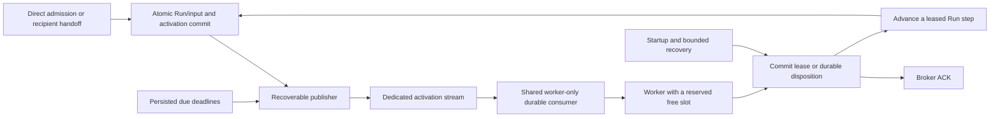

# Independent Harness worker activation specification

Status: **Q1-Q14 accepted; implementation authorized**, 2026-09-28. The user confirmed the shared understanding and requested implementation. This document defines the contract; runtime evidence is reported separately. [Issue #71](https://github.com/kent8192/aidash/issues/71), the [decision register](2026-09-28-worker-activation.md) and [glossary](../../CONTEXT.md) define its scope. Source inspection used `20d1fb46f13cf042af6afce7763140c132428b78`; a later comparison to `origin/develop/0.1.0` at `6b90aca` found no changes to the inspected activation/execution code.

## 1. Contract and ownership

Every committed transition that makes a Run eligible to advance persists its activation obligation in the same PostgreSQL transaction. #70 owns logical recipient selection and durable Run/input handoff; #71 supplies the shared activation contract used by that handoff and direct admission. #38 retains remote admission, Home-command authority and durable remote input/result delivery. Notification delivery cannot grant authority, bypass a visibility barrier, revive a terminal Run or authorize replay of an uncertain effect.

Equivalent workers in one executing Node and execution-capability profile share a dedicated durable JetStream pull consumer. The server-only role never consumes worker activations. All roles can publish committed activation obligations and promote due deadlines. PostgreSQL owns Run state, pending responsibility, lease/fencing, input progress and effect history; JetStream is a recoverable transport with bounded retention.



Only a successfully leased disposition enters `Advance a leased Run step`. A deferred/no-op disposition ACKs with its recorded responsibility and does not execute. Recovery reserves a worker slot and uses the same authority, visibility, eligibility and fencing checks as notification-driven claiming.

| Role | Publish/promote obligations | Consume activations / execute Runs | HTTP |
| --- | --- | --- | --- |
| server | Yes | No | Yes |
| worker | Yes | Yes | No |
| combined | Yes | Yes | Yes |

#70's routing consumer is separate and its deployment ownership remains with #70. This specification does not create one process or broker consumer per logical Agent.

## 2. Durable model and invariants

Names below describe the logical contract; physical tables and Rust symbols may follow existing repository conventions. Migrations and queries use SeaORM/SeaQuery. An activation mutation helper must accept the caller's transaction so Run/input changes cannot commit independently of their activation obligations.

| State | Purpose |
| --- | --- |
| Requested activation generation | Monotonic scheduling version for one Run, updated under the same serialization boundary as its triggering state change. |
| Claimed generation and fencing token | The generation an execution step took responsibility for, bound to its valid Run lease. |
| Settled generation / dispositions | Evidence of which activation obligations are handled or no longer actionable. A watermark represents only a settled contiguous prefix; preserve per-obligation dispositions and pending triggers wherever unresolved gaps exist. |
| Pending trigger/deadline | Remaining reason to reconsider a Run, including due time or a dependency/control/visibility-release trigger. Preserve independent triggers and their earliest eligible due time. |
| Activation ID and publication epoch | Stable logical identity plus a durable transport-delivery round. Retries of an uncertain publication reuse the round; intentional re-notification advances it. |
| Publication claim/result | Expiring ownership of a publish attempt, next attempt, confirmation/error and sanitized diagnostics. A publish confirmation never settles execution responsibility. |
| Run input ledger | Existing accepted-input identity, sequence and observation position. Activation progress cannot substitute for input observation. |

Required invariants:

1. A transaction rollback leaves neither a runnable transition nor its activation obligation visible. A successful commit retains both even if the process dies before publication.
2. Publication, deadline promotion and claiming respect the existing distributed-transaction visibility gate. An early or forged notification cannot make hidden state executable.
3. Each claim reloads current eligible state, preserves ordering and live authorization checks, and commits a lease/fencing token. Notification contents never become execution instructions.
4. A worker settles only responsibility captured by its own valid claim. Newer requested generations, accepted inputs and independent deadlines survive concurrent completion of an older step.
5. A scheduling generation being claimed or settled does not prove that input was included in inference. Existing stale-inference and terminal-completion checks remain authoritative.
6. The durable step transition also releases/reassigns scheduling responsibility: actionable continuation or pending input is re-armed atomically; future or blocked work retains its next trigger. The current worker may compete for the next step but cannot monopolize it through an implicit local continuation.
7. Run state, effect journal and generation progress protect against duplicates beyond the broker duplicate window. Coalescing hints does not remove recipient deliveries or accepted inputs.
8. A record needed for unresolved work cannot expire with the broker queue. Deleting settled activation rows requires retained generation/tombstone evidence sufficient to reject historical duplicates. General data-retention policy stays under #73.

Independent future deadlines remain explicit obligations even when newer immediate work is handled. Do not use a single maximum generation or one replaceable due-time field to infer that every older trigger is settled.

## 3. Notification and handoff lifecycle

Use a versioned reference envelope containing only protocol version, executing Node ID, Run ID, activation ID and activation generation. Broker metadata carries the publication epoch/deduplication key. Keep prompts, event bodies, credentials, model configuration and effect instructions in authorized durable storage. Validate the envelope and its correspondence to the durable activation; never trust its Node or generation as an instruction to modify unrelated state.

The publisher claims a bounded set of due obligations with an expiring database claim, commits the claim, and publishes without holding a Run row lock across network I/O. It records JetStream persistence confirmation conditionally against that publication claim/epoch. A crash or uncertain acknowledgment retries the same publication epoch. Deliberate re-notification after deferral, loss or reconciliation uses a new epoch so a recent broker deduplication entry cannot suppress needed delivery.

The receiving worker first reserves a free local execution slot and pulls at most one message for it. It validates the reference, acquires required visibility/authority protection, and transactionally performs one of these dispositions:

| Current condition | Durable result before ACK | Later responsibility |
| --- | --- | --- |
| Named Run is eligible and unleased | Claim that Run with fencing and the captured activation generation. | Current owner advances one durable step; lease-expiry recovery covers a lost owner. |
| Matching generation was already handled | Record/confirm idempotent disposition without modifying newer progress. | Any newer generation keeps its own responsibility. |
| Another worker owns the Run | Keep pending generation and a durable owner-release/lease-expiry recheck obligation. | Owner's step release re-arms pending eligible work; expiry/reconciliation repairs owner loss. |
| Retry/wake deadline is in the future | Keep the explicit due obligation; do not move an earlier actionable trigger into the future. | Deadline promotion uses the common notification path. |
| Run is paused or awaits a dependency/approval | Keep the identified unblock trigger and reconcile it after restart. | Resume, response, expiry or dependency release re-arms eligible work. |
| Terminal or superseded scheduling intent | Record no-op/superseded disposition from authoritative state. | No Run revival. Separate durable remote input/message delivery remains intact. |
| Database unavailable, visibility gate closed, lock/commit outcome uncertain | No success ACK without a proven committed handoff/disposition. | Bounded delayed retry/redelivery and independent recovery. |
| Invalid, unsupported or mismatched envelope | Commit sanitized quarantine metadata, then terminate that delivery. | Do not advance Run progress; recover compatible eligible work only from trusted state. |

ACK follows the committed disposition and does not wait for model/tool completion. If ACK fails after the database commit, retry/reconcile transport; never undo the committed lease or replay a step solely because ACK was lost. Before issuing an external operation, still validate the current lease and execution authority. Existing idempotent replay and unsafe-effect reconciliation determine what recovery may do.

Quarantine includes a reason, payload digest, delivery metadata and bounded verified identifiers where available, without arbitrary raw payload retention. Failed quarantine persistence leaves the message unacknowledged. An unsupported envelope does not justify executing incompatible durable Run/schema state through fallback.

## 4. Producers, time and concurrency

| Trigger | Required behavior |
| --- | --- |
| Direct admission; #70 recipient handoff | Persist activation in the same transaction as the Run/input decision; recipient eligibility remains #70's responsibility. |
| Accepted input; resume; human/approval response | Preserve existing legality and input ordering; record the pending generation atomically and activate when it permits progress. |
| Pause/cancel | Preserve existing control semantics. Cancellation processing may be executable even when normal progress is blocked. Retain the existing 250-ms committed-control check during inference. |
| Successful/error step transition | Persist any actionable continuation, retry deadline, pending input or terminal delivery responsibility with the step result. |
| Retry, wake or approval-expiry deadline | Inspect indexed due obligations at a maximum 250-ms interval using database time; create/refresh delivery without a broad runnable-Run scan. |
| Dependency, shared-capability ordering or transaction visibility release | Persist/recover the corresponding unblock obligation. A local Notify alone cannot be the release contract. |
| Owner dies or loses a lease | Respect the lease/fencing deadline, then recover the same durable state. Do not infer an unsafe effect did not happen. |
| Terminal Run has pending remote delivery | Preserve the existing #38 delivery/retry path independently of whether the Run can be leased again. |

An input arriving during inference does not add new immediate preemption semantics. Existing stale-response checks reject a response/finalization that omitted accepted input. New activation generations remain pending even if another worker receives and ACKs their durable deferral. Multiple due reasons must not overwrite one another; derive the next actionable deadline under current state.

Use one capacity-accounting path for notification and recovery claims. Pending pulls, delivered messages and executing steps together cannot consume more slots than configured. Expire/settle pending pulls before reallocating their slots to fallback so a delayed delivery cannot exceed the capacity bound. Broad recovery must remain able to run while broker pulls wait or connection attempts stall. Transport ACK releases broker pending capacity; the local execution slot remains occupied until its Run step stops.

## 5. Recovery, transport and operations

These are component defaults, not production throughput, availability or completion SLOs. Interval bounds apply with a functioning database and scheduler; record overload, slow database operations and lack of worker capacity separately rather than reporting fictitious recovery success.

| Parameter / behavior | Contract |
| --- | --- |
| Normal recovery scan cadence | Maximum 5 seconds between scheduling opportunities; bounded jitter stays within this maximum. |
| Broker unavailable/reconnecting | Maximum 1-second recovery cadence, independent of connection attempts. |
| Deadline scheduler | Maximum 250-ms interval over indexed due obligations, separate from broad recovery. |
| Reconnect | Exponential backoff starting at 500 ms, capped at 5 seconds including jitter; each connection/setup attempt has a 5-second total deadline. |
| Run lease | Preserve the current 30-second lease and existing heartbeat/fencing. Recovery cannot seize an unexpired lease. |
| Shutdown | Stop new pulls and claims immediately; drain current steps and HTTP within the existing total 20-second budget. Preserve unresolved work and consumer identity. |
| Broker stream | Dedicated per executing Node and compatible execution profile; File storage, WorkQueue retention, initial configurable MaxAge 24 hours / MaxBytes 1 GiB, DiscardNew. |
| Broker consumer | One stable durable pull consumer per activation scope/protocol; explicit ACK, at most one delivered message per reserved worker slot. Broker ACK timeout remains 30 seconds initially; DB recovery supplies the shorter missed-activation bound. |
| Broker deduplication | Initial 120-second transport window consistent with the existing publisher; correctness does not depend on it. Key includes logical activation and publication epoch. |
| Readiness | PostgreSQL readiness and draining remain decisive. Broker outage does not block HTTP/worker startup or remove otherwise valid readiness. |

Provision stable broker identities from deployment namespace/account, executing Node and protocol version, never Pod names or lossy character replacement alone. Production uses an operator provisioning command/manifest and role-scoped credentials; local development can explicitly bootstrap identical objects. Server-only credentials need publication but not activation pull/ACK capability. Worker/combined credentials also consume only their activation scope. Existing domain-event permissions remain separate. Validate persistent configuration; do not silently reset/delete an existing durable consumer to correct a mismatch. Report replication, consumer-wide capacity and credential scope in the deployment evidence; production scale/HA sizing stays with #73.

On broker capacity refusal, expiry, message/consumer loss or broker storage recreation, retain accepted work in PostgreSQL. Startup, reconnect and periodic recovery inspect eligible state and unresolved responsibility, repair transport obligations and allow compatible Run execution through fallback. A previous publish confirmation must not suppress this repair. Bound each scan batch and prevent starvation across successive batches; cadence alone does not guarantee a bounded drain time under arbitrary backlog.

Expose `event_driven`, `recovering`, `fallback` and `stopping`, plus sanitized reason and timestamps. Track oldest due obligation, pending publication, publish/ACK errors, deferred/quarantined deliveries, last successful recovery scan and claims by activation/recovery reason. Separate connection/subscription readiness from actual delivery progress since reconnect. Reconnect is complete only after consumer setup and reconciliation; when due work exists, verify progress before claiming restored delivery health. Private metrics use bounded labels, never Run/tenant/user IDs or secrets. Authorized operator diagnostics may show permitted Run linkage. New UI text, if added, supports en-US/ja-JP.

## 6. Rollout and shutdown

1. Add compatible schema and transactional activation helpers. Retain existing durable-state recovery while old producers/workers coexist.
2. Provision the activation stream/consumer and role credentials; validate configuration without making runtime startup depend on broker reachability.
3. Roll out compatible producers and workers. Reconciliation/backfill covers pre-existing work and writes from old producers that lack activation obligations. Do not claim the notification path is verified while old polling workers can satisfy the test.
4. Drain old workers, reconcile pending state, then run a fresh separate-process notification-path acceptance test on the delivered revision.
5. Rollback only to a Run/schema-compatible runtime; retain added schema, journals, activation obligations and broker objects. A rollback must be exercised, not assumed compatible.

On SIGTERM/SIGINT, mark draining and stop new admission to worker slots. Safely complete short committed dispositions/ACKs and drain current steps/HTTP within the same 20-second deadline. An uncommitted or uncertain handoff remains unacknowledged. Keep publication/recovery records durable if their background tasks stop. Do not eagerly release an execution lease while an external operation may continue; deadline/SIGKILL recovery follows the existing effect policy.

## 7. Failure checkpoints

| Fault injection point | Required evidence after recovery |
| --- | --- |
| Before Run/activation commit | Neither accepted work nor activation appears from the rolled-back transaction. |
| After commit, before publish claim/send | Accepted work survives and is published or recovered without a second admission. |
| After broker persistence, before DB publish result | Reuse publication identity on retry; duplicates cannot create another Run/step effect. |
| After receipt, before handoff commit | No success ACK; another attempt can complete the handoff. |
| Uncertain handoff commit | Reconcile actual state; neither guess success nor repeat an external operation. |
| After lease/disposition commit, before ACK | Redelivery observes committed ownership/disposition and preserves newer generations. |
| After ACK, before execution | Lease expiry recovers the original Run even if the broker record was removed. |
| During effect or before result persistence | Safe/idempotent adapters follow their durable key; uncertain unsafe effects require reconciliation. |
| During defer/re-notification inside duplicate window | New publication epoch delivers the still-pending generation without duplicate effects. |
| Concurrent newer input and old step completion | New obligation remains; accepted input cannot be omitted from a committed final response. |
| Before deadline promotion or visibility release | Restart reconstructs the trigger; no early execution or lost due work. |
| Broker disconnect, full queue, expiry or empty restart | Startup/admission remain available with PostgreSQL; fallback progresses compatible work and later broker repair converges. |
| Worker scale-to-zero, scale-up, rolling update or shutdown deadline | Durable work survives, leases remain fenced, consumer identity stays stable and duplicate effects do not appear. |

## 8. Acceptance matrix

All cases use real PostgreSQL and JetStream. Local providers/effect fixtures are deterministic and report actual calls; they do not establish commercial-model quality. Separate server/worker evidence means distinct OS PIDs running the Aidash executable, not tasks sharing a Federation/Notify inside a test process.

| ID | Scenario | Required assertion |
| --- | --- | --- |
| AT01 | Server-only process plus two independent worker processes; 100 sequential admissions after startup reconciliation | Notification-caused first valid lease p95 <= 1 second and maximum <= 2 seconds, with successful fixture execution and zero recovery claims in measured windows. |
| AT02 | Negative control: keep the broker/publisher healthy but suppress worker activation consumption after startup | Newly admitted work stays unclaimed through the healthy-path assertion interval while recovery is suppressed; enabling consumption produces the lease. |
| AT03 | Combined process plus independent worker; server-only consumer present | Same handoff contract; server-only role never drains the activation consumer; no local-Notify-only success evidence. |
| AT04 | Concurrent batch larger than available slots, including a deliberately blocked replica | Other replicas make progress, multiple worker PIDs execute, local capacity/prefetch is bounded and existing ordering holds; equal message counts are not required. |
| AT05 | Same activation repeated before/after broker duplicate window, and stale generations delivered out of order | No extra Run, concurrent lease ownership, lost input or duplicate fixture effect; newer generations remain valid. |
| AT06 | Concurrent accepted input, response commit and terminal transition | Existing input-ledger checks hold; activation settling cannot falsely mark new input observed or revive a completed Run. |
| AT07 | Admission, resume, human/approval response, cancel, step continuation and dependency release | Every legal runnable transition has atomic durable activation; invalid/unauthorized transitions remain rejected. |
| AT08 | Retry/wake/approval-expiry deadlines with broad recovery suppressed; earlier immediate input arrives later | Due scheduling produces notification-driven progress; future deadlines do not delay immediate eligible work. |
| AT09 | Transaction gate closed then committed/aborted; authority revoked before claim/effect | No uncommitted/hidden/unauthorized execution or content disclosure; release/reconciliation activates only eligible current state. |
| AT10 | Kill/restart processes at every checkpoint in section 7, including uncertain ACK/DB outcomes | Persistent handoff responsibility converges, fencing holds and each recorded effect result matches the fixture's actual calls. |
| AT11 | Broker absent at HTTP and worker startup, lost after setup and restored later | Acceptance survives in PostgreSQL, compatible work runs by bounded fallback, publisher/consumer recover and diagnostics reflect each mode. |
| AT12 | Shortened test retention, forced capacity refusal, consumer/message loss and broker restart with empty storage | No accepted-work loss; a previous publish ACK does not prevent reconstruction; normal notification delivery resumes. |
| AT13 | Malformed, wrong-Node, nonexistent/mismatched activation and unsupported-version envelopes; quarantine DB failure | No unauthorized generation mutation or execution; durable sanitized quarantine precedes TERM; persistence failure leaves delivery recoverable. |
| AT14 | Owner active while another worker receives pending activation; owner later releases or is killed | Pending generation survives ACK/defer; lease release or expiry re-arms it without unsafe replay. |
| AT15 | Actual SIGTERM drain, forced timeout/SIGKILL, scale-to-zero/up, mixed-version rollout and compatible rollback | No new claims while stopping, no consumer deletion, retained obligations and correct post-lease recovery. |
| AT16 | Metrics, authorized diagnostics, config mismatch and role credentials | Observable fallback/error/lag, bounded labels, no secrets, server pull denied, incompatible state fails closed and compatible recovery remains available. |
| AT17 | Shared handoff integration with #70; direct and remote admission boundaries | Real recipient handoff uses the atomic helper without redoing recipient selection; #38 authority and terminal delivery remain intact. A fixture substituting for #70 is labeled component-only evidence. |
| AT18 | Kubernetes and k3s deployment configuration | Stable consumer across Pod replacement, role credential/probe behavior and shutdown settings verified using the exact configuration/image under test. Release-wide two-Node acceptance remains separately tracked. |

Issue acceptance cross-reference:

| Issue #71 criterion | Primary evidence |
| --- | --- |
| 1. Committed runnable work, durable handoff and worker-owned consumption | AT01, AT03, AT07, AT17; sections 1-4. |
| 2. Separate server/worker notification path without recovery scanning | AT01-AT02 with causal delivery/lease correlation and zero recovery claims. |
| 3. Multiple replicas, fencing and duplicate safety in combined/split modes | AT03-AT06, AT10, AT14. |
| 4. Startup/reconciliation, bounded fallback and broker-independent availability | AT08, AT11-AT12, AT15. |
| 5. Restart/connection loss across publication, handoff, notification and lease | AT10-AT14; every section 7 checkpoint. |
| 6. Configuration, topology, reconnect, shutdown and observable fallback | AT15-AT16, AT18; sections 5-6 and the implementation runbook. |
| 7. Real PostgreSQL/JetStream, separate OS processes and revision/command evidence | AT01-AT18 using the evidence contract in section 9. |

The accepted 60-second recovery delay must cover each entire measured window. Collect the 100 AT01 samples in bounded windows if needed, recording the recovery counter at both ends and refusing contaminated samples as a failed measurement. Establish startup and quiescence barriers before opening each window; later step completions must not perform uninstrumented broad scans that could claim the next admission. Deadline scans may process only their explicit obligations and cannot serve as hidden general recovery.

Use a shared monotonic test time base and conservative commit boundaries: mark immediately before the runnable commit and acknowledge the first lease only after its commit. The outer elapsed interval is an upper bound on the requested commit-to-lease latency and includes transport/harness overhead. Preserve raw boundaries and report this measurement convention. Do not subtract provider latency from an admission/lease interval or use a transaction-start timestamp as the commit timestamp. Report every sample, sample count, maximum and percentile calculation; failures are not silently retried away.

## 9. Implementation surfaces and evidence delivery

| Surface | Required change |
| --- | --- |
| `src/main.rs`, `src/bus.rs` and a focused activation module | Separate role-owned activation publishing/consumption, supervised reconnect and shutdown. Use `module.rs` plus sibling directory conventions. |
| `src/store.rs`, migrations, Run/input transition helpers | Atomic obligations, conditional named-Run claim, generations, due triggers and durable dispositions using existing authority/lease rules. |
| `src/harness.rs` | Dispatch using free slots, preserve owner cancellation/input checks, publish durable continuation and arbitrate recovery fairly. |
| Generation, interaction, capability and transaction release paths | Inventory every producer and replace correctness dependence on local Notify with the shared transactional obligation. |
| Configuration, private metrics, deployment diagnostics | Expose the accepted intervals/modes, role credentials, validation and sanitized proof of fallback/notification progress. |
| `deploy/helm/aidash`, local fixtures, operations documentation | Provisioning/configuration, role topology, stable identities, reconnect, scale, drain, rollback and operator recovery procedures. |
| Integration tests and evidence | Separate executable processes, deterministic barriers/fault points, real services, raw timing and exact tested revision. |

The focused deliverables are `tests/worker_activation.rs` and `scripts/test-worker-activation.sh`. The wrapper reuses the repository's disposable integration-service and local-fixture credential conventions. See [operations](../operations/worker-activation.md) and the generated evidence reports for executed results; this acceptance matrix remains the contract, not a claim that every environment has passed.

```sh
# Focused separate-process acceptance:
bash scripts/test-worker-activation.sh

# Existing entry points, to run against the implementation as applicable:
bash scripts/test-rust.sh
bash scripts/test-cluster.sh kubernetes
bash scripts/test-cluster.sh k3s
```

Publish a machine-readable evidence report and a short operational summary with: full tested Git SHA, dirty-tree status, image digest when applicable, date/platform, exact commands and exit codes, service versions/configuration, topology and application PIDs, worker slot count, scan/scheduler settings, per-sample timing and activation-to-lease correlation, fault checkpoints, expected/observed effects, diagnostics, report paths and per-AT status. Never put credentials, prompts or arbitrary payloads in this report. Local results and hosted CI are separate facts.

Implementation and runtime evidence are maintained in
[the implementation report](../operations/worker-activation-verification.md).
The behavioral decision frontier is empty. Implementation and PR publication
were explicitly authorized. Local runtime results and the publication state of
the resulting PR are separate evidence; the verification report identifies the
tested source snapshot and remaining acceptance gaps.
