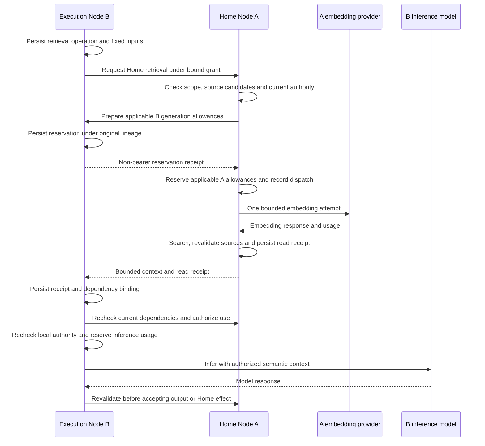

# Remote semantic memory: execution and acceptance specification

Status: accepted on 2026-09-30 after final design confirmation. Product decisions Q1-Q12 are recorded in the [decision record](2026-09-30-remote-semantic-memory.md). This records the accepted contract; implementation and verification results are recorded separately in the [implementation ledger](2026-09-30-remote-semantic-memory-implementation.md).

Issue: [#75](https://github.com/kent8192/aidash/issues/75). Base inspected: `827480c13d796bca142787be5bbd25ce34c80551`, `develop/0.1.0`.

## Supported scenario and release boundary

Home Node A owns a tenant, Workspace, Task and semantic sources. Execution Node B runs an explicitly admitted ordinary or generated Agent for that Task. When semantic retrieval is enabled for this execution, B obtains bounded, currently authorized context from A before each task-context inference. A performs search using its configured embedding service and vector backend, and B performs inference using the exact authorized model.

The remote semantic path is read-only. A's authorized local ingestion and management APIs continue to support Memory, Message and Artifact sources, updates, deletion, reindexing and model changes. The selected path does not perform remote `memory_write`, ingest into B as a substitute, combine B's own semantic store with A's results, or transfer subject/provider bearer values. Unsupported remote memory writes are excluded from advertised usable capabilities and explicitly rejected if requested.

Retrieval cannot enqueue operator-authorized background indexing to bypass a generated caller's limits. Home indexing retains its actual initiating identity, applicable generated ancestry and existing embedding approval/accounting; ingesting an output also requires its producer dependencies to remain readable. The remote acceptance case does not claim that generated remote writes or remote-initiated background ingestion are supported.

FR-MEM-001 and section 12 require this supported combination to be demonstrated; they do not require every remote Agent to search. Existing local memory acceptance, Kubernetes and k3s integration, generated-Agent limits, authorization, distributed transactions and A2A gates remain required. This design neither closes those gates nor changes release scope through [#67](https://github.com/kent8192/aidash/issues/67).

## Identity, enablement and provider bindings

The immutable execution binding includes:

- Home Node, Home tenant, Workspace, Task and task revision binding.
- Destination Node, remote grant, receiver admission and Run.
- Executor owning Node, Agent ID, exact definition version and digest.
- The original Home authority chain and receiving mapped identity, with credential and mapping identities bound as in scoped execution.
- An explicit retrieval mode: disabled or required Home retrieval. These are conceptual modes; final wire names may follow repository conventions.
- The Home index revision and approved embedding provider's node-qualified identity, immutable version and configuration digest.
- Authorized processing recipients: B's exact inference model and any explicitly approved external compaction provider.
- Applicable generated request identities, pinned policy revisions, ancestor links and authoritative budget owners.

Agent-scoped matching uses `(Home tenant, Home Workspace, Agent owning Node, Agent ID, version)`. Runs using the same exact definition can share authorized Agent-scoped sources. Unscoped Workspace sources can also qualify. Same-named Agents on different Nodes, different versions, other Workspaces and other tenants do not inherit access. This is not Logical-Agent-private memory.

The mode defaults to disabled when absent from an older grant. Both peers must advertise support for the new contract before required retrieval can be activated; an old peer or legacy offer path cannot supply it. Reusing an existing grant ID with different bindings is a conflict, not an upgrade.

Required retrieval is admitted only when A's index is configured, enabled and has `auto_context`, the exact Agent enables at least one applicable source class, and both Nodes authorize the operation. `allow_cross_conversation_memory` controls Memory sources, while `allow_workspace_retrieval` controls Message/Artifact sources. Neither control expands authority. A missing/disabled required index is an explicit configuration failure; it does not become a disabled success later in the Run.

Provider endpoints and credential references belong to their operating Node. A's embedding credentials remain at A; B's inference/compaction credentials remain at B. Cross-node approval pins an authoritative descriptor and digest and never resolves a foreign secret reference in the local environment. Provider aliases do not prove an immutable upstream model; record the configured model/version provenance and require a new approval/binding when the pinned definition changes.

## Current authority and disclosure

A requires the original task/workspace and delegation authority, `semantic.search`, each source's `semantic.read`, underlying Message/Artifact/Task reads and their transitive producer dependencies, and explicit disclosure to the approved execution and processing recipients. B requires current peer mapping, mapped identity, executor, foreign-resource use and exact provider/catalog permissions. Generated ancestors add their live policy, lifetime, approval and allowance requirements at their authoritative Nodes.

Authentication as a peer, possession of a grant/receipt ID, or local search permission alone never confers this authority. The receiving Node derives identity and scope from persisted bindings and the authenticated peer; a request cannot supply a replacement tenant, Agent, provider or credential.

Recheck authority before query/provider disclosure, before returning source text, before compaction or inference dispatch, before accepting a provider response, before publishing a Home effect, and on subsequent read/stream delivery boundaries. Cached authorization is limited to a single active boundary. A previous successful lookup does not authorize a later one.

The implementation must order dispatch admission against source/authority changes and persist that admission before external I/O. A provider operation already admitted before revocation can have an in-flight response that cannot be recalled; a fresh post-response check must prevent adopting or publishing it after invalidation. A read receipt is never sufficient to admit another operation. Tests must exercise revocation on both sides of dispatch admission rather than only before Run creation.

Authority checks must use bounded leaf RPCs without mutually nested Home/receiver callbacks or authority-lock cycles. If current authority cannot be established, pause/retry under the rules below rather than accepting a cached allow decision. Do not extend grant lifetimes or swap credentials during recovery.

External compaction has separate Home disclosure and B/provider authorization. Generated chains also require every relevant ancestor's exact compactor approval and call allowance. When no approved compactor is available, skip external compaction only if the complete inference request fits without it; otherwise report a context/compaction block. Other existing outward-facing capabilities retain their own disclosure gates and cannot use inference approval as blanket permission.

## Generated remote assignment

Generation preparation precedes an exact-Agent execution grant:

1. A records a generation intent for its Task, destination B and permitted B policy, under the original task/delegation/generation authority. B checks its peer mapping, generation permission and policy, including required human approval. The intent is not execution permission.
2. B idempotently prepares the generated definition and generation record, retaining an explicit foreign Home Task reference and all generated ancestor restrictions. It reserves the policy's generation/count/concurrency/lifetime allocations without starting an unrelated local Task or Run.
3. The prepared exact Agent/provider definitions allow A to create the final remote grant. B binds that grant and admission to the existing generation record before activation. Mismatched Tasks, definitions, policies or authority are rejected.
4. The activated Run remains constrained by B's generated executor and any generated delegators at A or B. Each ancestor is identified by its owning Node, tenant and request ID; caller-provided claims cannot omit ancestors or turn generated work into ordinary work.
5. Cancelled, denied or expired preparation is reconciled durably. Release unused allocations once when it is proven that activation did not occur; an uncertain remote activation must be reconciled before releasing them. Replayed requests do not create another Agent, grant or Run.

The idempotency binding includes the original authority and intent, Home Task and destination, and exact generation policy revision. It survives process restart and cannot be rebound under a new credential. Existing local task-bound generation checks must be extended with this explicit foreign-task binding, not bypassed because the local Task row is absent.

## Retrieval operations, queries and bounded results

One retrieval operation belongs to one durable inference boundary. Its binding covers the grant/admission/Run, step or input position, exact query digest, filters, source-class controls, result budget and provider/index bindings. Identical transport re-delivery uses the same operation identity; changed input conflicts or creates a distinct operation. A later inference creates a new operation and checks all previously consumed dependencies first.

Construct the textual query from the current authorized Task and the Run inputs actually admitted at that boundary. Retain their source identities and revisions/positions in the operation binding. Do not submit unrelated conversations, hidden records, raw multimedia or the entire execution journal as query text. Apply deterministic UTF-8-safe bounds and record query truncation explicitly. The generated embedding token reservation is based on the exact submitted bytes, not the unbounded original input.

Retain the local search protections: PostgreSQL supplies current authorized candidates; Qdrant is only a vector/identifier index. Recheck returned IDs, source revisions/digests, Agent and tenant/Workspace scope, underlying source authority and current text. Reject stale vector/text pairings and malformed results. No keyword fallback or vector-payload text can stand in for semantic success.

Preserve existing upper bounds of 1,024 live sources, 32 KiB source/query input, 4 KiB source metadata and 20 results, with lower configured limits applying. Do not silently truncate the candidate allowlist. The result budget is the minimum of A's configured cap and B's available semantic-context allowance; B retains its existing allocation of up to half the available context headroom before final fitting. Count envelope, provenance, JSON framing and text, and recheck the complete actual inference request against its window and output/framing/media reserves before dispatch.

Each successful result/receipt includes the Home identity and scope, operation and execution bindings, index/provider definition provenance, embedding model/version, retrieval time, and each source's type, identity, revision, content digest and Agent scope. The bounded response also reports estimated tokens, result count and truncation. Source text is returned only after current authorization and durable Home dependency recording. Embedding vectors, provider credentials and unauthorized candidate identities are not returned.

Distinguish a real zero-match result from a result whose matches were all excluded by the context budget. If even necessary result provenance cannot fit, or no matched source can fit with its usable text and provenance, pause with a budget reason. A successful result with some matches omitted reports truncation. An empty authorized candidate set returns a completed empty search without an embedding call or corresponding usage charge.

## Durable sequence and accounting

The diagram shows an embedding call when candidates require one; a genuine empty-candidate result skips provider dispatch. Compaction, when needed, occurs after durable receipts and its own authority/allowance checks, before inference.

A is the durable dispatcher for an embedding attempt. Every applicable generated ancestor's allowance owner must durably reserve one call and the conservative input-token amount before dispatch. Retain the existing amount of exact UTF-8 query bytes plus 1,024 framing tokens. These tokens share the generation inference-token budget; call limits remain separate. Checking or copying a balance without a durable reservation is insufficient. Enforce the same ancestor intersection on inference and compaction so changing the serving Node cannot bypass another part of the shared budget.

Reservations bind the same operation, attempt, query/configuration digest, amount and lineage. An authenticated receipt references authoritative state; it is not a transferable spending credential. Home dispatch occurs only after every required reservation and current authorization are confirmed. Serialize each attempt with a durable owner/fence; concurrent indexers, workers and duplicate RPCs cannot dispatch the same attempt twice.

Record the dispatch state before HTTP. If the dispatcher dies after recording it, treat the attempt as charged and potentially sent. Do not re-send that attempt on restart. Reconcile a saved result if available; otherwise a fresh call needs a new attempt identity and new allowances and consumes the bounded retry budget. Transport polling or replay of a completed result does not itself create a new provider attempt.

If only some reservations succeed, do not dispatch. Refund/release them only after a durable final pre-dispatch abort proves that no dispatch can occur. If that proof is unavailable, retain the reservation and reconcile. This is a conservative prerequisite protocol; it does not claim an atomic transaction with an external embedding provider.

Settle a completed attempt at each allowance owner idempotently. Only complete, positive and consistent bounded usage can refund unused token reservation. Missing/malformed usage retains the full amount; usage above the reserved bound is an explicit error without refund. Consumed calls remain consumed. Repeated settlement cannot refund twice, and a late response from an abandoned attempt cannot overwrite a newer accepted result.

Home must durably commit source/revision dependencies and the result binding before returning text, including when response delivery subsequently fails. B must durably commit the received receipt/dependencies before sending that text to compaction or inference. Neither Node requires a fictional local copy of the other's Run: dependencies link the Home grant and the B admission/Run explicitly.

Replay first rechecks the current peer, grant, mapping, original authority, lineage, source revisions/content digests, index/provider bindings and the authorized candidate-set state used for that search. A changed candidate set invalidates cached search freshness and requires a fresh search attempt where allowance is needed. A changed already-consumed source invalidates the Run under Q7 instead; refreshing a cache cannot clear that dependency. Cross-process caches never bypass these checks, even for an empty result.

## Outcomes and recovery

These are semantic outcomes; map them to existing Run states with a typed reason rather than inventing an independent scheduler.

| Condition                                                                                           | Outcome and next action                                                                               |
| --------------------------------------------------------------------------------------------------- | ----------------------------------------------------------------------------------------------------- |
| Retrieval disabled in the grant                                                                     | Record disabled; do not query, charge or claim retrieval success                                      |
| Authorized search returns matches                                                                   | Record ready, provenance and any result/query truncation                                              |
| Authorized search genuinely has no matches                                                          | Record empty; inference may continue                                                                  |
| Required index/configuration or Agent controls are incompatible                                     | Pause with configuration reason; no fallback                                                          |
| Temporary Home, embedding, Qdrant or authority-transport outage                                     | Persist retry state; no inference from stale results                                                  |
| Temporary retry allowance exhausted                                                                 | Pause for explicit authorized retry; do not finish the Task successfully or reset counters on restart |
| Current permission denied, credential/mapping revoked, grant expired or generation disabled/expired | Pause with authorization reason; no automatic retry or credential rebinding                           |
| A consumed source is deleted or changes revision/content                                            | Mark invalidated; stop reuse of the Run and start new work with current sources                       |
| Provider output violates the pinned model/configuration/schema or usage bound                       | Pause with sanitized provider-contract reason; no automatic retry                                     |
| Context, embedding-call, shared-token or compaction allowance is insufficient                       | Pause with the relevant budget reason; no provider call outside its reservation                       |
| Operator cancels                                                                                    | Stop new dispatch; reconcile already committed receipts/usage and cancellation idempotently           |

Transient failures permit the initial attempt plus up to five automatic retries, waiting 2, 4, 8, 16 and 32 seconds. Persist attempt/retry counters and the next due time. The deadline is also bounded by the original grant and generation lifetime; waiting does not renew either. Preserve bounded provider transports (the inspected semantic adapter uses a 3-second connect timeout and 20-second request timeout). Never sleep while holding a database transaction for backoff.

An authorized manual retry starts a new bounded retry cycle only if the original binding and all dependencies are still valid. It records the actor and reason, retains prior attempt history and consumed allowance, and does not revive a cancelled or source-invalidated Run. Permission restoration requires explicit resumption and complete revalidation. A replaced credential, grant or changed source requires a new execution instead of silently rewriting the old one.

On restart, reload operations, reservations, dispatch states, receipts, dependency membership and retry schedules from the authoritative stores. Resume a proven safe pending step; reconcile uncertain provider dispatch without automatic re-send; reject old worker fences. Restart of either or both Nodes must not reset quota, retry state, original identities or source dependencies.

## Dependent visibility and retention

Dependencies accumulate across retrieval operations for the lifetime of the Run and propagate to known authored outputs. Replacing current context, pruning history or producing a summary cannot remove them. Both Nodes' journal, Artifact and Message detail/list/search/event/stream paths must check the dependencies under current authority. Apply the same checks when those outputs are ingested into Home semantic memory or reached through other producer relationships, including generated Task text where applicable.

A reader must satisfy the current source/derived-resource requirements; the original producer's old permission is not a reusable read grant. An unavailable authority peer withholds dependent content. Traverse recorded source/producer relationships with node-qualified identities and cycle protection that does not skip external dependencies. This is explicit producer/dependency enforcement, not a claim to infer arbitrary information flow from generated prose.

After a consumed source changes or is deleted, old dependent content is unavailable through ordinary reads; a new Run must not import the invalid journal, summary, tool output or Artifact. New work can use independently authorized current sources. A restored permission can allow explicitly resumed work only when the exact original sources, revisions and bindings remain valid.

The inspected Home execution schema binds one execution to a Task. For invalidated work, use an explicit Follow-up Task, fresh remote grant and fresh Run based on currently authorized intent/sources; do not overwrite the old Task/admission binding or copy its invalid context. This is distinct from retrying a transient failure within the same still-valid Run.

Deletion removes retrieval visibility immediately through authoritative source state and creates durable vector/cache cleanup obligations. Old Qdrant points, delayed responses and restored process caches cannot reintroduce a tombstoned source. Retain restricted audit and replay metadata only under the separately approved [retention and recovery requirements](../operations/nonfunctional-release.md); byte deletion schedules and backup expiry are not invented by this design. Already delivered external requests or user-visible frames cannot be recalled; check subsequent delivery and output adoption boundaries.

## Observation and controls

Home and execution dashboards show enabled/disabled retrieval, ready/empty/truncated outcomes, waiting/retry time, pause reason and generation allowance consumption. Reasons distinguish backend outage, missing configuration, source invalidation, authority denial, provider-contract failure and budget shortage. Existing authorized controls provide pause/cancel and explicit retry/resume where allowed, with en-US and ja-JP text.

An authorized management principal can cancel invalidated work using minimal control metadata without gaining access to its hidden journal or outputs. Starting replacement work is explicit and creates the Follow-up Task described above; it is not an automatic retry button that restores invalid dependencies.

Expose only authorized bounded provenance and receipt summaries. Do not put source/query text, credential values, raw provider error bodies or unauthorized source identities in operational logs, errors, public status or metric labels. UI refresh failures must not leave denied source content displayed as a fresh authorized result. A status or counter proves neither retrieval nor full release acceptance.

## Two-node acceptance matrix

The matrix defines the required acceptance boundary. Execution evidence is recorded in the [implementation ledger](2026-09-30-remote-semantic-memory-implementation.md). Use separate A/B PostgreSQL databases and HTTP Nodes, real Qdrant, deterministic local embedding/model/compactor fixtures and captured provider requests. The model fixture must assert the actual received semantic context and provenance. This proves plumbing and authority behavior, not commercial embedding quality.

| ID      | Case                                                                                                                         | Required observable result                                                                                                |
| ------- | ---------------------------------------------------------------------------------------------------------------------------- | ------------------------------------------------------------------------------------------------------------------------- |
| MEM-R01 | Ordinary B Agent searches A's shared and exact-Agent sources with a non-keyword query                                        | Provenanced A content reaches B's actual inference; no B-owned or unrelated source appears                                |
| MEM-R02 | Same names across Nodes, tenants, Workspaces, versions; Agent source-class controls and metadata filters                     | Only the exact authorized scope is returned; filters and controls cannot expand it                                        |
| MEM-R03 | Disabled mode, genuine empty result, truncated result, and insufficient provenance/text budget                               | Distinct outcomes; no false empty/success, oversize request or unnecessary empty-query embedding charge                   |
| MEM-R04 | Pre-existing grant, unsupported peer, disabled index and attempted remote `memory_write`                                     | Explicitly disabled/rejected behavior; no legacy fallback or execution-node memory substitution                           |
| MEM-R05 | Concurrent generation intent retries and restart before final grant                                                          | One prepared B Agent, original Home Task binding, required approvals and no unbound activation                            |
| MEM-R06 | Generated B executor for A Task, with a generated A ancestor                                                                 | Both Nodes' live policies and all applicable reservations are present before provider dispatch; limits and lifecycle hold |
| MEM-R07 | Missing/mismatched Home embedding approval, revoked catalog entry, expired generation, exhausted child or ancestor allowance | No prohibited provider request; no ordinary-Agent or cross-node accounting bypass                                         |
| MEM-R08 | Concurrent retrieval, duplicate RPC, response loss and repeated settlement                                                   | One dispatch per attempt; durable receipts and dependencies; no duplicate charge/refund for completed replay              |
| MEM-R09 | Partial reservation failure and crashes before/after dispatch journal and provider response                                  | No dispatch without all allowances; uncertain attempts stay charged; no unsafe replay or false refund                     |
| MEM-R10 | Source deletion/revision change and linked Message/Artifact change before delivery, inference and output commit              | No stale vector/text use; consumed-source invalidation stops the old Run and hides derived content                        |
| MEM-R11 | Home or B permission, credential, mapping, peer trust or grant revoked on both sides of dispatch admission                   | Subsequent use/read denied; in-flight output not adopted after invalidation; no credential substitution                   |
| MEM-R12 | Embedding/Qdrant outage, missing points, authority timeout and malformed provider output                                     | Correct failure classes; bounded retries or immediate pause; no stale/keyword fallback                                    |
| MEM-R13 | Restart Home, execution server/worker, both Nodes and persistent Qdrant at each durable boundary                             | Original IDs, allowances, retry counts and dependencies survive; old fences cannot publish                                |
| MEM-R14 | Five retries exhausted, manual retry, grant expiry during backoff and cancellation during recovery                           | Paused/actionable state, preserved charges, authorized bounded resumption, no expiry renewal                              |
| MEM-R15 | External compaction required, allowed, denied and unnecessary                                                                | Exact recipient approval and ancestor call accounting; no environment fallback or unauthorized history disclosure         |
| MEM-R16 | Provider/index model change, candidate-set change and empty-result replay                                                    | Correct new binding or fresh search; changed consumed sources never get silently replaced                                 |
| MEM-R17 | Derived journals, Artifacts, Messages, generated text, semantic re-ingestion and SSE after invalidation                      | Both Nodes deny dependent visibility; cycles terminate without bypass; no sensitive stale UI/error data                   |
| MEM-R18 | Required provider credentials missing/revoked, credential rotation and protocol/body inspection                              | Explicit failure or valid same-binding rotation as applicable; no subject/provider bearer forwarding or secret output     |
| MEM-R19 | Dashboard configuration, pause reasons, provenance and allowed retry/cancel in both locales                                  | Usable en-US/ja-JP flow matching backend outcomes and current visibility                                                  |
| MEM-R20 | Selected ordinary and generated scenarios on both Kubernetes and k3s with Pod kill and link outage                           | Same Task/Run/lineage recovery and authority/accounting guarantees in each distribution                                   |

For every case, record the exact source revision/image digest, configuration/fixture identity, topology, raw result location and outcome. Distinguish source inspection, local integration results, hosted CI and the full section-12 integrated release result. Existing semantic or remote-execution suites alone cannot mark these new combined cases passed.

## Implementation order and delivery evidence

1. Extend scoped execution/generation schemas and migrations with the foreign Task/lineage binding, explicit retrieval/provider/disclosure bindings and protocol capability negotiation. Preserve unrelated local and legacy behavior; do not silently grant access to old records.
2. Implement durable operation/attempt, origin-owned reservation and settlement records with SeaORM/SeaQuery. Add narrow leaf authority/allowance RPCs, fenced dispatch and bounded payload validation.
3. Connect Home semantic search and source-read receipts to remote grants, then persist B dependencies before compaction/inference. Keep qualified executor scope distinct from the Home Node.
4. Extend both Nodes' source/producer visibility checks and retry/restart reconciliation, including generated lifecycle and output acceptance. Prove race boundaries with deterministic barriers and process kills.
5. Add the bilingual observation/control surfaces and focused integration/browser coverage. Extend real two-node and cluster acceptance without calling a fake provider result a quality benchmark.
6. Update implemented-behavior documentation and the canonical requirement clarification with exact evidence only after the selected path is implemented and verified. GitHub/Notion publication is separate from this local design session.

The exact table and endpoint names are implementation details; changes must preserve this contract. No application files have been changed or executable acceptance cases run in the design session. The design document checks cover formatting, local links, decision coverage and whitespace only.
