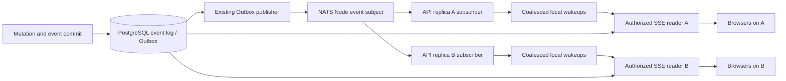

# Notification-driven SSE delivery specification

Status: **Q1-Q10 accepted**, 2026-09-30. This specification consolidates the [design interview](2026-09-30-sse-event-delivery.md) for [Issue #72](https://github.com/kent8192/aidash/issues/72). The user authorized implementation on 2026-09-30 with "実装を開始してください。" This is a design contract; the [verification report](../operations/sse-delivery-results.md) records the local runtime acceptance evidence. Inspection baseline: `827480c13d796bca142787be5bbd25ce34c80551` on `develop/0.1.0`.

## 1. Shared event and ownership

Use one canonical PostgreSQL event record for a business occurrence, preserving its event ID, Node, optional Workspace, kind, sequence, time and contents. The existing `Event::cloud_event()` already supplies the representation used by NATS publication and SSE data. An oversized broker publication may contain a reference instead of the body; that does not create another event identity.

Each HTTP-serving process independently subscribes to its configured Node event subject using ordinary Core NATS subscription without a queue group. Retain the existing PostgreSQL Outbox and JetStream publication. UI subscribers never consume or ACK the shared execution consumer. Ordinary notification delivery is at-most-once; PostgreSQL replay and reconciliation recover missing hints. [ADR-0010](../adr/0010-ui-notification-fanout-and-durable-replay.md) records this choice.

Issue #70 retains logical Agent subscriptions, recipient selection and durable processing. Issue #71 retains Run activation and worker-owned consumption. An Agent delivery ACK, Run activation disposition and browser resume ID express different progress and cannot substitute for one another. Remote Federation protocols and their Node ownership are unchanged. API replicas here share one logical Node and its PostgreSQL authority; this does not introduce access to another Node's database.

## 2. Per-stream state and invariants

| State | Meaning |
| --- | --- |
| Server scan position | Last canonical sequence actually examined or safely completed under the current read contract, including rejected records where appropriate. |
| Last emitted frame ID | Sequence attached to the most recent authorized frame handed to the response body. It is not proof of browser receipt. |
| Browser resume ID | Existing client-provided `Last-Event-ID`, representing the last frame that client received. |
| Local wakeup generation | Retained, coalesced evidence that another canonical read may be needed. It is unrelated to durable event sequence and cannot advance it. |
| Independent deadlines | Next reconciliation, credential/policy check, browser-session check and, only during a known visibility wait, gate retry. |
| Pending canonical page | At most 100 events, still requiring authorization and visibility checks at emission. |

Required invariants:

1. A broker payload never supplies data directly to a browser, changes authority or advances an SSE cursor. Current PostgreSQL records, resource checks and visibility gates determine every frame.
2. Frames emitted on one connection have increasing canonical sequence IDs. Reconnecting from an older client ID may legitimately repeat previously transmitted data, using the same event IDs.
3. A missed, duplicate, delayed or reordered hint cannot remove durable data, make a later sequence hide an earlier eligible one, or reset cursor progress.
4. Registration precedes the initial read, and a notification arriving during a read remains observable before sleeping. Local receiver replacement/closure also retains or recreates the need to reconcile.
5. No database transaction, visibility lease or policy/credential lock survives an idle wait, backpressure wait or network yield. Revalidation is not replaced by an authorization result captured when a page was loaded.
6. Authentication/authorization and reconciliation deadlines cannot be repeatedly postponed by hints, backlog processing or gate retries. If an authority check cannot complete, further protected emission remains blocked; errors fail closed.
7. Per-connection tasks, registrations and bounded state are released on disconnect, cancellation and shutdown. One slow client cannot block another stream or the shared subscriber.

## 3. Notification classification and fan-out

Read the existing CloudEvent's bounded identifying metadata: `specversion`, `source`, `id` and optional `subject`. Require the configured Node and well-formed identifiers. Ignore malformed, unsupported or wrong-Node envelopes with sanitized diagnostic counters. Support both full and `dataref` publications, but never fetch a URL supplied in `dataref` or interpret payload data as a delivery instruction.

Maintain local registrations only for active streams. A valid Workspace hint wakes that Workspace's filtered observers and the observers of all authorized Workspaces. A valid Node event without a Workspace wakes all local streams. Node-wide events, reconnect and recovery can signal a global generation without allocating an entry for every hint. Notification IDs or arbitrary Workspace values must not grow an unbounded map.

Routing fields remain untrusted hints. A misleading Workspace value can cause an unnecessary authorized read or delay the correct wakeup until reconciliation; it cannot expose the supplied event body. Duplicate hints coalesce in generation/dirty state. The durable log retains every distinct event and remains the backlog. Raw event bodies and credentials are not retained or logged by the wakeup hub.

## 4. Read, drain and wait algorithm

1. Authenticate and validate the requested scope using the existing response/error contract. Register local observation before resolving the initial cursor and reading events. Do not require broker availability to perform the canonical initial read.
2. Capture the relevant local generation. Perform due authority/session checks and attempt the visibility gate. A known closed gate enters the wait described in section 6 without advancing a cursor or reading event content.
3. Read canonical records in sequence order under current authority. Use bounded raw candidate slices of 100 records, and collect at most 100 eligible events in the pending page. Expose continuation/scanned-position information internally so filtered pages cannot trap replay or require an unbounded single call. Preserve the JSON replay endpoint's existing external contract.
4. Before each body emission, revalidate current browser/subject authority, individual resource visibility and the transaction gate. Do not preauthorize a queue of frames. Retain the existing audit behavior for delivered frames, while empty revalidation does not append repeated decision audits.
5. Advance scan progress only after the corresponding canonical work is accounted for. Rejected records can advance internal scan progress, but do not emit synthetic IDs. A blocked/failed check or partially emitted page cannot advance past still-pending eligible events. Never copy a high broker sequence or the last fetched page sequence over unfinished work.
6. Drain remaining pages immediately, yielding cooperatively between bounded slices and honoring independent deadlines. Remove the ordinary 250-ms inter-page sleep. Waiting for another hint while known backlog remains would violate this contract.
7. When caught up, compare the retained generation with the value captured before reading. If it changed, reconcile again. Otherwise atomically observe/await the next generation or the earliest independent deadline/cancellation. A generation change in the read-to-wait gap must wake the waiter. The specific Rust synchronization primitive is a reversible implementation choice.

A due five-second reconciliation causes a canonical read even when no hint arrived. Authority ticks alone never cause event-log scans. Keep absolute deadlines or equivalent non-starving scheduling, without bursts of unlimited catch-up timer work after suspension. A notification-triggered read may also satisfy an already due reconciliation, but metrics must report all effective causes so it cannot disguise timer-assisted delivery as notification-only evidence.

## 5. API, replay and permission changes

Preserve `/api/events/stream`, the `mesh` event name, CloudEvent data, canonical numeric SSE IDs and the adjacent JSON `/api/events` API. `Last-Event-ID` retains precedence over `after`; preserve the existing header parse/fallback behavior. A negative effective cursor remains tail-start mode. Resolve any high-water mark used by delivery consistently with the existing visibility contract; notification metadata cannot establish it. Known hidden transaction state cannot become visible through initialization or replay.

Test old retained cursors, zero, negative tail-start values, malformed headers, ahead-of-head values and filtered sequence gaps against the existing handler. Do not silently clamp an ahead-of-head cursor, invent a reset frame, return a new cursor error or rewind on permission restoration. PostgreSQL retention determines which historical records exist; this issue does not promise recovery of deleted history or add a retention protocol.

The browser continues to keep its received ID across reconnects and use its existing 1.5-second retry delay. A new browser subscription starts from its existing `-1` behavior and refreshes its view upon successful connection. This does not establish a durable browser acknowledgment or persist a cursor across a fresh page/session. Keepalive comments every 15 seconds do not change the resume ID. Retain the existing sanitized stream error behavior.

| Change | Result |
| --- | --- |
| Credential/session/mapping invalidation or expiry | Close the whole stream; no further protected emission. |
| Required permission lost for an explicitly selected Workspace | Close that stream. |
| Workspace/resource permission lost on an all-authorized-Workspace stream | Filter that scope and continue other permitted scopes. |
| No Workspaces currently permitted but the identity remains valid | Keep a valid idle stream and continue independent revalidation. |
| Authority restored or another Workspace becomes visible | Apply current permission to future reads without automatically rewinding. Explicit history requests may use an earlier retained cursor. |
| Authority lookup fails | Fail closed under existing error/disclosure semantics. |

Keep credential/policy check cadence at 250 ms and browser-session idle revalidation at five seconds. Checks must remain scheduled when the stream is idle, waiting on visibility or backpressured. Bound concurrent checks per connection; slow checks do not authorize emission from stale results. Scheduling cadence is not a claim that a failing database can complete a query within that interval.

## 6. Visibility, backpressure and lifecycle

Preserve the existing Node-wide distributed-transaction gate. While it is known closed, retry only the gate at 250-ms intervals, retaining the pending read. Keep authority/session checks and keepalive live without event-log reads. When the gate opens, reread/revalidate canonically before emission; commit, abort and recovery all retain their existing visibility semantics. A buffered page does not bypass a newly closed gate. Do not change the cross-Node transaction protocol to implement UI wakeups.

Keep at most one page of 100 canonical events per connection and bounded coalesced wakeup state. This bounds queue depth, not the size of an individual event permitted by the existing API. Preserve large-event compatibility and measure memory with an oversized-broker/reference-envelope case.

When a pending frame cannot make progress into the HTTP body for 30 seconds, close/abort that stream and let its browser reconnect. The condition does not apply to an idle stream with no pending output. Enforce revalidation, cancellation and the deadline independently of the body being polled; merely setting a flag that is only noticed on a future poll is insufficient evidence. Body handoff is the measurable server boundary, not a browser ACK, and already handed-off bytes cannot be recalled. Verify task and admission-permit cleanup at that boundary.

Broker failure does not prevent HTTP/SSE startup when PostgreSQL and authentication are usable. A per-API subscriber supervisor uses bounded connection/setup attempts and backoff while existing streams reconcile every five seconds. After actual subscription readiness is confirmed with a broker round-trip/barrier, immediately reconcile local streams, covering the disconnected interval. Reconnect callback delivery alone is not evidence that the subscription is active. Receiver closure/overflow and uncertain transport state cause recovery or an explicit degraded state.

On shutdown, stop admitting streams, cancel connection/subscriber tasks and use the existing 20-second application drain budget. Do not delete shared broker state. Remaining clients resume on another replica from their received IDs. Worker-only processes do not need UI subscribers. Existing PostgreSQL readiness and unsafe-failure behavior remain intact.

## 7. Configuration and observability

The following names and bounds are concrete implementation guidance, distinct from a claim that these new settings already exist. Defaults express the accepted decisions; document any final naming adjustment in the implementation runbook.

| Setting or behavior | Default / bound |
| --- | --- |
| Existing `NATS_URL` and Node identity | Reuse the configured Node event subject; keep credentials server-side. |
| `AIDASH_SSE_RECONCILE_INTERVAL_MS` | 5000; validated positive range 250-60000. The focused healthy-path fixture uses 60000 and records the override. |
| `AIDASH_SSE_BACKPRESSURE_TIMEOUT_SECONDS` | 30; validated range 1-300. |
| Credential/policy revalidation | 250 ms; preserve as an internal security cadence. |
| Browser-session revalidation | Five seconds, plus before emitted frames. |
| Known-closed visibility gate retry | 250 ms; no event-log query at each retry. |
| Keepalive | 15 seconds, preserving its current wire behavior. |
| Canonical page / raw scan slice | At most 100 retained events / 100 candidate records per slice. |
| Reconnect guidance | Five-second deadline for the complete connect/subscribe/readiness attempt; bounded randomized retry delay from 250 ms up to five seconds. Recovery reads run independently. |
| Existing `AIDASH_SSE_CONNECTIONS` | Preserve the default 128 per process and current overload response. |
| Existing HTTP header timeout | Preserve `AIDASH_HTTP_TIMEOUT_SECONDS`, default 30 seconds; it does not replace the SSE body backpressure deadline. |
| Existing application shutdown | Preserve the 20-second drain budget. |

Reject invalid configuration rather than allowing zero-duration loops or disabled recovery. Keep local fixtures and Helm documentation consistent with the settings, using the existing deployment configuration mechanism. The accepted acceptance run uses the five-second default except for explicitly identified notification-only windows. A larger operator override changes the maximum scheduling delay and must be visible in diagnostics.

Extend the existing private metrics surface rather than creating a new public debugging API. Record:

- Subscriber transport state, reconnect/setup failures and last successful subscription/reconciliation. Separate transport readiness from observed notification-driven progress; no traffic is not itself a failure.
- Hints received/rejected/coalesced and bounded reasons. Do not log raw payloads, credentials or credential-bearing broker URLs.
- Actual SSE event-log query counts by bounded cause: initial read, notification, reconnect, fallback, backlog and gate release. Include every raw candidate-page SQL execution, not just one count for a helper that may issue many queries.
- Authority/session checks, visibility checks/waiting streams, pending-output timeouts, emitted frames and existing connection/disconnect counts. Account for actual SQL work separately where one logical check uses several statements.
- Queue-depth and memory measurements, and PostgreSQL Outbox/other background work separately from per-SSE reads. Preserve the existing publisher's 250-ms scan in this issue's baseline and end-to-end latency accounting.

Metric labels use bounded role/state/reason categories. Do not use event, user, tenant or Workspace IDs as labels. Restricted test evidence may correlate generated fixture IDs with expected frames; that does not authorize publishing production event contents or identities. Successful fallback remains an observable degraded transport condition. No new browser status UI is required to implement the agreed contract.

## 8. Acceptance matrix

Use real PostgreSQL and NATS with JetStream enabled. Multi-replica causal assertions use separate executable OS processes; multiple router instances or local `Notify` calls in one runtime are insufficient.

| ID | Scenario | Required evidence |
| --- | --- | --- |
| AT01 | Writer A, execution consumer B, SSE receiver C, plus connections on other API replicas | Every expected authorized observer receives the committed canonical event with fallback delayed; execution consumption does not suppress UI fan-out. |
| AT02 | Workspace-filtered, all-authorized-Workspace and unauthorized observers; unrelated Workspace activity | Correct hint fan-out, no unauthorized contents, and no event-log wakeup for unrelated filtered streams except explicitly measured recovery/global causes. |
| AT03 | Rolled-back, still-uncommitted, hidden, mismatched, malformed and wrong-Node hints; full and `dataref` envelopes | No content comes from broker payloads; current canonical authority/visibility controls output. No arbitrary reference URL is fetched. |
| AT04 | Notification before registration, during initial read, after an empty read and immediately before wait | Deterministic barriers prove no read-to-wait loss; startup/reconnect reconciliation covers an earlier disconnected gap. |
| AT05 | Lost, duplicate and out-of-order hints, including sustained irrelevant/duplicate traffic | Canonical ordering and stable IDs; independent fallback/auth deadlines make progress despite the flood. Missing data recovers within the configured scheduling bound when dependencies are healthy. |
| AT06 | More than 100 eligible events and multiple raw pages of denied events | Prompt complete backlog drain without timer gaps; scan progress passes rejected rows and remains fair to revocation/cancellation and other streams. |
| AT07 | Same/other-replica reconnect; old, zero, negative, malformed and ahead-of-head cursors | Existing API/parser behavior, retained-history replay and monotonic emitted IDs; duplicates do not cause omissions or cursor regression. |
| AT08 | Credential, policy, browser session, mapping/operator grant and resource-read revocation while idle and with a buffered page | Current scope semantics, timely independent checks, and no newly emitted protected frame after the relevant boundary denies access. Empty checks do not flood decision audits. |
| AT09 | Gate closes with a page buffered, remains closed without traffic, then commits/aborts or recovers | No hidden output/cursor advance, no event-log polling during the closed-gate retries, independent auth/keepalive, prompt canonical resumption. |
| AT10 | Broker absent at startup, interrupted after subscription, restored and restarted with lost broker state | HTTP/SSE survives through five-second canonical recovery, subscription is recreated/confirmed and immediate reconciliation precedes restored normal notification evidence. |
| AT11 | Reader stalls while another reader advances; disconnect before the body is polled; existing large event | The 30-second pending-output rule, live revalidation, bounded page/registration state, no held database lock, and task/permit cleanup. Healthy idle connections remain open. |
| AT12 | SIGTERM, forced process kill and reconnect to another replica | Bounded drain/cancellation and replay from client ID; no stale subscriber state blocks new replicas or changes execution consumer ownership. |
| AT13 | Invalid settings, operator metrics, rejected payloads, subscriber failure and recovery | Validated bounds, accurate causal/read counters, no sensitive payload/credential labels or logs, and visible fallback with healthy HTTP where permitted. |
| AT14 | Accepted 100-connection active and idle workloads | Three passing repetitions for latency and measured idle-query reduction, full raw evidence and exact baseline/candidate revisions. |

Issue acceptance mapping:

| Issue #72 criterion | Coverage |
| --- | --- |
| 1. Committed-event wakeup across replicas; fan-out distinct from execution | Sections 1 and 3; AT01-AT02, AT10, AT12. |
| 2. Canonical PostgreSQL order/cursor/authorization; hints never disclose hidden data | Sections 2 and 5; AT02-AT03, AT07-AT09. |
| 3. Close the read/wait race, coalesce and drain without cursor loss | Section 4; AT04-AT07. |
| 4. Replay, keepalive, revalidation, transaction gates and bounded fallback | Sections 5-6; AT05, AT07-AT12. |
| 5. Real services, multiple replicas and negative/fault scenarios | AT01-AT14; separate-process evidence described above. |
| 6. Notification-only proof, reduced idle polling and observed latency/load | Sections 7 and 9; AT01, AT13-AT14. |

## 9. Measurement and evidence

The accepted workload is three API processes, 100 SSE connections across 10 Workspaces and 10 committed events per second. Include both Workspace-filtered and all-authorized-Workspace observers; record the exact distribution and expected authorized event/client pairs. Use the same fixture, resources and service topology for the baseline and candidate, with any differences explicitly documented.

Run three independently prepared 30-second active windows. Warm up and establish startup, quiescence, observer and subscription-readiness barriers before each. In each healthy-path window, delay fallback to 60 seconds and prove no fallback read contributed anywhere in the measured interval. Do not count reads caused by a reconnect or a coincident timer as notification-only evidence. Contaminated windows are failed measurements to diagnose, not samples to silently discard or retry until green.

Every expected authorized client must receive each relevant event. Record per-client and per-replica timing; use the latest expected client receipt for each originating event's complete-fan-out latency so a fast replica cannot hide a slow one. Each repetition must satisfy the agreed p95 at most 500 ms and p99 at most one second. Report p50, maximum, sample count, percentile definition, missing/extra/regressing IDs and all raw samples, including failures. This is a tested workload result, not a production-scale claim under Issue #73.

Use a shared monotonic clock in the test controller. Capture the start immediately before releasing a mutation's commit barrier and end when each client parses the complete SSE frame. This conservative outer interval includes harness/transport overhead. Do not substitute a transaction-start timestamp for commit time or start timing only after the HTTP mutation response, because SSE can arrive earlier. Record the synchronization convention and all boundaries.

Run three separate 60-second idle windows on the inspected polling baseline and on the candidate with its normal five-second reconciliation. Exclude setup/warmup explicitly, verify no fixture mutation is occurring, and count all canonical event-log queries per connection per unit time. Require at least 90% measured reduction in each repetition. The timer-ratio estimate is approximately 95%, but query time, scheduling and window boundaries affect actual counts. Report total SQL, authority/visibility/Outbox work, CPU and memory separately; do not claim the same reduction for all database load.

Retain commands, exit status, exact tested revisions, service versions/images, resource limits, process placement, actual settings, timing samples, query counters and correctness assertions in a reproducible evidence bundle. Implementation deliverables are `tests/sse_delivery.rs`, `scripts/test-sse-delivery.sh` and the [operations runbook](../operations/sse-delivery.md). The chosen 100-record raw slice tightens the original proposed 500-record bound without changing the public replay API. Reuse existing integration-service fixtures and fake identities, and exclude live credentials and user content from evidence.

## 10. Implementation surfaces and completion boundary

| Surface | Intended implementation work |
| --- | --- |
| Event bus / focused SSE module | Independent UI subscriber supervision, bounded hint classification and local wakeup registration; no execution consumer coupling. |
| SSE handler | Race-safe canonical drain/wait state, separate timers, per-frame authority/visibility and bounded body cancellation. |
| Scoped event reader | Bounded scan continuation and cursor bookkeeping while preserving resource filtering and audit behavior. |
| Runtime and HTTP admission | Start/stop subscriber roles, enforce body backpressure and clean up connection tasks/permits without changing ordinary admission limits. |
| Settings, private metrics, deployment docs | Validated defaults, causal progress/query accounting, safe fallback and operational troubleshooting. |
| Focused integration tests and evidence | Real-service, separate-process acceptance with deterministic fault barriers and reproducible measurements. |

Use SeaORM/SeaQuery for database statements and the repository's Rust module conventions. The design requires no new business-event type, durable per-browser delivery ledger or database migration. If implementation uncovers a necessary compatibility change or a new architectural trade-off, bring that specific decision back to the interview rather than silently broadening the contract.

Q1-Q10 and their trade-offs are settled. Reversible internal names, synchronization primitives and fixture organization can be chosen during implementation within this contract. The user confirmed the consolidated understanding and authorized implementation. Design-document checks do not establish passing integration tests, hosted CI, delivery latency, load reduction or Issue completion.

## Implementation refinement from measured contention

The accepted event, cursor, authorization and replay contracts are unchanged. Release-profile load tests exposed global audit-allocation lock contention when the original 250-ms Outbox cadence grouped sustained events. Compound audits now acquire their allocation lock inside the bounded INSERT source. The publisher retains 250-ms idle/error scans and uses 50-ms scans for one second after successful publication, renewing that window while events continue. This reduces bursts without adding idle SSE scans or changing durable Outbox/JetStream ownership. All accepted thresholds and fault tests remain enforced; the [verification report](../operations/sse-delivery-results.md) records failed and final measurements.
