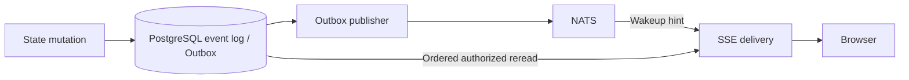

# Notification-driven UI event delivery

Status: Q1-Q10 accepted on 2026-09-30. The user accepted each round with "全て推奨" and confirmed the recommended shared-event interpretation. Implementation was authorized on 2026-09-30 with "実装を開始してください。". This document records [Issue #72](https://github.com/kent8192/aidash/issues/72). Accepted design, implemented behavior and executed acceptance evidence must remain distinguishable.

## Verified starting point

Source inspection on 2026-09-30 used `origin/develop/0.1.0` at `827480c13d796bca142787be5bbd25ce34c80551`. The original checkout is clean at the Issue's `236bc28` baseline. This document lives in a separate worktree on `docs/issue-72-sse-delivery-design`.

- The SSE handler is `src/api.rs::stream`, serving `/api/events/stream`; `events` is the adjacent JSON replay handler. The SSE loop reads PostgreSQL, emits authorized frames, then sleeps for 250 ms, including after a full batch.
- `Last-Event-ID` takes precedence over `after`. A negative cursor starts from the current event high-water mark. SSE data uses the `mesh` event name, the durable sequence as its ID and the existing CloudEvent representation. Keepalive is 15 seconds.
- `src/store.rs::event` serializes event sequence allocation with a transaction advisory lock so allocation order agrees with commit order.
- `Scoped::poll_events` in `src/authorization/workspace.rs` reloads credential/policy authority, checks requested Workspace access, filters event resources and advances the scanned position past denied records. `can_emit` revalidates buffered events immediately before emission. Polling alone does not append repeated decision audits.
- Browser streams also revalidate their exact session, identity, mapping and operator/subject mode before every frame and every five seconds in the ordinary idle loop. These checks depend on the existing loop advancing; the new wait design must keep revalidation live during notification silence and visibility waits.
- Both reading and emitting use the distributed-transaction visibility gate. Waiting must not retain database transactions or policy locks. Notification receipt cannot bypass a closed gate.
- `src/bus.rs` publishes committed event records to the Node-scoped `aidash.{node}.events` JetStream subject. The publisher itself scans its outbox every 250 ms. Its shared durable `execution` consumer inserts a global inbox entry and wakes only its receiving process. This consumer cannot supply fan-out to every API replica.
- [Issue #70](https://github.com/kent8192/aidash/issues/70) owns durable logical Agent subscriptions and routing; [Issue #71](https://github.com/kent8192/aidash/issues/71) owns independent worker activation. Their accepted contracts distinguish durable recipient work and worker-owned activation consumers. #72 owns authorized UI observation and replay.
- The [functional requirements](https://app.notion.com/p/3e172fa877aa8096bca5c8d8c2c73b24) and [technology selection](https://app.notion.com/p/3e172fa877aa80e88c60d0dfeae01419) select SSE for UI streaming, PostgreSQL for durable state and NATS JetStream for intra-Node messaging. They do not prescribe a numeric SSE delivery target. The existing [nonfunctional release contract](../operations/nonfunctional-release.md) leaves deployment-specific capacity and latency targets to explicit agreement.

These are source-inspection findings, not runtime acceptance results.

## Requirements already fixed by the Issue

- Keep the SSE endpoint, frame representation, browser resume semantics, authorized PostgreSQL replay and ordered sequence cursor compatible.
- Use notifications only to prompt a canonical read. A notification cannot supply event contents to the browser, advance its cursor, confer authority or reveal transaction-hidden state.
- Reach every relevant API replica, independently of execution consumer ownership. Preserve correctness through missed, duplicate, delayed or reordered hints and process/broker restarts.
- Close the read-to-wait race, coalesce hints without dropping durable events and drain existing backlogs without waiting for the fallback timer between full pages.
- Preserve keepalive, idle revocation checks and visibility gates. Retain bounded reconciliation when a hint is missed or the broker is unavailable.
- Demonstrate the healthy notification path with fallback delayed, using real PostgreSQL and JetStream where applicable. Measure idle event queries separately from authorization and outbox work.

The [glossary](../../CONTEXT.md) distinguishes **UI event stream** and **UI event replay** from Agent subscriptions, recipient delivery and historical routing. These definitions restate the Issue's observation/execution boundary.

## Shared event model and transport terminology

In the interview, the user asked whether SSE and NATS events should be integrated. For the same recorded business occurrence, share its canonical event identity, kind, Workspace scope, durable sequence and representation. Source inspection already finds this common model: [`Event::cloud_event`](../../src/domain.rs) is used by both the [Outbox publisher](../../src/bus.rs) and the [SSE handler](../../src/api.rs). The publisher may replace an oversized body with `dataref`; wire payloads therefore need not be byte-identical to describe the same event.

SSE frames and NATS messages are transport representations of that common occurrence. Keep one PostgreSQL event authority and use the existing Outbox publication to prompt UI delivery. After a notification, the SSE handler reads the canonical ordered records under the observer's current authority and visibility gates, then emits the common representation with the existing SSE resume ID. It must not create a second business event, assign a new canonical identity or advance its cursor from a broker hint.

Current authorization can change after broker publication, notification arrival order can differ from durable sequence order, and notifications can be absent during disconnects. These are reasons to preserve the canonical reread and UI cursor even when the underlying business event is shared. Notification fan-out, logical Agent recipient processing and browser replay retain their different completion semantics. Run activation is a separate scheduling concept and does not become the same event type merely because it also uses NATS.

This clarifies the accepted Q1 architecture. The user subsequently accepted Q5-Q10. In particular, Q5 concerns which local observers a shared event hint wakes, not the creation of a separate UI business-event model.

## Round 1 — Accepted decisions

The user accepted all four recommendations. These are issue-level acceptance settings, not measured production guarantees.

### Q1 — Transport for per-replica UI wakeups

Accepted: retain the existing PostgreSQL outbox and JetStream publication, and have each API process independently subscribe to the Node event subject using ordinary Core NATS publish/subscribe without a queue group. Each process coalesces local wakeups; reconnect and missed notifications are reconciled from PostgreSQL. UI delivery does not consume or ACK the shared execution consumer, and it does not introduce a durable per-browser delivery ledger. [ADR-0010](../adr/0010-ui-notification-fanout-and-durable-replay.md) records this trade-off.

Considered but not selected: one independent JetStream consumer per API process, with explicit consumer lifecycle and redelivery handling. This provides broker-managed notification recovery while still requiring PostgreSQL replay, authorization and fallback. A shared consumer across API replicas is not a fan-out alternative.

[NATS documentation](https://docs.nats.io/learn/core-nats/) describes ordinary subscriptions as fan-out to currently connected subscribers and Core delivery as at-most-once. The recommendation deliberately assigns missed-notification recovery to PostgreSQL; it is not a claim that Core delivery is durable. Consumer lifecycle and delivery-policy alternatives are described in the [NATS consumer documentation](https://github.com/nats-io/nats.docs/blob/master/nats-concepts/jetstream/consumers.md).

Dependent decisions are settled in Q5, Q6 and Q9.

### Q2 — Delivery latency and fallback interval

Accepted: a healthy-path commit-to-client target of p95 at most 500 ms and p99 at most one second, with a five-second fallback reconciliation interval. The fallback interval bounds scheduling delay, not end-to-end delivery while the database is slow, visibility is blocked or a client is backpressured. Delay fallback to 60 seconds in bounded healthy-path test windows, and prove no fallback read contributed to measured delivery.

The existing 250-ms outbox publisher contributes to end-to-end latency and must be included in measurements. It is not eliminated by changing the SSE wait loop. Failed latency measurements must be reported rather than silently relaxing targets.

Dependent decisions are settled in Q8-Q10 and the required implementation consequences below.

### Q3 — Authorization cadence and idle-load objective

Accepted: preserve the current ordinary-loop credential/policy check cadence (250 ms) and browser-session idle revalidation cadence (five seconds), using independent checks that do not read the event log. Revalidate every emitted frame as today. These remain active during broker loss and visibility waits. Check errors fail closed under existing authority semantics.

The interval ratio implies approximately 95% fewer idle event-log scans than a 250-ms loop when fallback is five seconds: nominally 12 instead of 240 scans per minute per connection after startup, excluding externally triggered reads. Actual baseline cadence also includes query time and scheduling; Q10 sets the accepted measured reduction at at least 90% in every repetition. This is not a 95% reduction in all SQL: authorization, visibility, outbox and infrastructure work must be reported separately.

Considered but not selected: make reduction of total idle database work a requirement as well, then design shared authority invalidation/revalidation and explicit revocation bounds before choosing slower per-stream checks. Do not silently weaken revocation behavior to improve the event-query metric.

Dependent decisions are settled in Q6-Q8 and Q10.

### Q4 — Issue-level acceptance workload

Accepted: use three separate API OS processes, 100 SSE connections across 10 Workspaces, and 10 committed events per second for active delivery measurements. Measure a separate no-mutation idle window, with Workspace-filtered and all-authorized-Workspace observers represented. Add focused writer-A/execution-consumer-B/SSE-C cases, reconnection to another replica and unauthorized observers. The three-process setup must prevent same-process notification from serving as the only evidence.

Record resources, service versions, data shape, tested revision, raw samples, connection counts and event-query counts. Treat this as a reproducible acceptance fixture; supported production capacity remains under Issue #73.

Dependent decisions are settled in Q6 and Q10; the consolidated specification maps their evidence to every Issue acceptance criterion.

## Round 2 — Accepted decisions

Q1-Q4 unlocked the six independent decisions below. The user accepted all six recommendations, following the shared-event clarification above.

Additional source inspection confirms that the current CloudEvent carries Node identity in `source`, optional Workspace identity in `subject`, and the durable event `id` and `sequence`. `web/src/event-stream.ts` starts with `Last-Event-ID: -1`, refreshes the view on a successful connection, retains the last received frame ID across reconnects and waits 1.5 seconds before retrying. The transaction visibility gate is Node-wide. These facts constrain the recommendations; they do not establish tested behavior of the new delivery path.

### Q5 — Local wakeup granularity

Accepted: maintain coalesced wakeup state for active Workspace-filtered streams and a Node-wide wakeup for streams observing all authorized Workspaces. A Workspace event wakes its Workspace listeners and the Node-wide observers; a valid event with no Workspace wakes every local stream. Allocate routing entries only for currently registered observers and release unused entries, so arbitrary broker keys cannot grow memory.

Read only bounded envelope metadata needed to classify the hint. Require the configured Node identity and well-formed identifiers; ignore malformed or wrong-Node notifications with bounded diagnostic counters. The routing metadata is untrusted: it selects a possible wakeup target, never content, cursor progress or authority. A misleading Workspace hint can cause an unnecessary authorized read or a missed prompt wakeup, both handled safely by canonical reads and reconciliation. A broker message's event body is never forwarded, logged or retained as the UI backlog.

Considered but not selected: wake every local stream on every Node event. This is simpler but causes unrelated Workspaces to read their logs under another Workspace's activity. The accepted verification includes this interference case.

### Q6 — Slow readers and bounded backlogs

Accepted: keep at most one canonical page of up to 100 events for a connection and coalesced wakeup state, with no additional per-notification event queue. Bound raw candidate scans and yield between scan/emission slices so long filtered backlogs cannot starve authorization, cancellation or other clients. This bounds queue depth, not the bytes of an individual event already permitted by the existing API; existing event-size compatibility must be retained and memory reported.

Drain full pages promptly, without the old 250-ms pause between pages. If handing a pending frame to the HTTP body remains backpressured for 30 seconds, close the connection and let the existing browser reconnect from its last received ID. The limit applies to blocked output progress, not an otherwise idle connection. One slow connection must not delay other streams or the shared notification receiver.

Recheck current authority and visibility at actual body delivery, including buffered frames. Do not let a producer queue preauthorized frames and consider that equivalent to emission. Independent cancellation/revalidation must remain live when the HTTP body is not being polled, and all per-connection tasks must terminate on disconnect. No database/policy lock is retained while waiting for a reader. Data already handed to transport cannot be recalled, and body handoff is not a browser receipt acknowledgment.

### Q7 — Authority changes and stream scope

Accepted: close the whole stream on credential/session/mapping invalidation or expiry. For a stream explicitly selecting one Workspace, loss of its required Workspace permissions also closes that stream. For an all-authorized-Workspace stream, continue delivering other authorized Workspaces while immediately excluding revoked resources under the existing per-frame checks. An empty authorized set remains a valid idle stream while the underlying identity remains valid. Authority-check errors fail closed.

Do not rewind a live cursor when authority is restored or a newly visible Workspace appears. Current-authority checks govern future reads; reviewing earlier retained history requires an explicit earlier cursor or the existing snapshot/history UI. Otherwise an unrelated policy update could unexpectedly replay old activity to every live observer. Do not add cursor/reset frames or a new browser resume contract.

### Q8 — Closed transaction visibility gate

Accepted: preserve the existing Node-wide barrier, even when only one Workspace's transaction caused it. While the barrier is known to be closed, retry its visibility check every 250 ms without reading the event log, retaining the pending need to reconcile. Resume a canonical read promptly when the gate opens; no broker hint or timeout authorizes hidden content or cursor advancement.

Continue the accepted independent authority checks and 15-second keepalive during this wait, including if a buffered page was interrupted. Release all leases before waiting. If authority cannot be established, fail closed rather than treating a visibility retry as a successful authority check. Gate retries, authority checks and event-log reads have distinct measurement categories.

Considered but not selected: wait for the ordinary five-second reconciliation after a gate closes. This reduces barrier queries but can add a visible delay after a short transaction. Do not introduce a cross-Node transaction-protocol change solely to wake UI readers.

### Q9 — Startup and reconnect availability

Accepted: allow HTTP/SSE startup and authorized PostgreSQL replay while the broker is unavailable. Keep the five-second reconciliation active during bounded connection attempts and backoff. Each API process owns and supervises its UI subscriber independently of the load-balanced execution consumer; worker-only processes do not need a UI subscriber.

Once a subscription is confirmed active, request immediate reconciliation of all local streams to cover the disconnected gap, then continue ordinary hints. Subscription readiness must be a real broker round-trip/barrier, not only a locally allocated subscriber. New streams register their local wakeup observation before their initial canonical read; broker availability is not a prerequisite for that read. Reconnect notifications, local channel closure/overflow and uncertain subscriber health must cause reconciliation or a safe degraded state rather than a silent permanent wait.

Keep the existing browser connection/reconnect behavior. Expose broker degradation and recovery through operator metrics/logs; successful SSE replay is still useful during transport degradation. PostgreSQL/authority failure retains its existing readiness and fail-closed behavior. On shutdown, stop admitting streams and cancel their tasks within the existing server drain budget; clients resume on another replica using their received IDs.

### Q10 — Repeatable performance evidence

Accepted: use three independently prepared 30-second active measurement windows at the accepted load, with warmup and subscription/readiness barriers before each. Delay fallback to 60 seconds for each healthy-path assertion and prove the entire measured window precedes its deadline. Capture counters at both ends; any fallback contribution invalidates that healthy-path assertion rather than being hidden among successful samples. At 10 events per second this produces 300 source-event samples per window, with every expected authorized event/client pair accounted for.

Run three separate 60-second no-mutation idle windows against both the inspected 250-ms baseline and the new default five-second fallback behavior. Exclude setup/warmup explicitly and compare event-log reads per connection per unit time, with at least 90% measured reduction required in each repetition. The approximately 95% interval-ratio estimate from Round 1 is reported separately: the old loop adds query time before its sleep, and finite-window boundaries also affect measured counts. Report authority, visibility, outbox and other SQL separately, plus CPU and memory. Do not extrapolate an event-query reduction to total database load.

Record all samples, missing/extra/regressing IDs, p50/p95/p99 and maximum, the percentile calculation, fixture/resources, broker/database versions and tested revision. Every repetition must meet the agreed targets. Commit-to-client timing uses a shared monotonic test clock: begin immediately before releasing the mutation's commit barrier and end when the client parses the complete frame, retaining the conservative outer interval. Transaction-start timestamps are not commit timestamps, and waiting for an HTTP mutation response can miss earlier SSE receipt. Report the exact measurement convention and test overhead rather than subtracting unmeasured costs.

Separate deterministic fault cases cover lost/duplicate/reordered hints; read-to-wait races; sender/receiver/API replica placement; disconnect and reconnect on another replica; old and ahead-of-head cursors; permission and session loss during idle, backlog and visibility wait; broker absent at startup and outage/recovery; slow readers; and shutdown. Performance windows do not replace these correctness cases.

## Required implementation consequences

The Issue already requires the following; these are not optional alternatives in the interview:

- Register observation before reading, retain a monotonic local wakeup generation across the read-to-wait boundary and recheck it before sleeping. A plain edge-triggered `notify_waiters()` without retained state is insufficient. The precise Rust primitive is an implementation choice.
- Only ordered canonical reads advance a server scan position, and only authorized frames carry resume IDs. Notification sequence numbers cannot advance either position. Duplicate hints coalesce without suppressing distinct durable events; excluded records must not stall later permitted records.
- Keep fallback and authorization deadlines independent. Irrelevant hints, duplicate floods, long backlog drains and repeated visibility waits must not continually postpone them. Authorization ticks alone must not become hidden event-log scans.
- Preserve `Last-Event-ID` precedence, `after`, negative tail-start behavior, frame names/data, keepalive and current error disclosure. Test malformed, retained old and ahead-of-head cursor inputs against the existing handler instead of silently adding clamping or reset behavior. Database retention and recovery after loss of durable history remain distinct from recovering a lost notification.

## Consolidation

The [implementation and acceptance specification](2026-09-30-sse-event-delivery-specification.md) consolidates Q1-Q10, race handling, cursor compatibility, operational behavior and the complete Issue acceptance mapping. Operational names and reversible implementation defaults are explicit guidance; they do not add a new product decision or authorize implementation. No further design frontier remains after this consolidation. The agreed design, eventual implementation and executed runtime evidence remain separate.

[ADR-0010](../adr/0010-ui-notification-fanout-and-durable-replay.md) records the architectural trade-off. The glossary contains domain definitions only. The user confirmed the consolidated understanding and authorized implementation. Work continues in the existing dedicated worktree on `feat/issue-72-sse-delivery`.
