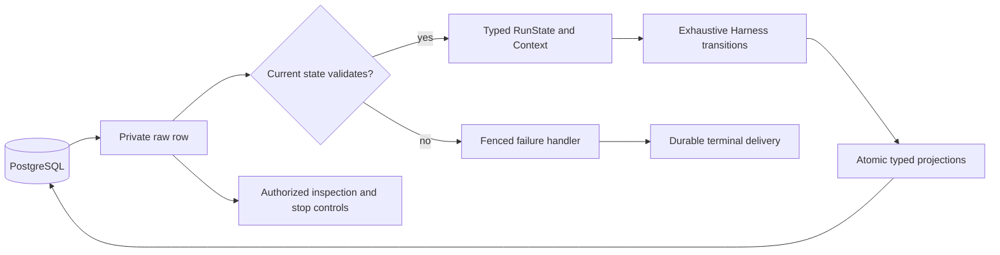

# Typed Run state specification

Status: accepted design, 2026-10-01; implemented locally on `feat/issue-62-typed-run-state`. See the [validation record](2026-10-01-typed-run-state-validation.md) for local verification.
Source: [Issue #62](https://github.com/kent8192/aidash/issues/62), the [decision interview](2026-10-01-typed-run-state.md) and [ADR 0011](../adr/0011-strict-typed-run-state.md).
Inspected source: `develop/0.1.0` at `3cb803544c37ebbeb413bc8554accb0a06d916fa`.

## Outcome and scope

Replace independently mutable string/JSON execution state with a strict, phase-specific Rust model. The domain Run owns one `RunState`; its `RunPhase` is derived. Type Run control, Context and its history/usage, Task status, waiting conditions and related command/transition arguments across all producers and consumers.

The user explicitly removed backward compatibility. Rust APIs, JSON shapes and HTTP/Federation contracts may change. Existing Runs need not deserialize or resume, unknown machine-state keys need not survive, and missing/null distinctions and timestamp spelling need not be preserved. There is no legacy converter, opaque-history fallback or old-binary compatibility gate.

Maintain the current behavior for valid execution: dependency and child-task handling, input visibility, compaction, approval scope/expiry, cancellation, authorization, lease/revision fencing, unsafe-effect reconciliation and durable terminal delivery. Removing compatibility does not authorize deleting records, bypassing controls or repeating effects.

## Domain model

| Value | Contract |
| --- | --- |
| `RunState` | A closed enum with Ready, Thinking, ToolCall, Waiting, Completed, Failed and Cancelled variants; each owns only the data belonging to that phase. |
| `RunPhase` | A typed projection from `RunState`, using the existing database values `READY`, `THINKING`, `TOOL_CALL`, `WAITING`, `COMPLETED`, `FAILED`, `CANCELLED`. There is no second mutable domain phase field. |
| `RunControl` | Active, Paused and Cancelled, encoded as `ACTIVE`, `PAUSED`, `CANCELLED` in the retained column. Cancellation request and terminal cancellation remain distinct concepts. |
| `TaskStatus` | Adopt the existing eight-variant enum throughout Task values, transition arguments and decisions. Retain specialized completion/abandonment behavior and current transition rules. Abandoned Task reconciliation produces Cancelled Run state. |
| `ResumeState` | A closed continuation containing Ready, Thinking or ToolCall data. It cannot name Waiting or a terminal phase. |
| `FailureTarget` | Failed or Cancelled; terminal-delivery failure intent cannot select an executable phase. |
| `Context` | Typed summaries, sequence/coverage records, `Option<ContextUsage>` and a vector of typed history events. |
| `RunControlAction` / peer commands | Typed pause/resume/cancel and typed peer answer/message commands. Required IDs/content belong to their command variant; arbitrary answer content remains JSON. |

Use constructors and consuming transitions to move phase-owned data. State changes update the derived persistence projections together. Ordinary Harness logic matches enums exhaustively and never mutates a JSON key or fabricates a default continuation after failed decoding. Runtime checks still enforce referential validity, authority, sequence freshness and values such as cursor bounds; enums do not replace those checks.

Waiting state is a tagged enum covering the existing reasons: dependencies, child work/deferred completion, a timer, human input, Core approval, exact external-write approval, uncertain-effect reconciliation and failure/cancellation delivery. Each variant owns its required request/approval ID, deadline, invocation identity and continuation as applicable. Failure delivery has a target and retry information, without an executable continuation. The ordinary wait variants retain their relevant Ready/Thinking/ToolCall data rather than sharing an unrelated bag of flags.

Terminal state owns its terminal outcome data and has no executable continuation. Delivery of already accepted messages remains an independent journal obligation after a terminal phase.

## Complete continuation coverage

The following inventory names the current source responsibilities, not keys that the new JSON must preserve. Every producer and consumer must be mapped before the work is complete.

| Responsibility | Current fields and required typed replacement |
| --- | --- |
| Response and tool progress | `response`, `cursor`, `response_epoch`, `request_tokens`, `request_window`, `finalizing`: typed ModelResponse, checked cursor/epoch and request budget; explicit finalization stage. Current-format ToolCall state requires a persisted epoch, without the old step-based fallback. |
| Waiting and approvals | `resume_phase`, `wake_at`, `human_request_id`, `core_approval_id`, `uncertain_key`, `workbench_approval`, `workbench_approval_result`: waiting/continuation variants, UUID references, fixed invocation/call binding, decision and expiry records. |
| Deferred/planned reads | `force_workspace_read_compaction`, `deferred_workspace_read`, `deferred_skill_read`, `deferred_workspace_observation`, `workspace_read_plan`, `skill_read_plan`, `workspace_observation_plan`: typed requests and plans bound to step/cursor/call, with explicit preparation/consumption. |
| Input synchronization | `included_input_seq`, `required_run_message_reads`, `deferred_run_message_reads`, `references_read_at_inference`, `run_message_catchup`, `run_message_summary_end_seq`, `run_message_summary_limit`, `observed_input_seq_before_response`: typed sequence/proof/catch-up records, retaining current admission and stale-output fences. |
| Media progress | `selected_media`, `inferred_selected_media`, `deferred_selected_media`, `deferred_human_media`, `media_inferred_through_seq`, `media_intake_through_seq`, `media_inferred_seq_before_response`: typed selections and inference/defer progress. Reuse the existing `capabilities::sharing::Selection` where appropriate. Preserve ordering, limits and stale-inference rollback. |
| Recovery and delivery | `retry_count`, `retry_at`, `lease_recovered`, `terminal_transition`, `last_delivery_error`: typed recovery metadata and failure-delivery state, without replaying a failed effect when its Home acknowledgment is unavailable. |

ModelResponse/ToolCall structures, approval records, read-plan metadata, media selections and state-owned counters are typed. Framework-owned result fields used to choose a transition are decoded into typed result views at the tool boundary. Arbitrary tool arguments/results, human content, workspace snapshots and provider payload content remain JSON within their declared envelopes; they are not a substitute for Run state.

Known Context events include tool call/result, human response, model-media observation, required-message-read and required-message-summary records. Give each a typed envelope and explicit required fields. Unknown variants, incomplete known envelopes and unknown machine-owned fields fail current-format validation. Compaction may retain or truncate arbitrary result content as today, while preserving a valid typed event envelope. Context history never substitutes for the independent effect journal.

## Strict current format and storage

Keep useful physical columns, including `runs.phase` TEXT, `runs.control` TEXT, `runs.pending` JSONB and `runs.context` JSONB. A private codec converts the phase-specific domain state into the phase projection and pending payload. Do not expose a second independently mutable domain phase/pending pair to callers.

Use a required `state_version` marker, starting at 1, to identify the entire Run state/context format. Pending contains that version, phase-owned data and typed recovery metadata; phase selects the payload type. For example, the initial Ready projection is:

```json
{
  "state_version": 1,
  "data": {},
  "recovery": {
    "retry": null,
    "lease_recovered": false
  }
}
```

The associated phase column is `READY`, and Context is the complete canonical initial Context produced by the current constructor. API/Federation DTOs expose the same required format version and a tagged `state` object containing its phase and phase-specific data, rather than an independently writable phase/pending pair. Include control, context, recovery and existing identity/revision metadata in the typed DTO. The exact nested field names are implementation details; one codec and one schema own them.

Reject absent/unsupported versions, unknown structural fields, invalid UUIDs/timestamps, missing required payloads and invalid continuation combinations. Use ordinary optional values only for actual optional concepts. Canonical serialization can omit or emit null according to the new schema; no tri-state presence wrapper or preserved timestamp lexeme is required. Defaults initialize newly created state, not unsupported input. Closed state schemas do not carry flattened extension maps.

Update every admission/save/control/transaction/remote producer and the database defaults to write complete current-format state. Update JSON-dependent activation/approval triggers and any affected indexes through new forward migrations; do not modify already applied migrations or backfill legacy state into executable current state. SeaORM/SeaQuery constructs ordinary queries and supported migration operations. Raw DDL is limited to operations those builders cannot express, with the existing documented exception pattern.

The PostgreSQL phase/control/Task constraints remain independent authorities for retained text projections. Their enum codecs must accept exactly those values. All state projection writes, event emission and activation intent continue to commit atomically with the existing fences.

## Decoding, scheduling and invalid-row isolation



Fetch private raw rows and classify them before ordinary execution. A query returning one invalid JSON payload must not fail an entire batch through direct typed `FromRow` decoding. Unvalidated values remain confined to the storage/transport codec, inspection and invalid-row repair boundary; they never enter ordinary Harness or tool execution.

Share scheduling/claim rules between notification claims and recovery scans. Evaluate current-format deadlines and references using typed values and database time. Never rely on a naked cast of an unvalidated JSON timestamp, or on SQL predicate order making such a cast safe. A bounded, paginated recovery pass must continue past invalid and currently ineligible rows rather than repeatedly selecting one row or starving later work. Preserve row-lock ordering, transaction visibility, dependency/area ordering, lease expiry and input-ledger fences.

For unsupported or malformed persisted state:

1. Validate the independent identity/control/ownership metadata needed for a disposition. Do not execute a model, tool, resumed approval or replacement Run.
2. Respect a live lease and Paused control. A paused invalid Run remains inspectable and does not advance; cancellation follows its normal authority and control path. Terminal Runs retain their terminal outcome.
3. When a nonterminal Run is eligible for controlled failure, acquire valid repair ownership and fence the write by the observed revision and unexpired ownership. Use Failed unless cancellation has priority. A lost lease/revision writes nothing.
4. Commit a typed failure-delivery intent and its durable event/activation disposition using the validated metadata. This is a failure disposition, not conversion of legacy continuation data into executable state.
5. Drain required Home terminal notification and accepted input delivery through the existing journal/retry semantics; do not mark delivery complete merely because decoding failed. Notification ACK still follows a durable disposition.

The failure-delivery and already-terminal message-delivery paths must not require a fully decoded Context or the damaged continuation. Use narrow typed metadata/intent projections with the same authority checks. Do not create a default valid Context and return it to ordinary execution. An invalid Context may remain stored for inspection even after its Run reaches a terminal failure; it cannot poison unrelated reads or delivery work.

Retention means keeping Run identity and the independent invocation, input and delivery journals. Necessary fenced updates to phase/pending/error implement failure handling; byte-preservation of the old pending payload is not promised. No automated purge, destructive reset or replacement execution is part of this work. Uncertain unsafe invocations remain recorded and are never inferred to have succeeded or become safe to replay.

## API, web and operational boundary

Use the current typed schema for normal Run/Task/command DTOs. Reject malformed or unsupported inbound state before side effects. Keep invalid persisted Runs visible through a typed inspection result containing authorized identity/lifecycle/control metadata and a bounded state error; do not require normal Run decoding to list, inspect, pause or cancel them. A resume request cannot restore unsupported state. The dashboard must handle that inspection variant without assuming an executable Run payload.

Retain existing authorization and disclosure filtering on Run details, events and peer operations. Diagnostics identify a state path/category and permitted Run linkage, without putting arbitrary raw context/tool payloads into public errors or metrics. Task status and control enums flow into OpenAPI and generated clients. Export the schema with `scripts/generate-api.sh`; build the dashboard against regenerated contracts. Existing generated-output ignore rules do not authorize force-adding build artifacts.

Deploy the current format as a coordinated server/worker/web/peer update. Stop old-format writers and drain/stop owners under the existing lease rules before enabling current-format production. Unsupported old Runs use the disposition above, and terminal delivery still drains. Do not relax existing worker/input-ledger gates because backward compatibility was removed. Rollback targets only a build that understands the new format; arbitrary previous-binary or mixed-format operation is outside acceptance.

## Implementation sequence

Complete one coherent task in the dedicated checkout, with reviewable, buildable stages. Intermediate stages are not independently deployable current-format releases.

1. Remove Run-state panics and introduce the raw-row/classification/fenced-failure boundary, with a real-database isolation case. Preserve existing control and effect fences.
2. Adopt Phase/Control/TaskStatus and typed command/transition arguments across callers. Keep projection values aligned with database constraints.
3. Implement RunState, waiting/continuation variants, strict versioned codec and recovery metadata. Map all continuation responsibilities above; update Harness, Store, activation, Federation, transactions and defaults/triggers together before cutover.
4. Adopt typed Context, history, usage and framework-controlled result views. Update compaction, proof capture and media paths without changing their accepted-input/effect rules.
5. Align inspection DTOs, OpenAPI, web and peer schemas; regenerate contracts and complete current-format recovery/rollout evidence.

Use Rust 2024 and `module.rs` plus its sibling directory for any new module. Specific file splits and nested names can be chosen during implementation. No commit, push, PR creation, deployment or destructive data operation is implied by accepting this design interview.

## Acceptance evidence

| Contract | Primary evidence |
| --- | --- |
| One typed execution state | RunState-owned phase data and derived RunPhase; enum matches and typed transitions throughout non-test execution. No Run-state `unwrap`/`expect`, duplicate mutable phase field, compatibility string API or runtime pending-key manipulation. Storage schema expressions/codecs are the boundary exception. |
| Complete current format | Independent handwritten current-format fixtures exercise each phase/wait reason, version validation, required-field failure and canonical read/write behavior. OpenAPI enum values and persisted values agree with the real database constraints. |
| Invalid-row isolation | With real PostgreSQL and the normal claim paths, place a malformed/unsupported Run ahead of healthy work. Observe a durable fenced failure disposition, no provider/tool invocation for the invalid Run, and healthy progress. Cover malformed scheduling timestamps, Context, unknown variants and absent/unsupported versions. |
| Controls and ownership | Invalid Paused/live-leased/terminal cases respect controls; concurrent cancellation and stale repair owners cannot overwrite a newer state or revive a terminal Run. Listing/inspection and stop controls remain usable. |
| Approval and uncertain effects | Retain the meaningful cases in `tests/postgres.rs`, execution/interaction authorization and worker activation: exact call/epoch approval, expiry/denial, restart and unsafe-effect reconciliation. Journals survive; no automatic unsafe replay. |
| Input, media and plans | Retain `run_message_finalization`, `run_message_remote`, `run_message_fence`, `multimodal_run`, `observation`, PostgreSQL read-plan and generation-compaction behavior, including stale inference and plan cleanup. |
| Process recovery and delivery | Retain worker-activation process/restart, lease-expiry, scheduled unblock, broker absence/redelivery and terminal-delivery tests. Shared recovery/notification logic must produce the same legal disposition. |
| Transaction and peer semantics | Retain scoped remote execution, inference cancellation/visibility and transaction-completion cases with the new typed commands/state. No authority or final-SSE/input visibility bypass. |
| Cross-language contract | Regenerate OpenAPI/client, build web and exercise the relevant existing Run-control/inspection browser journeys after DTO changes. |

Use existing owning integration fixtures first and add cases only for a distinct contract. Bug regressions must fail on the pre-fix code for the intended reason; new-format acceptance may intentionally change prior behavior. Do not add source-string mirror tests, duplicated mock recovery scenarios or production seams used only by tests. Unsupported-format rejection is an isolation test, not legacy-format compatibility.

After scoped checks pass, the breadth of state/DTO changes requires the repository's full Rust gate (`scripts/test-rust.sh`, which runs locked workspace/all-target tests) and `npm run build --prefix web`. Use `scripts/test-worker-activation.sh` for its process evidence when claim/scheduling paths change. Retain relevant current CI checks and report their actual results separately from local validation. Do not repeatedly broaden testing after a passing final head without a new failure/change/concern.

Old JSON round-trip, unknown-key preservation, missing/null equivalence, preserved timestamp spelling, unchanged API layout and old-binary execution are explicitly not acceptance requirements. This document defines acceptance; the [validation record](2026-10-01-typed-run-state-validation.md) reports the checks performed during implementation.

## References

- [Current domain](../../src/domain.rs), [Harness](../../src/harness.rs), [Store](../../src/store.rs), [activation claims](../../src/activation/durable.rs), [Context](../../src/context.rs) and [transaction completion](../../src/transactions/mutation.rs).
- [PostgreSQL JSON adapter in SQLx 0.8.6](https://docs.rs/sqlx/0.8.6/sqlx/types/struct.Json.html): structured Rust JSON storage does not require a different JSONB column type; strict decoding still needs row isolation.
- [Serde field attributes](https://serde.rs/field-attrs.html): define current-format field/default/serialization behavior explicitly; they are not a legacy-state recovery policy.
