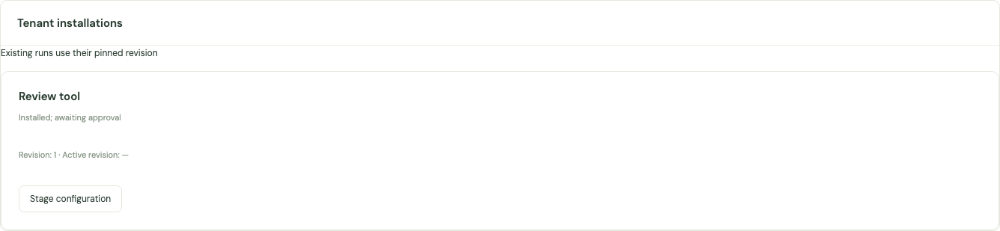

# Tenant Marketplace operations

Issue [#74](https://github.com/kent8192/aidash/issues/74) adds tenant-owned distribution alongside the original operator Marketplace. The accepted [design contract](../design/2026-09-30-marketplace-authorization-contract.md) defines the policy boundary. Application behavior is covered by `tests/marketplace_authorization.rs`; the dashboard scenarios are in `web/tests/marketplace.spec.ts`.

## Enable a compatible deployment

Apply the additive migration with the normal application migration command. It preserves legacy `packages`, `installations`, source bytes, digests and native catalog approvals. New scoped paths start disabled. Drain and upgrade **every API instance and worker** before enabling contract 1. In the operator Marketplace settings, confirm compatibility and enable the feature, or use:

```http
PUT /api/marketplace/compatibility
Content-Type: application/json

{"enabled":true,"expected_revision":1,"compatible_instances_confirmed":true}
```

Read `/api/marketplace/compatibility` for the current optimistic revision. Disabling this gate stops new scoped Marketplace requests; existing installed Runs still require live exact catalog approvals and policy. Operator approval revocation remains available while the gate is disabled.

Every installed Registry document carries an `installation` marker with contract, tenant, installation and revision. Older binaries reject this unknown field. Database triggers reject old writes to projection rows, legacy overlays on these IDs and cross-tenant catalog grants. Projection references are allocated once and persisted with each revision; an existing native ID beginning with `mkt-` remains native. These fences supplement the deployment gate; they do not make a rolling downgrade safe. A migration rollback refuses to erase populated scoped versions or installation mappings. Keep a compatible binary and restore from a verified backup for disaster recovery; do not strip markers or reuse projection IDs.

## Authority and identities

An opaque package key maps uniquely to repository Node, owner tenant, package identifier and exact source version. `author` is display metadata. Ownership and requesting tenant are server-derived. Another tenant can publish the same identifier/version independently.

Policies are evaluated in the caller's tenant. The package resource kind is `package`, its ID is the opaque key, and trusted attributes include `repository_node`, `owner_tenant`, `package_id`, `version`, `kind`, `source_digest` and `publisher`. Installation resource kind is `installation`, with its opaque stable ID, `installing_tenant`, `package_key` and `installation_revision`. Exact installed Registry entries keep their ordinary kind and immutable ID. Ownership, audience membership and catalog approval never grant actions implicitly.

| Operation                          | Actions                                                                                                            |
| ---------------------------------- | ------------------------------------------------------------------------------------------------------------------ |
| Summary search                     | `marketplace.browse`                                                                                               |
| Complete source manifest           | `marketplace.read` plus disclosure of every dependency                                                             |
| Install                            | `marketplace.read`, `marketplace.install`, `installation.create`, `installation.read`, dependency read permissions |
| Pending/retained management        | `installation.read` and included dependency read permissions                                                       |
| Stage configuration                | `installation.read`, `installation.configure`, dependency read permissions                                         |
| Publish registered source          | ordinary approved `registry.read`, `registry.export`, `marketplace.publish`                                        |
| Change exact-version audience      | owner-tenant `marketplace.share`                                                                                   |
| Change onward distribution consent | owner-tenant `marketplace.redistribution.manage`                                                                   |
| Approve/activate/revoke            | explicit operator catalog administration                                                                           |
| Execute                            | existing exact Agent-subject, catalog, delegation and actual action permissions                                    |

Default deny, explicit deny, role/group inheritance, ABAC and delegated ancestors apply to all subject kinds. A recipient needs both its own policy and a live audience/consent path. Installation does not create a privileged Agent subject. Administrators must explicitly configure the qualified installed Agent identity and its grants before execution.

## Publish, share and acquire

Use `/api/marketplace/sources` for approved registered sources. `POST /api/marketplace/publication-access` evaluates the precise proposed publication without creating data. Then publish with:

```json
{
  "source": { "id": "registered-tool", "version": "1.0.0" },
  "package_id": "review-tool",
  "author": "Review team",
  "permissions": ["tool.invoke"],
  "dependencies": [],
  "idempotency_key": "d59a010e-c10f-4a8c-ae29-664607608efd"
}
```

Send this to `POST /api/marketplace/packages`. There is no replacement manifest or tenant override input. The server exports the stored source; exporting an installed definition uses the retained original distribution definition, excluding local overrides. Secret references are not resolved during scoped validation. Private reference attachments and node-local knowledge require their separate current read paths.

`GET /api/marketplace/packages?q=...&offset=0&limit=50` searches authorized summaries. Offsets count only visible results. Configuration and dependency names are not search fields. A summary can be visible when its full definition is unavailable. `GET /api/marketplace/packages/{key}` returns the complete immutable manifest or the same generic 403 as a missing/unavailable target. It never redacts bytes while retaining their source digest.

New versions start with only the owner's tenant in their audience. Audience updates always retain the owner tenant so its policy-authorized managers can reload the current revision and restore recipients; redistribution consents remain independently withdrawable. `PUT /api/marketplace/packages/{key}/audience` accepts `expected_revision` and `tenants`. Grants apply to this exact version. `PUT /api/marketplace/packages/{key}/consents/{redistributor}` uses the same input, with revision 0 for a new consent. It authorizes the named tenant to distribute to the listed onward audience. Known imports, exact same-tenant copies and supported configuration derivations retain provenance. Every downstream browse/read/install rechecks all retained source consents and the audiences through which those copies were acquired. This does not claim to detect arbitrary semantic rewrites of copied content.

Install using `POST /api/marketplace/packages/{key}/install` with source `digest`, local `config`, optional `bindings` and an `idempotency_key`. A binding has exact `source` and `target` Registry references. Dependencies must already exist and be readable in the receiving tenant. Pending local installations can be prepared together; they still need individual approvals before use. Nothing is fetched or installed implicitly. Missing, inaccessible, wrong-kind or mismatched dependencies deny the whole operation. Typed Agent model/tool/skill/cluster, local Agent-tool and cluster coordinator edges are included even when omitted from the explicit dependency list. The traversal is limited to 128 definitions. Remote Agent-tool dependencies that cannot be resolved by the existing local typed definition graph are denied; distribution introduces no remote fetch or new peer protocol.

## Revisions, approval and recovery

`GET /api/marketplace/installations` and `/api/marketplace/installations/{id}?revision=N` are management views independent of ordinary Registry discovery. New installs are pending. `POST /api/marketplace/installations/{id}` accepts `expected_revision`, `config`, `bindings` and `idempotency_key`. Identical content returns the existing revision; changed configuration or dependency bindings create a new immutable pending Registry definition. Active content remains unchanged.

Operators inspect retained revisions with `GET /api/marketplace/administration?tenant=...`. Sources and administration accept `offset` (0–10,000) and `limit` (1–100, default 50), retaining their array bodies. A present `x-aidash-next-offset` header identifies the next page, including an empty source page after denied candidates. Source requests traverse at most 256 candidates; administration queries load only the requested tenant and revision page. Approve and activate a prepared revision atomically at `POST /api/marketplace/installations/{id}/activation`:

```json
{
  "tenant": "research",
  "revision": 2,
  "expected_activation_revision": 1,
  "expected_catalog_revision": 0,
  "enabled": true
}
```

Dependency approvals must already exist. `expected_catalog_revision` comes from `/api/authorization/{tenant}/catalog`; 0 creates the first grant. Use `enabled:false` to revoke that exact revision. Revoking the active revision does not fall back to an older approval. Ordinary discovery returns only active approved revisions. Existing Runs keep exact old references across restart and recheck approvals at subsequent boundaries. Source sharing/consent withdrawal does not disable committed local copies; recipient approval and policy control their execution.

Legacy operator `GET/POST /api/marketplace` and bare-ID install endpoints retain their original behavior. They never infer tenant ownership. Adoption rejects transitive legacy dependencies whose effective content differs from their stored definition, including endpoint-only overlays. Explicit `POST /api/marketplace/adoptions` accepts `tenant`, exact legacy `source` and `idempotency_key`; it makes an independent pending tenant copy of verified legacy bytes/configuration. Later legacy overlay changes do not mutate that copy. Native catalog approvals do not approve a new projection. Legacy peer discovery and admission exclude tenant projections.

## Transactions, disclosure and audit

Credential/policy, identity/mapping and (for browser requests) session leases precede a shared/exclusive distribution lock; catalog checks follow. This orders policy, credential, audience, consent, dependency and approval revocation with protected mutations. Registry rows, mappings, immutable revisions, idempotency records and success events commit together. Idempotency is scoped to tenant, principal and operation, and replays reauthorize current reads.

Scoped HTTP handlers have a 30-second deadline. Responses are serialized and inserted into a bounded queue (two MiB maximum) while authority remains held; only a successful commit exposes that queue to the transport. SSE uses a bounded per-frame handoff and rechecks each referenced resource. Database locks do not wait for the client's network drain. Bytes already handed off cannot be retracted. Authenticated scoped responses use `Cache-Control: no-store`.

Missing, foreign and unreadable resources/dependencies return generic 403; invalid credentials retain 401 behavior. Resource-independent malformed requests use 400/422. Authorized digest/version/revision conflicts use 409. Operator-only `marketplace.audit` events retain request and idempotency IDs, actor, policy revision, package/installation identity and digests, consulted audience/consent revisions and bounded outcomes. A denial is audited separately after the protected transaction rolls back. Neither bearer values nor configuration/secret contents enter this audit. Detailed policy audits and legacy/unknown events remain unavailable through subject Marketplace responses. Marketplace events disclose only a resource reference and mutation metadata after the current package/installation reader authorizes it. Dashboard caches are keyed by authority context and cleared after relevant 401/403 responses.

Subject event queries select tenant/audience candidates before loading documents; audit and unrelated-tenant events do not consume the scan budget. Snapshot and polling requests evaluate at most 4,096 candidates. Polling advances its cursor across denied candidates. HTTP `/api/events` keeps its array body and returns `x-aidash-event-cursor`; clients must use that header as the next `after` value even on an empty page. SSE maintains its own cursor across hidden history. Indexed tenant/package event references and audience membership support this filtering.

The lock deliberately serializes Marketplace mutations for one database. It keeps the first implementation's ordering auditable; it is not a claim of unbounded publication throughput. Source content, retained revisions and provenance are not garbage-collected by this feature.

Browser logout is ordered against pending requests, including SSE frame delivery. Session expiry is rechecked at response handoff. A durable Run reconstructs its credential/subject authority without the originating HTTP session; logout does not silently cancel previously admitted work, while credential, identity, mapping, policy and catalog revocation still apply.

Browser operators retain identity, operator-grant and session leases for administration reads, compatibility changes, activation and legacy adoption. Reads serialize into a bounded queue under those leases and recheck session expiry before commit; mutations also recheck expiry before commit; a queued request cannot outlive logout or operator-grant revocation.

## Dashboard examples

The en-US and ja-JP browser fixtures show the same tenant installation awaiting approval. These screenshots use test data; they do not represent deployment enablement.




## Local verification and acceptance coverage

The focused integration suite uses real disposable PostgreSQL services. Its intentional lock barriers run in serial fixtures because advisory locks are database-wide even when test data has separate schemas; the competing requests within each fixture still run concurrently.

| Acceptance        | Executable evidence                                                                                                                                                                                                                                                                           |
| ----------------- | --------------------------------------------------------------------------------------------------------------------------------------------------------------------------------------------------------------------------------------------------------------------------------------------- |
| MKT-A01, A02, A04 | Four subject-kind cases in `tenant_publication_pending_installation_and_revisions`; `policy_conditions_delegation_and_denies_apply_to_marketplace_boundaries`; existing `policy` tests for group inheritance and deny/delegation evaluation.                                                  |
| MKT-A03, A05      | `hidden_typed_dependency_and_denial_leave_no_installation`; `live_redistribution_consent_retains_local_copies_and_export_bytes`; `response_handoff_releases_locks_before_body_drain_and_rechecks_event_replay`.                                                                               |
| MKT-A06, A11, A16 | `immutable_versions_replays_and_recovery_keep_their_authority_boundaries`: renewed credentials, hidden replay results, future-version isolation, immutable storage, corruption detection, migration round trip and populated rollback refusal.                                                |
| MKT-A07, A08, A09 | `readable_distribution_precedes_dependency_preparation_and_bindings_pin_revisions`; subject-kind installation cases; hidden typed dependencies. Missing/wrong-kind dependencies leave no partial install; dependency binding changes stage a new pending revision.                            |
| MKT-A10           | `new_runs_select_active_revision_and_restarted_runs_keep_exact_old_reference`; exact old approval revocation and no active fallback. The existing `scoped_remote_execution` suite verifies remote protocol compatibility.                                                                     |
| MKT-A12           | A-to-B-to-C source export, live consent and acquisition-audience withdrawal, plus committed-copy management in `live_redistribution_consent_retains_local_copies_and_export_bytes`. Known-copy lineage also has coverage in adoption tests.                                                   |
| MKT-A13           | Deterministic audience, dependency/catalog, consent, credential, policy and browser-logout barriers; both competing outcomes for distribution/dependency/session mutations. A buffered HTTP body does not retain authority locks; stale SSE replay cannot newly disclose a withdrawn package. |
| MKT-A14           | `web/tests/marketplace.spec.ts` runs en-US and ja-JP browse/detail/install/pending/configuration-conflict/publish/403/context-switch workflows. Tests use mocked API responses; server boundaries are covered separately by the PostgreSQL integration suite.                                 |
| MKT-A15           | `explicit_legacy_adoption_and_mixed_writer_fence`, existing `registry_and_execution_contracts`, `record_constraints`, and `execution_authorization` regressions.                                                                                                                              |

Run `cargo test --locked --lib --test marketplace_authorization --test dashboard_oidc --test sse_delivery` for the scoped boundaries, `cargo clippy --locked --workspace --all-targets -- -D warnings`, and `npm run build --prefix web` (which regenerates OpenAPI/client types). From `web`, run `npx playwright test --config playwright.ui.config.ts marketplace.spec.ts` and ESLint on the changed dashboard files. OpenAPI route assertions live in `api::schema_tests`.

Verified locally on 2026-09-30 after integration with the current SSE delivery service: all 21 Marketplace cases, four OIDC cases, 19 SSE cases and 155 library tests passed. The separate SSE load benchmark remains ignored by default. The earlier focused regression run also passed 80 existing policy, execution, Registry, record-constraint and scoped-remote tests. Both dashboard locale cases, API generation/TypeScript/Vite build, Clippy with warnings denied, focused ESLint, formatting and whitespace checks passed. The browser tests use API fixtures; live server authorization is exercised by the database tests. The Vite build retains its existing large-chunk warning.

These checks establish local implementation behavior. The deployment gate remains disabled until an operator verifies and enables a compatible fleet; no hosted CI, deployment or release is implied by local tests.
