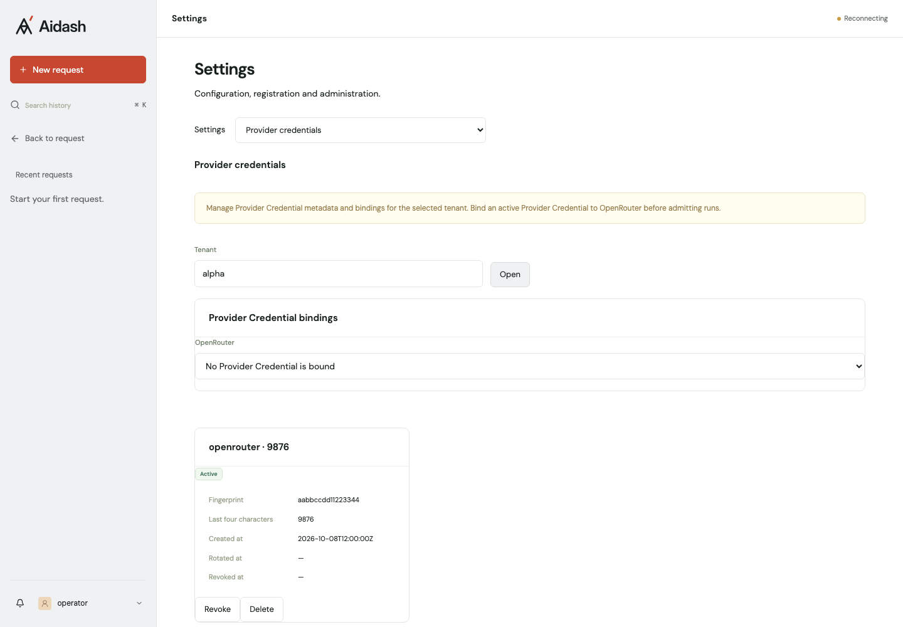

# Provider Credentials

Provider Credentials are Tenant-owned metadata records obtained only through
Provider Authorization, the provider's OAuth flow, as decided in ADR 0006.
Key Material passes from the server-side exchange into the Provider Credential
Store write port. Pinned reads use a separate narrow read port.
Aidash exposes no HTTP create/rotate endpoint or dashboard
form accepting typed or pasted provider keys. OAuth connection and reconnect
flows are tracked in [#158](https://github.com/kent8192/aidash/issues/158).
The v1 Provider Catalog contains `openrouter`, with base URL
`https://openrouter.ai/api/v1`.
Registry model and embedding configurations use `provider_credential =
"openrouter"`, mutually exclusive with `credential_env`; they never contain a
Provider Credential ID. The removal of operator `credential_env` keys and the
mandatory Store requirement for self-hosted nodes belong to #158's migration.

Choose a Provider Credential Store in server settings. Without
`[provider_credentials.store]`, Provider Credentials and Plan Connections are
unavailable. Until [#158](https://github.com/kent8192/aidash/issues/158) lands,
a self-hosted node has no production path to create Provider Credentials.

For self-hosted PostgreSQL storage:

```toml
[provider_credentials]
max_per_tenant = 20
fingerprint_key = { env = "AIDASH_PROVIDER_FINGERPRINT_KEY" }

[provider_credentials.store]
kind = "postgres"
master_key = { file = "/run/secrets/aidash-master-key" }
# Alternatively: master_key = { env = "AIDASH_PROVIDER_STORE_MASTER_KEY" }
retired_master_keys = []
```

Generate a Master Key with `openssl rand -hex 32`. Deliver its 64 hex characters
through a private mounted file or the named environment variable. Server and
worker both need the same current and retired Master Keys. The Helm chart's
`existingSecret` supplies both processes through `envFrom`; when using separate
server/worker Secret overrides, include the keys in both. Native `manage`
commands such as `migrate` validate settings shape but do not load these keys.
The explicit recovery command below loads the same keys as bootstrap.
Surrounding whitespace is trimmed from file and environment values.

For Cloud, replace the Store section with:

```toml
[provider_credentials.store]
kind = "secret_manager"
byok_project_id = "your-aidash-byok-project"
environment_id = "develop"
```

Both kinds require the separate `provider_credentials.fingerprint_key` setting.
It replaces `store.fingerprint_env`, including on Cloud. Supply an independent
random raw string of at least 32 bytes, through `{ env = "..." }` or
`{ file = "/run/secrets/..." }`. Each source must name exactly one of file or env;
`AIDASH_SECRET_*` environment names are rejected because Registry configurations
can resolve that namespace. Fingerprints use independent derived Tenant keys,
HMAC-SHA256 and the first eight bytes in hexadecimal. They are metadata, not
bearer values. PostgreSQL contains AEAD ciphertext only; plaintext Key Material
never appears in tables, events, responses, request logs or browser persistence.

The Store encrypts each version with AES-256-GCM and a fresh random nonce.
Associated data binds its Tenant, resource and version. Encryption keys and key
identifiers are separately derived from the Master Key with HKDF-SHA256.

To rotate the Master Key, generate a new key, set it as `master_key`, move the
previous source into `retired_master_keys` and restart server and worker. Retired
keys decrypt existing versions only. A Provider Credential moves to the current
key when it is next rotated; there is no bulk re-encryption command. Retain old
keys while any needed versions still use them.

Startup refuses a missing, unreadable or malformed Master Key, configured keys
that match no registered key identifier, or a failed stored key check. Wrong
keys are rejected before registering them. When some registered keys are known,
versions under an unconfigured key produce a warning with counts; reads fail,
while revocation and deletion remain available. There is no fallback.

Losing the Master Key loses every Provider Credential and Plan Connection on
the node. Recovery means reconnecting through OAuth (#158 for Provider
Credentials).
A database backup is useless without a separately retained key backup. Keep the
current and necessary retired keys backed up outside the database.

After total or partial key loss, stop server and worker and run the following
with the same settings and key sources as the node, including any retained keys:

```sh
manage provider-credential-store-recovery
manage provider-credential-store-recovery --execute
```

The default is a dry run. Both invocations print only JSON counts:
`affected_tenants` and `affected_provider_credentials` count active records whose
pin uses a lost key; `version_rows` and `key_registry_rows` count rows to remove.
Recovery requires a PostgreSQL Store and valid current Master Key and fingerprint
key. It verifies registered configured keys, so a failed key check refuses both
dry run and execute without changes. It bypasses the wrong-key startup gate and
does not register a replacement key, migrate, or start runtime services.

With `--execute`, normal application Revocation records the lifecycle event for
each affected Provider Credential. Recovery then deletes all version and key
registry rows under unconfigured keys. Configured-key versions in the same
resource are disabled by normal Revocation, remain present, and keep their
ciphertext. Unaffected Provider Credentials retain every row and state.
Recovery never decrypts or re-encrypts version payloads. Restart server and worker
afterward; normal startup registers the current key. Tenants then delete revoked
credentials and reconnect through OAuth (#158). The command is safe to rerun
after an interrupted recovery. Plan Token recovery will be added by #159.

Tenant metadata endpoints are GET `/api/tenants/{tenant}/provider-credentials`
and GET `/api/tenants/{tenant}/provider-credentials/{id}`. Revoke and delete remain
available, alongside `/api/tenants/{tenant}/provider-credential-bindings`.
Lifecycle operations and
binding updates require the current `expected_revision`; stale writes return 409. Sending `provider_credential_id: null` explicitly unbinds a provider and
retains its revision history; unbind before deleting the last bound record.
Public policy actions are `provider_credential.read`, `.revoke`, `.delete`, and
`provider_credential_binding.read`, `.update`. Internal Provider Authorization
writes retain the `.create` and `.rotate` policy decisions. Resources
carry the provider attribute and UUID or Provider Catalog ID respectively.
Authenticated Subjects may operate only within their Tenant; authenticated
operators retain explicit policy decision audits. Responses use
`Cache-Control: no-store`.

Tenant settings show metadata, binding selection, revocation and deletion without
key-entry controls. This example uses test fixture metadata:



The application-layer `Service::create` and `Service::rotate` use cases remain
internal write paths for #158's server-side OAuth callback. Native management
composition accepts typed providers and `SecretString` directly and runs policy
decisions; there is no Key Material HTTP serializer, SDK operation, environment
variable, or settings input for this write path. Tests seed through it directly.
Creation persists `pending` before provider verification and secret storage.
Rotation pins a verified new version before disabling the old one. Revocation
is irreversible and disables all versions; deletion destroys versions and keeps
a metadata tombstone, but refuses a bound record. A supervised reconciler scans
expired PostgreSQL pending records and disables unpinned active versions left
by interrupted rotations. It never lists Secret Manager secrets.

Admission records a local-only Provider Credential ID per Run and provider.
This includes the enabled workspace semantic index's embedding provider, even
when the Agent's Model uses an environment source. Missing embedding bindings
therefore reject admission before the Run is committed.
Calls check that record's current active state and current version pin; changing
a binding cannot retarget admitted Runs. Receiving federation admission uses
the mapped local Tenant. PostgreSQL resolves the current pinned version through
the narrow read port. Cloud broker routing belongs to Issue #137; until that
broker exists, Cloud Tenant access fails with `credential broker not configured`
after metadata validation and never falls back to environment keys.

Explicitly authorized local maintenance without a Run resolves the current
Tenant binding and includes its memory indexing, retention, reflection or
retrieval purpose in the access context. Run calls keep their admission pins.
Both paths check current metadata before access. PostgreSQL reads the pinned
version; Cloud continues to fail with `credential broker not configured` until
#137 supplies the Credential Broker.

Workbench tests currently support environment-backed Models only. A Model using
Tenant Provider Credentials is rejected before a sandbox session is admitted;
Workbench has no Run or memory-maintenance authority for Tenant provider access.

Terraform requires an existing billing-enabled `byok_project_id` distinct from
the application project. This project contains only Provider Credential
secrets. Runtime creation permission exists only there; management is limited
to `aidash-<environment_id>-cred-` by a project-number-based IAM condition. The
runtime identity has no BYOK `versions.access` or `setIamPolicy`. Bootstrap
configures DATA_READ and DATA_WRITE audits and the fixed custom roles once.
Deploy can grant only the fixed runtime Create/Manage roles and cannot edit
BYOK roles. The BrokerRead role is defined but unbound; no broker identity or
BYOK payload read grant is provisioned here. #137's human-run bootstrap owns
the broker identity and the prefix-conditioned BrokerRead binding.
Human-run bootstrap also binds deploy to a prefix-conditioned delete-only
`aidashByokRetire` role and an unconditioned project list-only
`aidashByokRetireInventory` role. Deployment cannot grant either role through
its unchanged Create/Manage allowlist. Retirement inventories only metadata,
deletes the exact environment prefix, and confirms it is empty before disk,
runtime identity and IAM removal. Existing running writers are sealed first;
stopped or missing VMs are never awakened. Cleanup failures retain the disk and
identity for an idempotent retry. Residual: project-level listing makes BYOK
secret names visible to deploy; no payload or version read permission is added.

Outputs `byok_project_id` and `secret_prefix` supply the secret namespace. The
existing shared-project deployment identity could manage a broker service
account's IAM policy there, and a broker deployment identity could execute code
with Key Material access. The deploy pipeline remains part of the trust root;
the IAM deny policy and entry-point hardening are tracked in
[#151](https://github.com/kent8192/aidash/issues/151). A separate credential
enclave is deferred. See the residual deployment trust boundary in
[the infrastructure guide](../infra/gcp/README.md).
